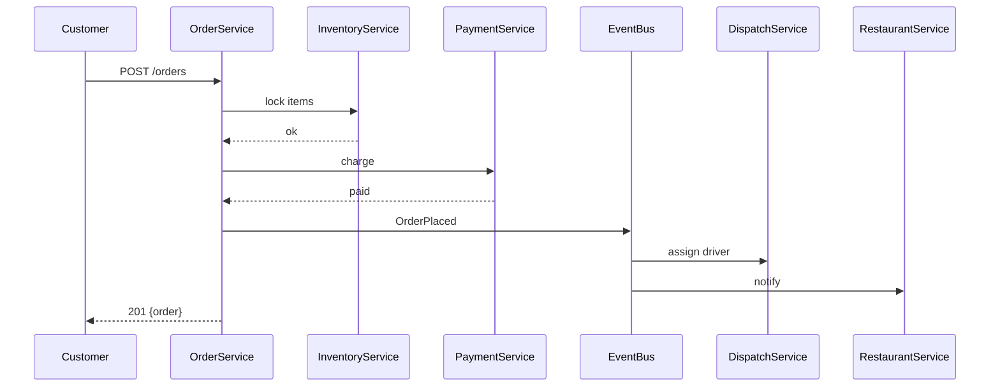
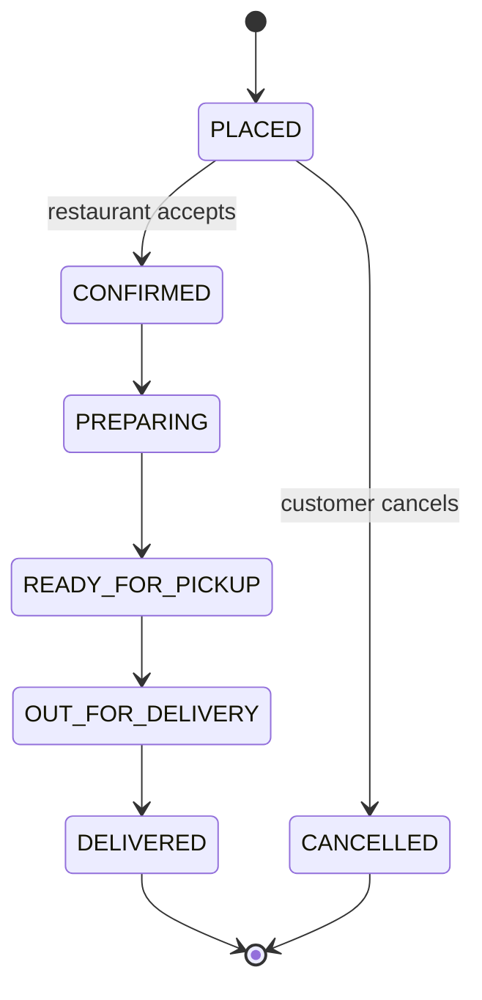

# 03 · The Structured LLD Framework (12-Step Playbook)

> Every staff-level LLD reduces to this 12-step pipeline. Memorize it. Apply it ruthlessly.

---

## The 12 Steps

```
STEP                                TIME    OUTPUT
───────────────────────────────────────────────────────────────────
1.  Clarify scope                   5 min   FR / NFR / out-of-scope
2.  Capacity estimation             3 min   5 numbers
3.  Identify actors                 2 min   Who calls the system
4.  Identify core entities          5 min   Nouns, attributes
5.  Identify aggregates             3 min   Consistency boundaries
6.  Define APIs                     5 min   REST contract
7.  Database schema                 5 min   Tables + indexes
8.  Class design                    10 min  Interfaces, services, patterns
9.  Pick design patterns            5 min   With justification
10. Sequence diagrams               5 min   Happy + 1 edge case
11. State machines                  5 min   For lifecycle entities
12. Concurrency + scale             7 min   Locks, races, idempotency
                                    ─────
                                    60 min total
```

You will not always do all 12 in one interview. The ones you skip should be a **deliberate choice**, not an oversight.

---

## Step 1: Clarify Scope

Covered exhaustively in [`01_requirement_gathering.md`](./01_requirement_gathering.md).

**Output:** A whiteboard section with `FR | NFR | OUT | EXTENSIONS`.

---

## Step 2: Capacity Estimation

Covered in [`02_capacity_estimation.md`](./02_capacity_estimation.md).

**Output:** 5 numbers (DAU, write RPS, read RPS, storage, bandwidth).

---

## Step 3: Identify Actors

Actors are anyone who **calls the system**. This includes:

- **Human users** (customer, driver, admin)
- **External systems** (payment gateway, SMS, push notification)
- **Internal services** (cron, ETL, search indexer)
- **Operators** (support agent, ops engineer)

Why this matters: each actor implies an **API surface**, **auth model**, and **rate limit class**.

```
Actors for Food Delivery:
  - Customer  (mobile app, web)
  - Driver    (driver app)
  - Restaurant (POS / partner app)
  - Admin     (internal dashboard)
  - PaymentGateway  (webhook callback)
  - DispatchService  (internal cron / streaming)
```

You should find **4–7 actors** in most systems.

---

## Step 4: Identify Core Entities (Domain Decomposition)

Entities are the **nouns** of your domain. Most LLD problems have 8–15.

### Technique: noun extraction

Read the FR list. Underline every noun. Group similar nouns. The remaining unique nouns are your entities.

> "A **customer** places an **order** containing **items** from a **restaurant**. A **driver** is assigned and delivers it to an **address**."

Extracted:
```
Customer, Order, OrderItem, Restaurant, MenuItem,
Driver, Vehicle, Address, Payment
```

### What is "core"?

Anything required by the **happy path** is core. Anything required only by an extension is **deferred**.

| Entity | Core / Deferred | Why |
| --- | --- | --- |
| Order | Core | Happy path |
| Cart | Core | Pre-order step |
| Driver | Core | Delivery |
| Review | Deferred | Extension |
| PromoCode | Deferred | Extension |

State this filter out loud.

### Attributes per entity

For each core entity, list:
- Identity (PK, surrogate or natural)
- 3–6 essential attributes
- Relationships to other entities

```
Order
  id (UUID)
  customer_id (FK)
  restaurant_id (FK)
  status (enum)
  total_amount (decimal)
  created_at, updated_at, version
```

Don't go to 50 attributes. Stay essential. Add detail when asked.

---

## Step 5: Identify Aggregates

> An **aggregate** is a cluster of entities that must be **mutated atomically**.

This is the most under-taught LLD concept. Aggregates determine:

- Where you put **transaction boundaries**.
- Where you place **optimistic locks**.
- Which APIs **return together**.
- Which entities go in the **same DB partition**.

### Aggregate root rules (Eric Evans / DDD)

1. Each aggregate has **one root entity** (Order, Customer, Restaurant).
2. External code holds references **only to the root**, never to internal entities.
3. Internal entities are mutated **only through the root**.
4. The aggregate has a **version** for optimistic locking.

### Example: Order aggregate

```
Order (root)
├── OrderItem[]
├── DeliveryAddress (snapshot, not FK)
└── PriceBreakdown (subtotal, tax, fee, total)

Driver, Restaurant are NOT in this aggregate. They are separate aggregates.
```

When you `cancelOrder()`, you mutate the Order root, which cascades to its items. You do **not** modify Driver state in the same transaction.

### Splitwise example

```
Group (root)
├── GroupMember[]

Expense (root, separate aggregate)
├── ExpenseSplit[]
├── ExpensePayer[]

UserBalance (root, separate aggregate, materialized)
```

Why separate? An expense can be edited without touching the group's metadata. They have **different consistency boundaries**.

---

## Step 6: Define APIs

Always do this **before** coding classes. APIs are the contract; classes are the implementation.

### REST conventions

```
POST   /v1/orders                    Create
GET    /v1/orders/{id}               Read one
GET    /v1/orders?customer_id=X      List
PATCH  /v1/orders/{id}               Partial update
POST   /v1/orders/{id}:cancel        Action (verb endpoints OK for actions)
DELETE /v1/orders/{id}               Soft delete (rare)
```

### Request body shape

```json
POST /v1/orders
{
  "customer_id": "u_123",
  "restaurant_id": "r_45",
  "items": [
    {"menu_item_id": "m_9", "quantity": 2}
  ],
  "delivery_address_id": "a_77",
  "idempotency_key": "ord-abc-2025-01-19-001"
}
```

Idempotency key is **mandatory** on every mutating API. We discuss why in [`07_api_design.md`](./07_api_design.md).

### Response

```json
201 Created
{
  "order": {
    "id": "ord_abc",
    "status": "PLACED",
    "total_amount": 480.00,
    "estimated_delivery": "2025-01-19T20:30:00Z"
  }
}
```

### Errors

Use **structured errors**, not strings:

```json
400 Bad Request
{
  "error": {
    "code": "INVENTORY_UNAVAILABLE",
    "message": "Item m_9 is out of stock",
    "details": {"menu_item_id": "m_9"}
  }
}
```

Cover this fully in [`07_api_design.md`](./07_api_design.md).

---

## Step 7: Database Schema

For each entity, decide:

1. PK and FKs
2. Indexes (think about read patterns)
3. Constraints (UNIQUE, CHECK)
4. Versioning column (for optimistic locking)
5. Soft delete? (`deleted_at`)
6. Audit columns? (`created_by`, `updated_by`)

```sql
CREATE TABLE orders (
  id              UUID PRIMARY KEY,
  customer_id     UUID NOT NULL REFERENCES users(id),
  restaurant_id   UUID NOT NULL REFERENCES restaurants(id),
  status          VARCHAR(20) NOT NULL,
  total_amount    NUMERIC(10,2) NOT NULL CHECK (total_amount >= 0),
  version         BIGINT NOT NULL DEFAULT 0,
  idempotency_key VARCHAR(80) UNIQUE,
  created_at      TIMESTAMPTZ NOT NULL DEFAULT now(),
  updated_at      TIMESTAMPTZ NOT NULL DEFAULT now()
);

CREATE INDEX idx_orders_customer_status
  ON orders (customer_id, status, created_at DESC);

CREATE INDEX idx_orders_restaurant_status
  ON orders (restaurant_id, status)
  WHERE status IN ('PLACED', 'CONFIRMED', 'PREPARING');
```

The `WHERE` clause makes a **partial index** — only "active" orders. Massive read speedup. We cover this in [`08_database_design.md`](./08_database_design.md).

---

## Step 8: Class Design

This is where most candidates **start**. We arrive here at minute 25 — and that's correct.

### The standard service-layer architecture

```
┌────────────────────────────────────┐
│   Controller / API layer           │  HTTP, validation, auth
├────────────────────────────────────┤
│   Application Service              │  Use case orchestration
├────────────────────────────────────┤
│   Domain Service / Domain entity   │  Business rules
├────────────────────────────────────┤
│   Repository (interface)           │  Persistence contract
├────────────────────────────────────┤
│   Repository (impl) / DAO          │  JDBC / JPA / SQL
└────────────────────────────────────┘
```

For each entity:
- **Entity** (`Order` — domain object, holds invariants)
- **Repository** (`OrderRepository` — interface)
- **Service** (`OrderService` — use cases)

For each cross-cutting concern, add a **strategy interface**:
- `PricingStrategy`, `DispatchStrategy`, `SplitStrategy`, etc.

### Example skeleton

```java
public interface OrderRepository {
  Optional<Order> findById(UUID id);
  Order save(Order order);
  Optional<Order> findByIdempotencyKey(String key);
}

public class OrderService {
  private final OrderRepository orderRepository;
  private final InventoryService inventoryService;
  private final PaymentService paymentService;
  private final EventPublisher eventPublisher;

  public Order placeOrder(PlaceOrderCommand cmd) {
    // 1. Validate, idempotency, lock inventory
    // 2. Create Order aggregate
    // 3. Persist
    // 4. Publish OrderPlaced event
  }
}
```

We cover the **complete** Java skeletons inside each system folder.

---

## Step 9: Pick Design Patterns

You don't pick patterns to "use a pattern." You pick them because they **solve a specific problem you have right now.** For each pattern in your design, justify aloud.

| Trigger | Pattern |
| --- | --- |
| Multiple algorithms with same input/output | Strategy |
| Entity with lifecycle and state-dependent behavior | State |
| Object construction with many optional fields | Builder |
| Decoupling sender from receiver of operations | Command |
| Decoupling event producers from consumers | Observer / Pub-sub |
| Persistence abstraction | Repository |
| Wrapping behavior dynamically | Decorator |
| Sequential filtering / processing | Chain of Responsibility |
| Family of related objects | Abstract Factory / Factory Method |

Covered in detail in [`05_design_patterns.md`](./05_design_patterns.md).

---

## Step 10: Sequence Diagrams

A picture saves 5 minutes of explanation.

Draw at least:
- **Happy path** of the most important flow.
- **One failure path** (e.g., payment failure, no driver available).



Covered in [`09_uml_tutorial.md`](./09_uml_tutorial.md).

---

## Step 11: State Machines

If your entity has a lifecycle (Order, Ride, Booking), draw it:



For each transition, state:
- **Trigger** (event/action)
- **Guard** (precondition)
- **Effect** (side effect)

```
PREPARING → READY_FOR_PICKUP
  trigger: restaurant marks ready
  guard:   order.status == PREPARING
  effect:  notify dispatch, update ETA
```

Implement with the **State pattern** if there's lots of state-dependent behavior, otherwise an **enum + switch** is fine. Covered in [`05_design_patterns.md`](./05_design_patterns.md).

---

## Step 12: Concurrency + Scale

The final 7 minutes. Cover:

1. **Race conditions** in your design (always exist; identify them).
2. **Locking strategy** (optimistic by default).
3. **Idempotency** (already added at API layer).
4. **Sharding** (if scale requires it).
5. **Caching** (read-through / write-through).
6. **Async flows** (where queues replace sync calls).

Covered in [`06_concurrency.md`](./06_concurrency.md).

---

## How to Apply This in 60 Minutes

```
0:00–0:05   Clarify scope          ← steps 1
0:05–0:08   Capacity estimation    ← step 2
0:08–0:10   Actors                 ← step 3
0:10–0:18   Entities + aggregates  ← steps 4, 5
0:18–0:25   APIs + DB              ← steps 6, 7
0:25–0:38   Class design + patterns ← steps 8, 9
0:38–0:45   Sequence + state       ← steps 10, 11
0:45–0:55   Concurrency + scale    ← step 12
0:55–1:00   Tradeoffs + extensions ← summarize alternatives
```

Practice this on every system in this repo until the timing feels natural.

---

## What Differentiates Staff-Level

A senior candidate produces **a working design**. A staff candidate produces:

- A working design **plus** the alternatives considered and rejected.
- An explicit list of **failure modes** and how the design handles them.
- A view of **how the system evolves** over the next 2 years.
- Awareness of **operational concerns** (rollouts, rollbacks, monitoring).
- Ability to **negotiate scope** on the fly when stuck.

Every system folder ends with `13_extensions_and_tradeoffs.md` and `14_interviewer_followups.md` to drill these.

---

## Checklist for Each Step

- [ ] **Step 1:** Scope written, agreed.
- [ ] **Step 2:** 5 numbers stated.
- [ ] **Step 3:** Actors listed.
- [ ] **Step 4:** Entities listed with key attributes.
- [ ] **Step 5:** Aggregates marked.
- [ ] **Step 6:** APIs with idempotency keys.
- [ ] **Step 7:** Schema with indexes.
- [ ] **Step 8:** Service classes named.
- [ ] **Step 9:** Patterns justified.
- [ ] **Step 10:** At least one sequence diagram.
- [ ] **Step 11:** State machine if lifecycle exists.
- [ ] **Step 12:** Race conditions identified, locking + idempotency stated.
