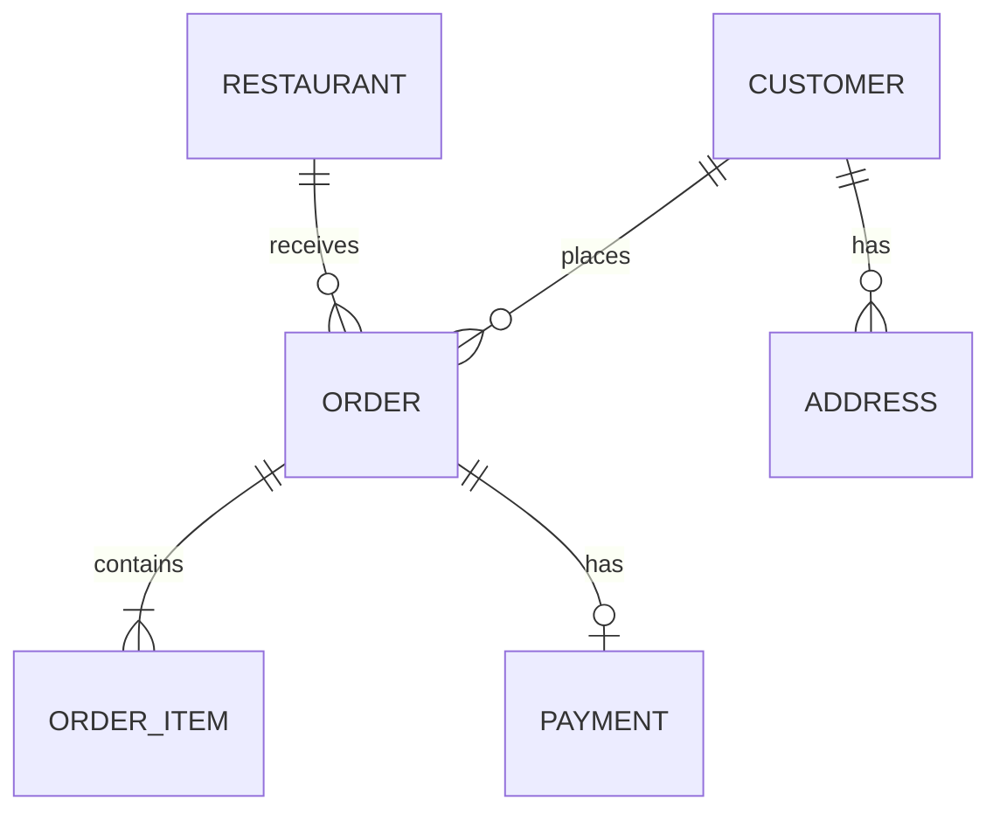

# 08 · Database Design Guide

> Storage choices outlive APIs and frameworks. Get them right.

---

## Decision Framework

For every entity, answer:

```
1. Access pattern   - read by what key? range scan? full text?
2. Mutation rate    - read-heavy? write-heavy? balanced?
3. Consistency      - strong (money) or eventual (search index)?
4. Size             - GB or PB?
5. Query shape      - point lookup, scan, join, aggregate?
6. Lifecycle        - hot for 30 days? archive after 1 year?
```

Then pick a storage type:

| Type | Use |
| --- | --- |
| RDBMS (Postgres, MySQL) | Default. ACID, joins, mature ecosystem. |
| Wide-column (Cassandra, ScyllaDB) | Massive write throughput, time-series, single-key access |
| Document (MongoDB) | Schema-flexible documents, hierarchical reads |
| Key-value (Redis, DynamoDB) | Sub-ms reads, sessions, caches, counters |
| Search (Elasticsearch, OpenSearch) | Full-text, faceted, ranking |
| Graph (Neo4j) | Friendship graph, recommendations |
| Time-series (InfluxDB, TimescaleDB) | Metrics, telemetry, driver locations |
| Object store (S3) | Large blobs, archival |

> **Default to Postgres** unless you can articulate why it doesn't fit.

---

## ER Diagrams

Always draw the ER for core entities. Use Crow's-foot notation:

```
Customer (1) ──── (N) Order
Order    (1) ──── (N) OrderItem
Order    (N) ──── (1) Restaurant
Order    (1) ─── (0..1) Payment
```

### Mermaid example



---

## Normalization vs Denormalization

### Normal forms in 30 seconds

| NF | Rule |
| --- | --- |
| 1NF | Atomic columns; no arrays in columns |
| 2NF | All non-key columns depend on the whole PK |
| 3NF | No transitive deps (`A → B → C` means split) |
| BCNF | All determinants are candidate keys |

In practice, **3NF** is the target for OLTP. Then **selectively denormalize** for hot reads.

### When to denormalize

- A query joins 5+ tables and is on the hot path.
- An aggregate (`SUM(amount)`) is recomputed on every read.
- A single value is repeatedly looked up across many rows.

Examples:
- `users.full_name` (instead of computing from first/last every time).
- `orders.restaurant_name_snapshot` (so renaming the restaurant doesn't change historical orders).
- `user_balances` materialized view (Splitwise).

### Snapshots — a key denormalization for "history" entities

Orders, bookings, invoices should **snapshot** the data they depend on at creation time:

```
Order:
  restaurant_id          (FK, current pointer)
  restaurant_name_snap   (the name at order time)
  delivery_address_snap  (full address as JSON)
  price_breakdown_snap   (line items with prices at order time)
```

Why? If the restaurant later changes its address or menu, the order receipt should still show what was bought and where it was delivered.

---

## Indexing

### Mental model

An **index** is a sorted data structure (B-tree or hash) that maps key → row pointer. It speeds reads, slows writes (must update the index too), and consumes storage.

### Index types

| Index | Use |
| --- | --- |
| B-tree | Default. Range scans, equality. |
| Hash | Equality only (Postgres rarely needs explicit hash). |
| GIN | Full-text, JSONB containment. |
| GiST | Geometric, range, custom. |
| BRIN | Huge time-series tables (block range). |
| Partial | Filter on common predicate. |
| Covering / Include | Make queries index-only. |
| Unique | Constraint + index. |

### Composite indexes — order matters

```sql
CREATE INDEX idx_orders_customer_status_time
  ON orders (customer_id, status, created_at DESC);
```

- Useful for `WHERE customer_id=? AND status=? ORDER BY created_at DESC`.
- Also useful for `WHERE customer_id=?` (uses left-most prefix).
- **Not** useful for `WHERE status=?` alone.

### Partial indexes

```sql
CREATE INDEX idx_active_orders_by_restaurant
  ON orders (restaurant_id, created_at)
  WHERE status IN ('PLACED', 'CONFIRMED', 'PREPARING');
```

The "active orders" set is small relative to the whole table. The index is tiny and lightning-fast.

### Covering / index-only

```sql
CREATE INDEX idx_orders_customer_status
  ON orders (customer_id, status)
  INCLUDE (total_amount, created_at);
```

The query reads everything from the index, no heap fetch.

### Costs

- **Writes**: every index update on insert/update.
- **Storage**: each index ~5–25% of the table size.
- **Vacuum / maintenance**: indexes need rebuilding under heavy churn.

Don't add an index "just in case." Add one **per identified query pattern**.

---

## Locking — At the DB Level

### Row-level locks

`SELECT ... FOR UPDATE` takes an exclusive row lock until commit/rollback.

```sql
BEGIN;
SELECT total_avail FROM room_inventory WHERE ... FOR UPDATE;
UPDATE room_inventory SET total_avail = total_avail - 1 WHERE ...;
COMMIT;
```

Use sparingly — long transactions block others.

### Advisory locks (Postgres)

```sql
SELECT pg_advisory_xact_lock(hashtext('reservation:hotel-99:room-deluxe:2025-04-20'));
-- transactional advisory lock; auto-released on commit/rollback
```

App-level mutex, identified by a 64-bit key.

### Transaction isolation levels

| Level | Behavior |
| --- | --- |
| READ UNCOMMITTED | dirty reads (almost never) |
| READ COMMITTED | default in Postgres; no dirty reads |
| REPEATABLE READ | snapshot per txn; no non-repeatable reads |
| SERIALIZABLE | as if txns ran one at a time; some retries |

For inventory and money, use REPEATABLE READ or SERIALIZABLE for the critical txn. Postgres's SERIALIZABLE is implemented as **SSI** — optimistic, may abort on conflict.

### Deadlock prevention

Always acquire locks in the **same order**. Across multiple rows:

```sql
SELECT * FROM accounts WHERE id IN (?, ?) ORDER BY id FOR UPDATE;
```

If both txns lock in id order, no deadlock. Random order causes them.

---

## Modeling Relationships

### One-to-many

FK on the "many" side:

```sql
CREATE TABLE orders (
  id UUID PRIMARY KEY,
  customer_id UUID NOT NULL REFERENCES customers(id)
);
```

### Many-to-many

Junction table:

```sql
CREATE TABLE group_members (
  group_id UUID NOT NULL,
  user_id  UUID NOT NULL,
  role     VARCHAR(20),
  joined_at TIMESTAMPTZ NOT NULL,
  PRIMARY KEY (group_id, user_id),
  FOREIGN KEY (group_id) REFERENCES groups(id),
  FOREIGN KEY (user_id)  REFERENCES users(id)
);
```

### Self-referential (graph)

```sql
CREATE TABLE friendships (
  user_a_id UUID,
  user_b_id UUID,
  PRIMARY KEY (user_a_id, user_b_id),
  CHECK (user_a_id < user_b_id)         -- store one canonical order
);
```

The CHECK ensures `(A, B)` not duplicated as `(B, A)`.

### Polymorphic associations (avoid if possible)

```sql
audit_log (
  entity_type VARCHAR,
  entity_id UUID,
  ...
)
```

You can't have a single FK because it points to many tables. You lose referential integrity. **Prefer**: separate audit table per entity, or use one big "entity" table.

---

## Soft Delete

```sql
ALTER TABLE users ADD COLUMN deleted_at TIMESTAMPTZ;

CREATE INDEX idx_users_active ON users (id) WHERE deleted_at IS NULL;
```

All queries become `WHERE deleted_at IS NULL`. Use a view to encapsulate:

```sql
CREATE VIEW users_active AS SELECT * FROM users WHERE deleted_at IS NULL;
```

### Tradeoffs

- ✔ Recoverable, audit-friendly.
- ✘ Every query must include the filter.
- ✘ UNIQUE constraints get tricky (`UNIQUE(email)` blocks re-creating after delete; use partial UNIQUE).

```sql
CREATE UNIQUE INDEX uniq_active_email ON users (email) WHERE deleted_at IS NULL;
```

---

## Audit Trail

Two common approaches:

### 1. Audit table per entity

```sql
CREATE TABLE order_events (
  id BIGSERIAL PRIMARY KEY,
  order_id UUID NOT NULL,
  event_type VARCHAR(50) NOT NULL,
  actor_id UUID,
  payload JSONB,
  occurred_at TIMESTAMPTZ DEFAULT now()
);
```

Append-only. Useful for state machine history.

### 2. Generic event log + projections

A single `domain_events` table feeds projections (CQRS-lite). More work upfront, more flexible.

---

## Partitioning

### When

- Table > 100 GB.
- Time-series data with most reads on recent data.
- Tenant isolation needs (multi-tenant SaaS).

### Strategies

| Strategy | Use |
| --- | --- |
| Range (by date) | Time-series, archival |
| Hash (by tenant) | Multi-tenant uniform load |
| List (by enum) | Few discrete values |

### Postgres partition example

```sql
CREATE TABLE orders (
  id UUID,
  created_at TIMESTAMPTZ NOT NULL,
  ...
) PARTITION BY RANGE (created_at);

CREATE TABLE orders_2024_q1 PARTITION OF orders
  FOR VALUES FROM ('2024-01-01') TO ('2024-04-01');
```

Old partitions can be detached and archived to cold storage.

### Sharding (horizontal partitioning across nodes)

Different from partitioning. Sharding splits **across machines**.

- Choose a shard key with high cardinality and even distribution.
- Avoid keys that lead to "celebrity" hotspots.
- Cross-shard transactions are painful — design to avoid them.

For Splitwise: shard by `group_id` (most queries are within a group).
For Uber: shard by `geo region` or `driver_id`.

---

## Caching

### Patterns

| Pattern | How |
| --- | --- |
| **Cache-aside** | Read: check cache, fall back to DB, populate. Write: update DB, invalidate cache. |
| **Write-through** | All writes go cache → DB. Cache always fresh. |
| **Write-back** | Writes to cache; flushed to DB async. Risk of loss. |
| **Read-through** | Library handles cache+DB transparently. |

Cache-aside is the safe default.

### Common caches

| Cache | Use |
| --- | --- |
| Local in-process (Caffeine) | Hot, small, per-node | (1–10 ms) |
| Redis | Distributed, sub-ms | session, counters, hot data |
| CDN | Static / public reads | menus, images |

### Invalidation

> "There are only two hard problems in computer science: cache invalidation and naming things."

Strategies:

- **TTL** — simplest, may serve stale.
- **Explicit invalidation** — write path deletes cache key; race-prone.
- **Versioned key** (`cache:menu:r_55:v=42`) — bump version on write.
- **Stream-driven** — DB CDC (Debezium) pushes invalidations.

---

## Connection Pooling

```
Each app instance: 10–20 DB connections (pgbouncer in front)
DB connection limit: 200 (Postgres default)
Max simultaneous app instances safely: ~10–20
```

Beyond that, use a pooler (pgbouncer in transaction mode). Without pooling, you'll exhaust connections under burst.

---

## Migrations

- Always **forward-only** in production.
- Use a tool: Flyway, Liquibase, sqitch, Atlas.
- Each migration is **immutable** once merged.
- Plan for online migrations: add column → backfill → swap reads → drop old column. Never drop a column in one shot under live traffic.

### Online column rename pattern

```
1. Add new column.
2. Update writes to populate both.
3. Backfill old rows.
4. Update reads to use new.
5. Stop writing to old.
6. Drop old.
```

State this pattern in interviews — shows operational maturity.

---

## Schema Examples Used in This Repo

### orders (food / e-commerce)

```sql
CREATE TABLE orders (
  id              UUID PRIMARY KEY,
  customer_id     UUID NOT NULL REFERENCES users(id),
  restaurant_id   UUID NOT NULL REFERENCES restaurants(id),
  status          VARCHAR(20) NOT NULL,
  total_amount    NUMERIC(10,2) NOT NULL CHECK (total_amount >= 0),
  currency        CHAR(3) NOT NULL DEFAULT 'INR',
  version         BIGINT NOT NULL DEFAULT 0,
  idempotency_key VARCHAR(80) UNIQUE,
  delivery_address_snap JSONB NOT NULL,
  price_breakdown_snap  JSONB NOT NULL,
  created_at      TIMESTAMPTZ NOT NULL DEFAULT now(),
  updated_at      TIMESTAMPTZ NOT NULL DEFAULT now()
);

CREATE INDEX idx_orders_customer_created
  ON orders (customer_id, created_at DESC);

CREATE INDEX idx_orders_active_by_restaurant
  ON orders (restaurant_id)
  WHERE status IN ('PLACED','CONFIRMED','PREPARING','READY_FOR_PICKUP');
```

### bookings with calendar inventory

```sql
CREATE TABLE room_inventory (
  hotel_id   UUID NOT NULL,
  room_type  VARCHAR(40) NOT NULL,
  date       DATE NOT NULL,
  total_avail INT NOT NULL CHECK (total_avail >= 0),
  PRIMARY KEY (hotel_id, room_type, date)
);

CREATE TABLE bookings (
  id UUID PRIMARY KEY,
  user_id UUID NOT NULL,
  hotel_id UUID NOT NULL,
  room_type VARCHAR(40) NOT NULL,
  check_in DATE NOT NULL,
  check_out DATE NOT NULL,
  status VARCHAR(20) NOT NULL,
  version BIGINT NOT NULL DEFAULT 0,
  idempotency_key VARCHAR(80) UNIQUE,
  CHECK (check_in < check_out)
);
```

We discuss the **calendar model** in detail in `03_Hotel_Booking_System/05_database_design.md`.

---

## Anti-Patterns

| Anti-pattern | Why it's bad |
| --- | --- |
| Auto-increment IDs in URLs | Information leak |
| `ENUM` types in DB (Postgres ENUM) | Hard to alter; use VARCHAR + CHECK |
| Storing JSON for everything | Loses schema, indexing, validation |
| FK with `ON DELETE CASCADE` everywhere | Hidden destructive deletes |
| One generic `data JSONB` column | Equivalent to no schema |
| `TEXT` columns where length is bounded | Wastes validation opportunity |
| No `created_at` / `updated_at` | Debugging nightmare |
| Missing indexes on FKs | Slow joins, lock issues |

---

## Checklist

- [ ] Each table has PK, `created_at`, `updated_at`, `version` (if mutable).
- [ ] Each FK is indexed.
- [ ] Hot queries have a matching index (composite if needed).
- [ ] Inventory / money columns have CHECK constraints.
- [ ] UNIQUE on idempotency_key.
- [ ] Soft delete pattern (if needed) uses partial UNIQUE.
- [ ] Snapshots for "history" entities.
- [ ] Partition / shard strategy stated for >100GB tables.
- [ ] Migration plan for any online schema changes.
