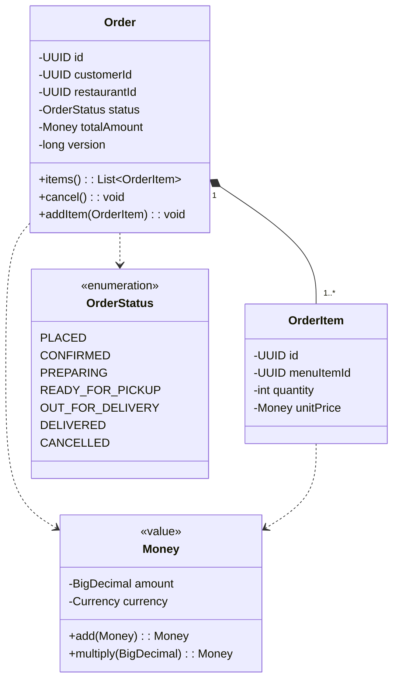
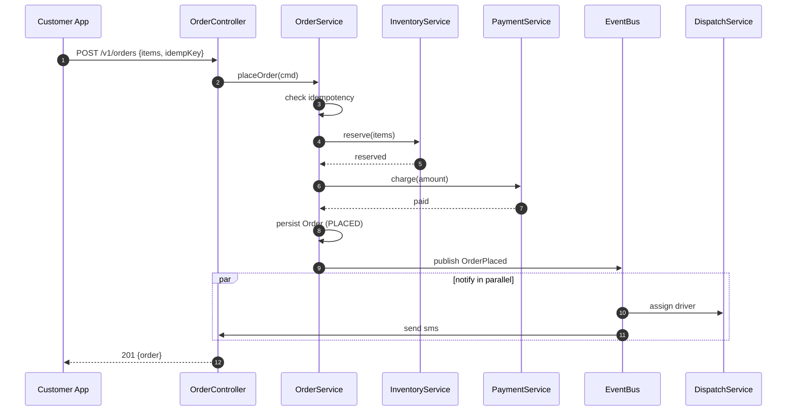
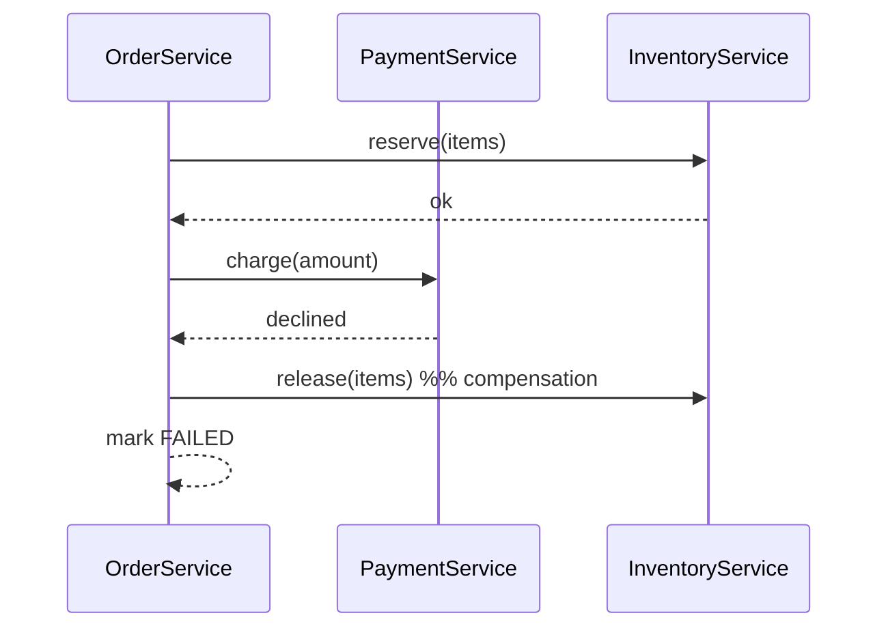
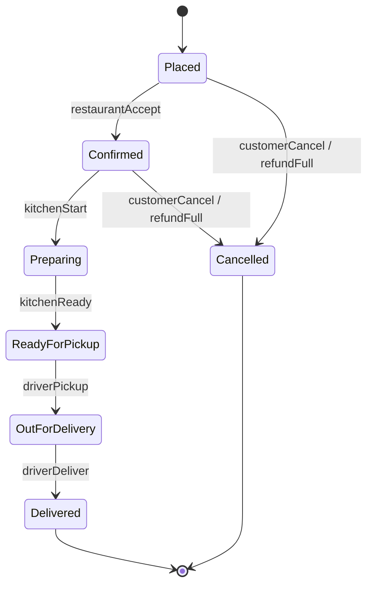
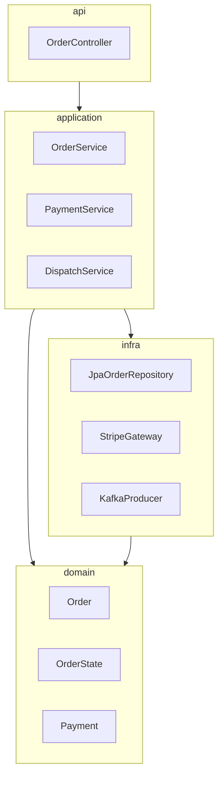
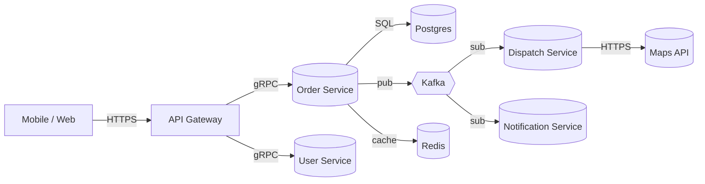
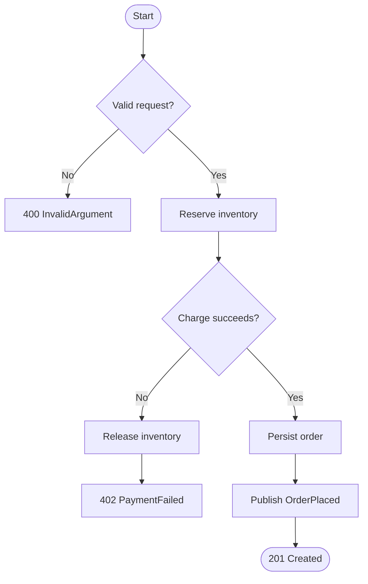

# 09 · UML Tutorial — Class, Sequence, State, Package, Component

> UML is the standard visual vocabulary for designs. You don't need to be a Rational Rose expert. You need to draw the right diagram at the right moment.

We use **Mermaid** throughout this repo because it renders inside Markdown.

---

## When to Use Which Diagram

| Diagram | Use when |
| --- | --- |
| **Class** | Showing static structure: entities, relationships, multiplicities |
| **Sequence** | Showing a flow: who calls whom over time |
| **State** | Showing lifecycle: status transitions, guards, effects |
| **Package** | Showing module/package boundaries and dependencies |
| **Component** | Showing deployable units, services, and protocols between them |
| **Activity** | Showing branching workflows; rare in LLD |
| **Deployment** | Showing physical layout; HLD territory |

In a 60-minute LLD, you'll likely draw **3–4** diagrams. Class is mandatory.

---

## 1. Class Diagrams

### Notation

```
+ public         - private          # protected         ~ package-private
<<interface>>    <<abstract>>       <<enumeration>>     <<value>>

Multiplicities:
  1     exactly one
  0..1  zero or one
  *     zero or more
  1..*  one or more
  3..5  range
```

### Relationships

| Symbol | Meaning |
| --- | --- |
| `<|--` | Inheritance (`B` extends `A`) |
| `*--` | Composition (strong "owns") |
| `o--` | Aggregation (weak "uses") |
| `-->` | Association (knows about) |
| `..>` | Dependency (uses temporarily) |
| `<|..` | Realization (implements interface) |

### Example: Order aggregate



### Reading rules

1. Read multiplicities **left to right**: an Order has **1..\*** items, an item belongs to **1** order.
2. Filled diamond `*` (composition): items live and die with the order.
3. Empty diamond `o`: weaker ownership (e.g., Order references Customer but doesn't own it).
4. `<<value>>` indicates an immutable value object.

### Common mistake

Drawing a class diagram with **methods only** and no fields. Or fields only and no methods. Both miss the point. Show enough to convey structure.

---

## 2. Sequence Diagrams

Sequence diagrams show **interaction over time**. Lifelines are vertical; arrows are messages.

### Notation

```
->>   sync request
-->>  return / response
->    async / one-way
loop  loop
alt   alternatives (if/else)
opt   optional block
par   parallel block
```

### Example: place order flow



### Tips

- Use `autonumber` for crisp explanations.
- One actor per lifeline. Don't crowd.
- Show the **happy path** first. Then a separate diagram for errors.
- Use `alt` blocks for "what if payment fails."

### Failure path



---

## 3. State Diagrams

For entities with lifecycles. Each transition has a **trigger**, optional **guard**, optional **effect**.

### Notation

```
state name : description
[*] --> InitialState
StateA --> StateB : trigger [guard] / effect
StateA --> [*]    : terminal
```

### Example: Order lifecycle



### Implementation tips

- If the state has **state-dependent behavior**, use the **State pattern**.
- Otherwise, an `enum` + `transition()` method is fine.
- Encode legal transitions in a single map / matrix:

```java
private static final Map<OrderStatus, Set<OrderStatus>> ALLOWED = Map.of(
  PLACED,           Set.of(CONFIRMED, CANCELLED),
  CONFIRMED,        Set.of(PREPARING, CANCELLED),
  PREPARING,        Set.of(READY_FOR_PICKUP),
  READY_FOR_PICKUP, Set.of(OUT_FOR_DELIVERY),
  OUT_FOR_DELIVERY, Set.of(DELIVERED),
  DELIVERED,        Set.of(),
  CANCELLED,        Set.of()
);
```

A single source of truth for state transitions.

---

## 4. Package Diagrams

Show how packages depend on each other. Useful for **clean architecture** boundaries.



### Direction matters

In **clean architecture**, dependencies point **inward**. `domain` depends on nothing. `application` depends on `domain`. `infra` depends on `application` and `domain` (implements interfaces). `api` depends on `application`.

If your domain depends on infra (e.g., `Order` imports `JpaConnection`), you have a layering violation.

---

## 5. Component / Deployment-ish Diagrams

Show external services and protocols.



This is **HLD-flavored**, but useful in LLD to position your service in a wider system.

---

## 6. Activity Diagrams

Show branching flows / business processes. Less common in LLD but handy for "give me a flowchart of what happens."



---

## 7. Diagram Tooling Tips

| Need | Tool |
| --- | --- |
| In-Markdown | Mermaid |
| Quick whiteboard | Excalidraw |
| Polished docs | PlantUML, Lucidchart, drawio |
| Code-as-diagram | Structurizr (C4 model) |

In an interview, **whiteboard sketches** are fine. The interviewer cares about the structure, not the tool.

---

## 8. Combining Diagrams in a Real Design

A typical LLD doc has:

1. **Class diagram** of core aggregates (1).
2. **Sequence diagram** of the happy path (1).
3. **Sequence diagram** of one error path (1).
4. **State diagram** for the central entity (1).
5. **Package diagram** for layering (1, optional).
6. **Component diagram** for external systems (1, optional).

= 4–6 diagrams. Each system folder in this repo follows that.

---

## 9. Mistakes to Avoid

- Drawing a class diagram with 30 classes — nobody reads it. Show 5–10.
- Sequence diagrams that span 3 screens — split into multiple flows.
- State diagrams without guards/effects — incomplete.
- Class diagrams with no multiplicities — incomplete.
- Confusing composition vs aggregation — pick one and be precise.
- Mixing layers in a class diagram (Order calls a Postgres class). Layering must be visible.

---

## Checklist

- [ ] Class diagram has multiplicities and at least one `<<interface>>` or `<<value>>`.
- [ ] Sequence diagram has both happy path and a failure path.
- [ ] State diagram has triggers, guards, and effects on transitions.
- [ ] Package diagram shows inward dependencies (clean architecture).
- [ ] Each diagram fits one screen.
