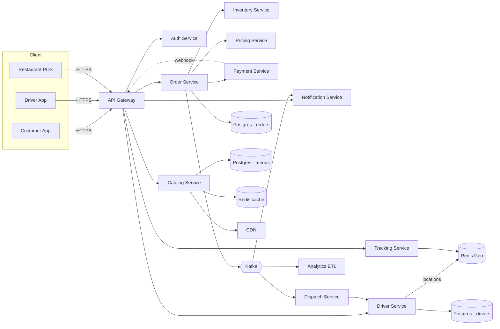

# 03 · Food Delivery — High Level Architecture

## Overview



---

## Service responsibilities

| Service | Owns | Storage |
| --- | --- | --- |
| **Order Service** | Order aggregate, lifecycle, idempotency | Postgres orders DB |
| **Catalog Service** | Restaurant + menu data, search | Postgres + Redis + ES |
| **Inventory Service** | Item-level stock per restaurant | Redis + Postgres |
| **Pricing Service** | Subtotal, tax, fees, surge, discounts | Stateless |
| **Driver Service** | Driver profile, online/offline state | Postgres + Redis |
| **Dispatch Service** | Match order → driver | Reads driver geo, writes assignments |
| **Payment Service** | Charge / refund / webhook handling | Postgres |
| **Tracking Service** | Live driver location → customer | Redis + WebSocket |
| **Notification Service** | Push / SMS / email | Stateless |
| **Auth Service** | JWT, RBAC | Postgres |

Each service has its own DB. Data sharing is via APIs and async events on Kafka.

---

## Why services?

We discuss alternatives in `13_extensions_and_tradeoffs.md`. Briefly:

- **Modular monolith** is fine for V1; can split later.
- **Microservices** start to pay off when teams scale and components have different SLAs (e.g., dispatch is latency-critical while analytics is bulk).
- The **logical decomposition** above is correct regardless of physical deployment.

---

## Key data flows

### 1. Browse and add to cart (read path)

```
CustomerApp → APIGW → CatalogService
                       ├── REDIS (hit?)
                       └── PG     (miss → populate cache)
```

Most browses hit the cache or CDN. The DB is shielded.

### 2. Place an order

```
CustomerApp → APIGW → OrderService
   1. validate cart
   2. call Inventory.reserve(items)
   3. call Pricing.compute(items, surge, promos)
   4. call Payment.charge(amount, idempotencyKey)
   5. persist Order(PLACED) with version=0
   6. publish OrderPlaced to Kafka
   7. return 201 to client
```

Steps 2, 3, 4 are **synchronous**. Steps 6 fanouts handle async side effects.

Asynchronously:

```
Kafka(OrderPlaced)
   ├── DispatchService → assign driver → publish OrderDriverAssigned
   ├── NotificationService → push to restaurant
   └── AnalyticsETL → record
```

### 3. Restaurant accepts

```
RestaurantPOS → APIGW → OrderService.accept(orderId)
   - optimistic lock on Order(version)
   - transition PLACED → CONFIRMED
   - publish OrderConfirmed
```

### 4. Dispatch flow

DispatchService reads driver geo from Redis, scores nearby drivers, sends offer to top driver.

```
DispatchService
   - find drivers nearby pickup (Redis GEOSEARCH)
   - rank by score (distance, busy state, rating)
   - send offer (push) → driver app
   - if accepted in 15s: bind to order; mark driver BUSY
   - else: try next
```

Detailed in `10_design_patterns.md`.

### 5. Live tracking

```
DriverApp → DriverService.updateLocation
   - Redis GEOADD driver:locations
   - Kafka publish driver-locations (async)

CustomerApp ← WebSocket ← TrackingService
   - subscribes by orderId
   - TrackingService listens to Kafka and pushes to subscribed clients
```

### 6. Delivery completion

```
DriverApp → POST /v1/orders/{id}:deliver
   - state machine transition
   - settle driver earnings (event)
   - mark order DELIVERED
   - publish OrderDelivered
```

---

## Synchronous vs asynchronous boundary

| Sync (in request) | Async (event-driven) |
| --- | --- |
| Inventory reserve | Notification fanout |
| Pricing compute | Driver dispatch (initial) |
| Payment charge | Analytics |
| Persist Order | Loyalty / referrals |
| Return to client | Reconciliation |

Anything that **blocks the customer's "place order" tap** is sync; everything else is async. This minimizes p99 latency.

---

## External integrations

| Integration | Direction | Pattern |
| --- | --- | --- |
| Payment Gateway | Sync charge + async webhook | Idempotency key + signed webhooks |
| Maps API | Sync request | Cache for short TTL |
| SMS Provider | Async fire-and-forget | Retry + DLQ |
| Push Service (FCM/APNS) | Async | Retry + DLQ |
| Restaurant POS | Sync push from us | HMAC + retries |

---

## Failure modes & mitigations

| Failure | Impact | Mitigation |
| --- | --- | --- |
| Payment gateway down | Cannot place orders | Circuit breaker; queue retries; offer COD if enabled |
| Dispatch service down | Orders pile up unassigned | Backlog queue; alert; manual reassign tool |
| DB primary failover | ~10 s of write outage | Retry with backoff; use connection pool with retries |
| Driver app offline | Stale location | Mark driver inactive after 60 s no update |
| Restaurant POS disconnected | Cannot accept | Auto-accept if within SLA; or auto-cancel & refund |
| Kafka outage | Side effects delayed | Outbox pattern keeps DB authoritative |

---

## Where each step of the 12-step framework lands

| Step | File |
| --- | --- |
| 1, 2 (requirements + estimation) | this folder, `01_*.md`, `02_*.md` |
| 3 (actors) | `01_requirements.md` |
| 4, 5 (entities + aggregates) | `04_domain_model.md` |
| 6 (APIs) | `06_api_design.md` |
| 7 (DB schema) | `05_database_design.md` |
| 8, 9 (classes + patterns) | `07_class_diagrams.md`, `10_design_patterns.md` |
| 10, 11 (sequence + state) | `08_sequence_diagrams.md`, `09_state_machines.md` |
| 12 (concurrency + scale) | `11_concurrency_and_scaling.md` |

---

## Reasoning summary

- **Postgres** chosen for the order DB — strong consistency, simple joins, mature ops. Sharded by `customer_id` later if needed.
- **Redis** for live driver location and inventory hot path — sub-ms.
- **Kafka** as the system's spine for async events — durable, replayable, horizontally scalable.
- **CDN** for menu images; **Redis cache** for menu JSON.
- **Elasticsearch** (future) for restaurant search by cuisine, fuzzy match.

We always default to Postgres and only escalate when numbers force it.
