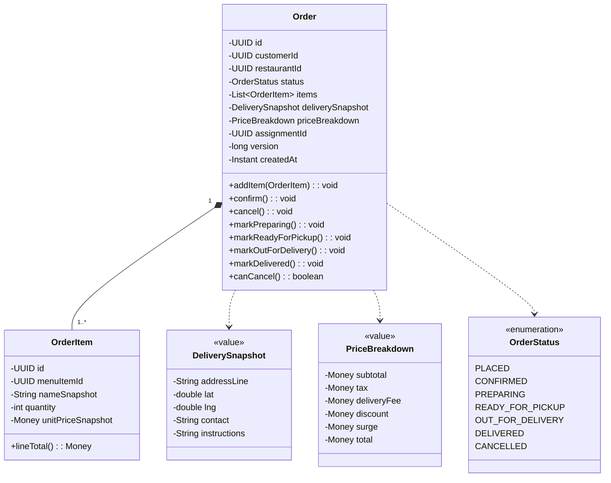
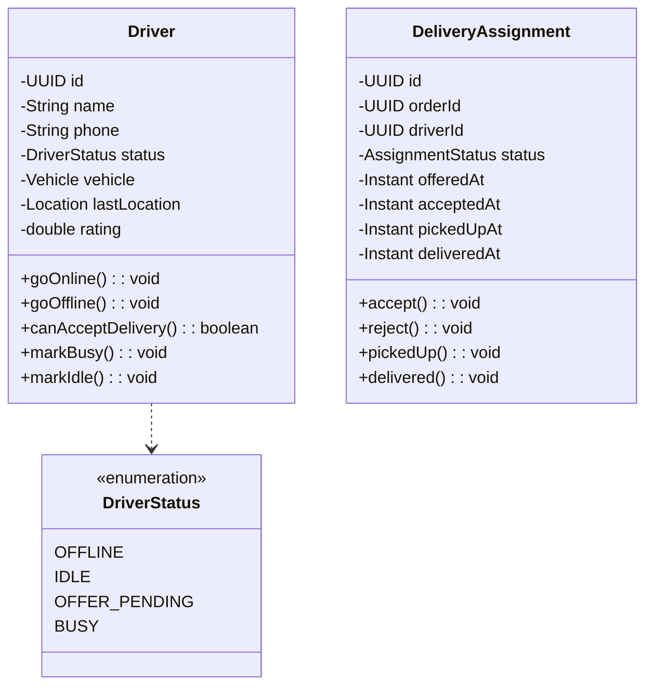

# 04 · Food Delivery — Domain Model

> Entities, aggregates, invariants. This is the soul of your design. Get it wrong and everything else cracks.

---

## Top-level entities

```
Customer        - the user placing the order
Restaurant      - merchant; has a menu
MenuItem        - sellable item under a restaurant
Cart            - in-progress order before placement (transient)
Order           - confirmed order, has lifecycle
OrderItem       - line item inside an order (snapshot of MenuItem)
Address         - delivery address
Driver          - delivery partner
DriverLocation  - latest known location (mutable, frequent update)
Payment         - charge / refund record
Promotion       - discount applied to order
DeliveryAssignment - driver↔order binding with timestamps
```

---

## Aggregates

We group these into **5 aggregates**:

```
1. Customer aggregate
     - Customer (root)
     - Address[]                ← part of customer

2. Restaurant aggregate
     - Restaurant (root)
     - MenuCategory[], MenuItem[]
     - OperatingHours

3. Order aggregate                    ⭐ the heart
     - Order (root)
     - OrderItem[]                    ← composition
     - PriceBreakdown (value)
     - DeliverySnapshot (value)

4. Driver aggregate
     - Driver (root)
     - Vehicle (value)

5. DeliveryAssignment aggregate
     - Assignment (root)              ← links Order ↔ Driver
     - StatusHistory[]
```

### Why five?

Each aggregate has a **distinct consistency boundary**:

- An Order's lifecycle changes via Order, not via Driver.
- A Driver's online state changes via Driver, not via Order.
- The DeliveryAssignment is its own aggregate because it has a separate lifecycle (created, accepted, expired, completed) and you do not want to lock the Order while the driver is mulling over an offer.

The Order does **not** contain the Driver. It holds a `driver_id` reference. The Driver does **not** contain Orders. They communicate via events.

---

## Class layout (sketch)





---

## Invariants (must hold at all times)

These are the **contracts** of your domain. Each is enforced in code.

### Order

1. `total = subtotal + tax + deliveryFee - discount + surge`
2. `subtotal = sum(items.unitPriceSnapshot × items.quantity)`
3. `items.size() ≥ 1` for any order in `PLACED` or beyond
4. `status` transitions follow the order state machine (see `09_state_machines.md`)
5. `version` is monotonically increasing
6. `assignmentId != null` once status reaches `OUT_FOR_DELIVERY`
7. The same `idempotencyKey` cannot map to two different orders

### Driver

1. A driver in `BUSY` cannot accept another offer.
2. `OFFER_PENDING` can become `BUSY` (accepted) or `IDLE` (rejected/expired).
3. A driver who hasn't pinged in 60 s is auto-set to `OFFLINE`.

### DeliveryAssignment

1. Each assignment has a non-null `orderId` and `driverId`.
2. `pickedUpAt` requires `acceptedAt`.
3. `deliveredAt` requires `pickedUpAt`.
4. An assignment in `EXPIRED` or `REJECTED` cannot transition to `ACCEPTED`.

### Inventory

1. `stock_count ≥ 0` always (DB CHECK constraint).
2. Decrement is atomic (`UPDATE WHERE stock_count > 0`).

---

## Value objects

Money, Location, DeliverySnapshot, PriceBreakdown are **immutable value objects**.

```java
public final class Money {
  private final BigDecimal amount;
  private final Currency currency;
  // immutable: add/subtract/multiply return new Money
}

public final class Location {
  private final double lat;
  private final double lng;
  public double distanceKm(Location other) { /* haversine */ }
}
```

**Rule:** anything without identity that participates in domain logic should be a value object. They prevent thousands of bugs.

---

## Snapshots in the order aggregate

Why do we duplicate `name`, `unitPrice`, and address inside the Order?

> Because the Order is **history**. It must not change when:
> - The restaurant updates its menu price tomorrow.
> - The customer renames their saved address.
> - The driver's phone number changes.

Snapshots make the Order immutable from the outside. The price the customer paid is the price they will see in five years. This is a **non-negotiable** principle for any transactional system (orders, invoices, contracts).

We also keep FK pointers (`menu_item_id`, `address_id`) for analytics and reconciliation.

---

## Events the domain emits

Each transition emits at least one event. These power side effects (notifications, dispatch, analytics).

```
OrderPlaced(orderId, customerId, restaurantId, total, items, at)
OrderConfirmed(orderId, restaurantId, at)
OrderRejected(orderId, reason, at)
OrderCancelled(orderId, by, reason, at)
OrderReadyForPickup(orderId, restaurantId, at)
OrderOutForDelivery(orderId, driverId, at)
OrderDelivered(orderId, driverId, deliveredAt)
PriceComputed(orderId, breakdown)
PaymentCaptured(orderId, paymentId, amount)
PaymentFailed(orderId, reason)

DriverOnline(driverId, at)
DriverOffline(driverId, at)
DeliveryOffered(assignmentId, driverId, expiresAt)
DeliveryAccepted(assignmentId, driverId)
DeliveryRejected(assignmentId, driverId, reason)
DeliveryExpired(assignmentId)
DriverPickedUp(assignmentId, driverId)
```

**These are domain events**, not "command requests." They describe what happened, in past tense. We use them with the **Outbox pattern** to make the DB write + event publish atomic.

---

## Bounded contexts (DDD lens)

The five aggregates live in **3 bounded contexts**:

| Context | Aggregates |
| --- | --- |
| **Ordering** | Customer, Order |
| **Catalog** | Restaurant, MenuItem, Inventory |
| **Logistics** | Driver, DeliveryAssignment |

Cross-context communication is via **events** and **anti-corruption layers** (e.g., the Order references a `restaurant_id` but doesn't import the Restaurant class).

---

## Things we explicitly do NOT model

- Cart in the backend domain. Carts are client-side or kept in Redis with TTL. They are not an aggregate; they have no transactional invariants.
- Reviews / ratings. Out of scope.
- Promotions. Modeled as a Strategy injected into Pricing; not an aggregate of its own.

This keeps the design tight.

---

## Output of this step

We have:

- 5 aggregates with a **single root** each.
- A clear list of **invariants** per aggregate.
- A **value-object** layer for `Money`, `Location`, snapshots.
- A list of **domain events** that wire the system together.

Next: `05_database_design.md` translates these into tables.
