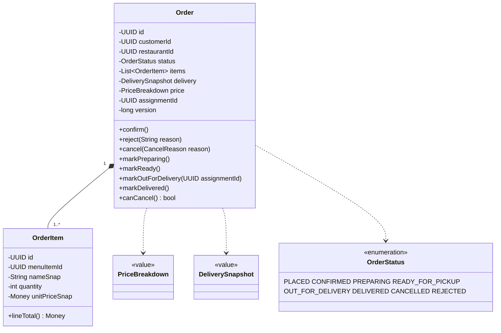
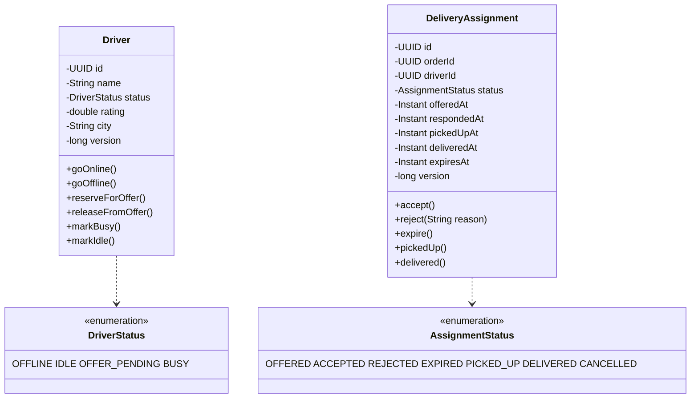
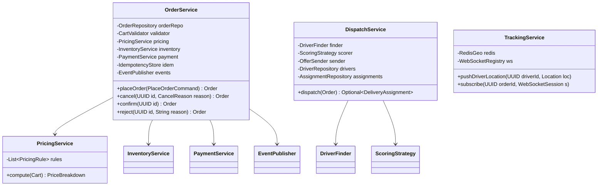
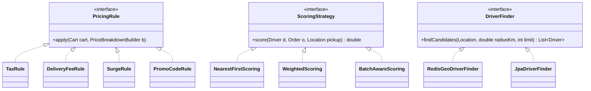
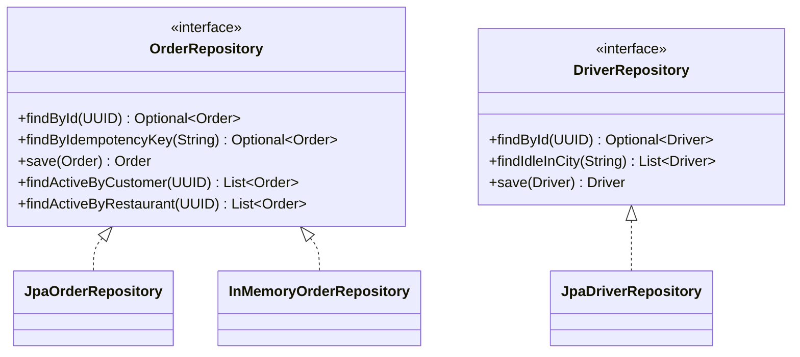
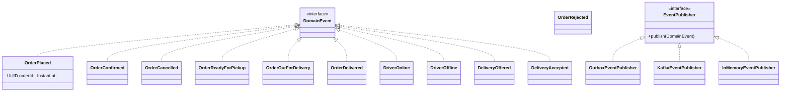

# 07 · Food Delivery — Class Diagrams

## Domain layer (aggregates)

---

## Application services

---

## Pluggable strategies

The `ScoringStrategy` is what makes "nearest" vs "highest-rated" vs "batch-aware" pluggable. We discuss it in detail in `10_design_patterns.md`.

---

## Repositories

---

## Events

---

## Layering (clean architecture)

```mermaid
flowchart LR
  subgraph api[api]
    OrderController
    DriverController
    RestaurantController
  end

  subgraph app[application]
    OrderService
    DispatchService
    TrackingService
    PricingService
  end

  subgraph dom[domain]
    Order
    Driver
    DeliveryAssignment
    PricingRule_int[PricingRule]
    OrderRepository_int[OrderRepository]
    EventPublisher_int[EventPublisher]
  end

  subgraph infra[infra]
    JpaOrderRepository
    KafkaEventPublisher
    RedisGeoDriverFinder
    StripeGateway
  end

  api --> app
  app --> dom
  infra --> dom
  app --> infra
```

`infra` implements interfaces declared in `dom`. `app` orchestrates. `api` exposes HTTP.

> The arrow that **must not exist** is from `dom` to `infra`. If you ever see `import com.example.infra.*` inside a domain class, you have a leak.

---

## Key takeaways

- **Order** and **DeliveryAssignment** are separate aggregates; they communicate via events.
- **Strategies** plug in at every place an algorithm varies (pricing, scoring, finding).
- **Repositories** are interfaces in `domain`; implementations live in `infra`.
- **EventPublisher** is the seam between sync transaction and async fanout (Outbox pattern).
- The whole codebase respects the **dependency rule** of clean architecture.
