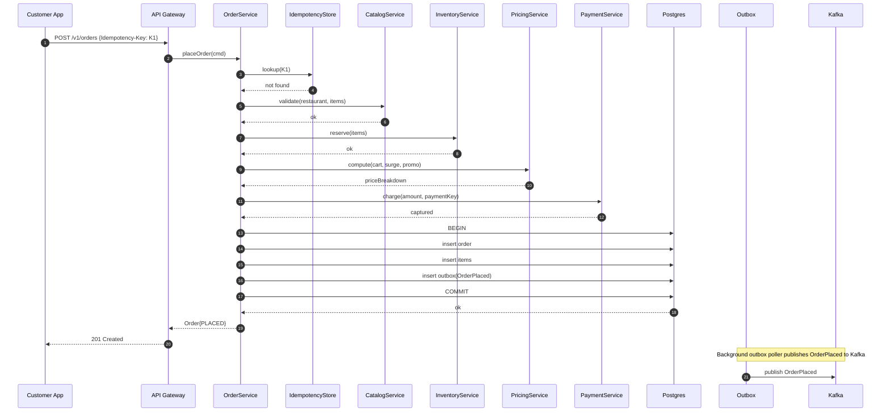
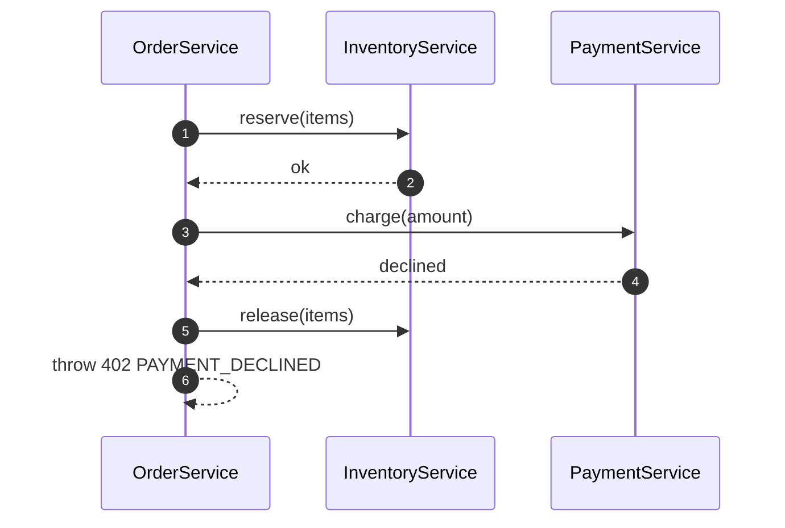
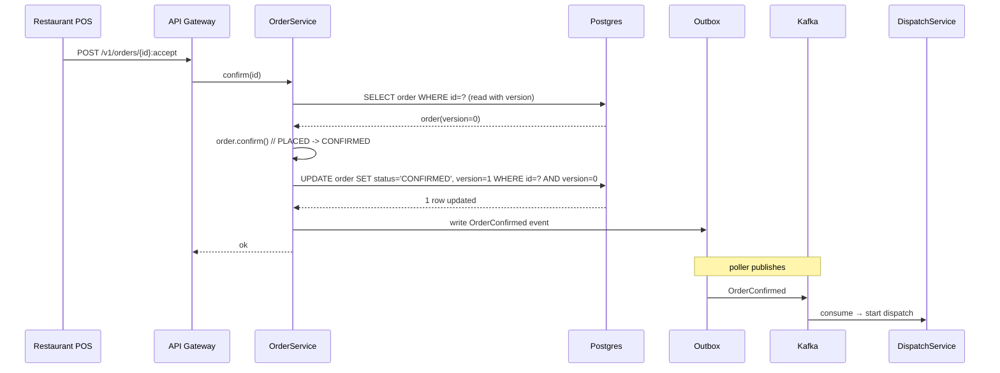
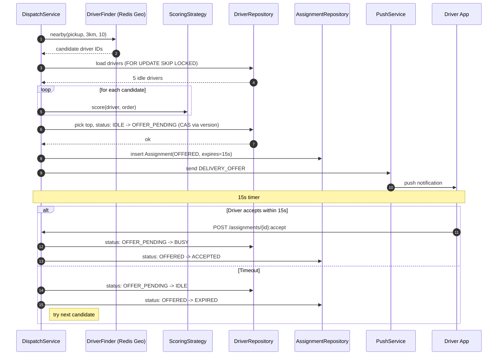
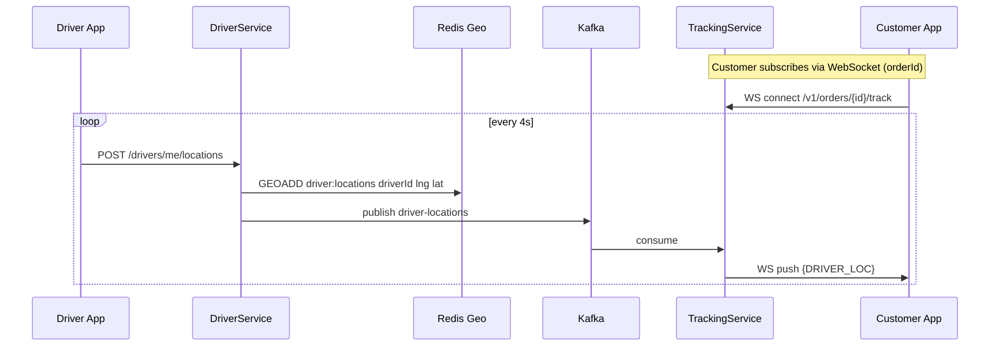
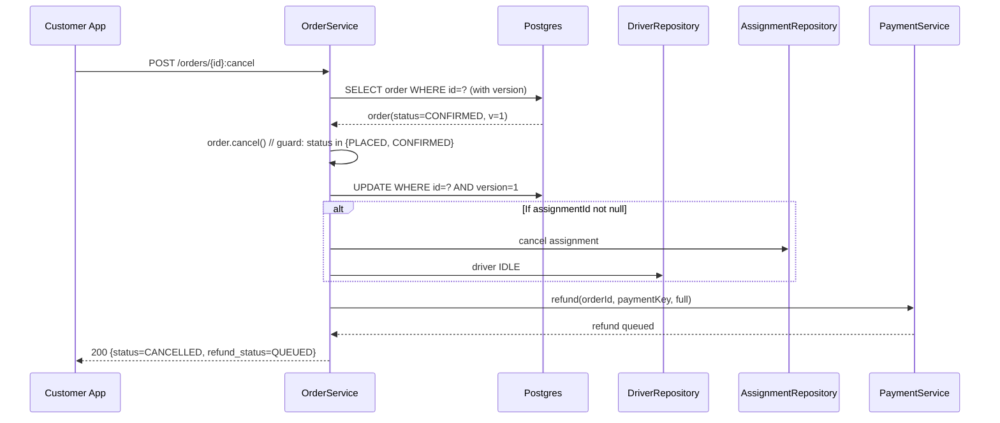
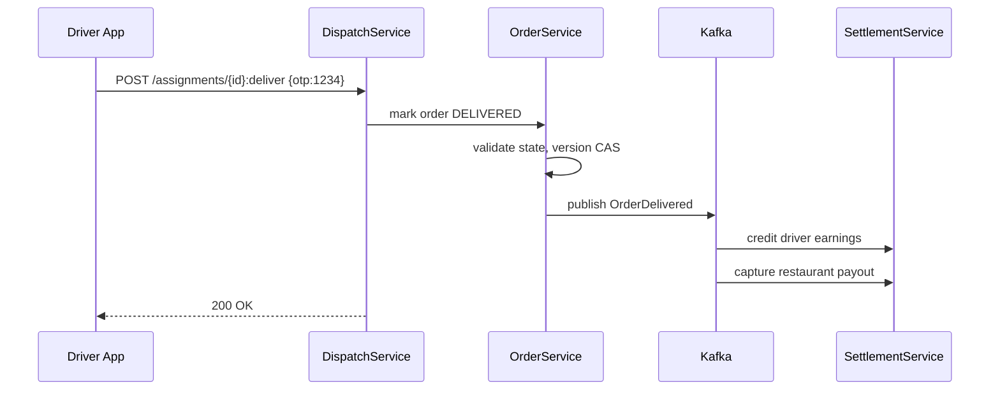
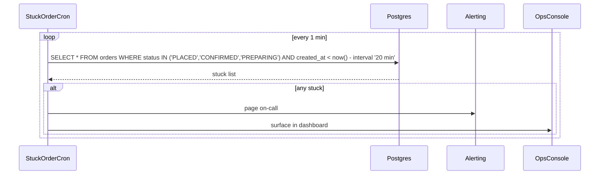

# 08 · Food Delivery — Sequence Diagrams

## 1. Place order — happy path

Key insight: the order persistence and the outbox event happen in the **same transaction**. The Kafka publish happens later, asynchronously, but durably.

---

## 2. Place order — payment failure (compensation)

If charging fails after inventory reservation, we explicitly release inventory. Otherwise items get stuck "reserved."

---

## 3. Restaurant accepts order

Optimistic lock ensures we never overwrite a concurrent transition.

---

## 4. Dispatch — find and offer driver

`FOR UPDATE SKIP LOCKED` lets parallel dispatchers pick **different** candidates safely.

---

## 5. Live tracking flow

Customer app gets sub-second latency updates. Redis is the source-of-truth for "where is driver right now"; Kafka is the durable bus for downstream.

---

## 6. Customer cancels order

Note: refund is **async**; the API doesn't wait for actual money movement.

---

## 7. Order delivered

Settlement is a downstream consumer. Order delivery does not block on it.

---

## 8. Stuck-order monitoring

Required for any production system. Often forgotten in interviews.

---

## What these diagrams reveal

- The **transaction boundary** is always around the local DB write + outbox.
- All cross-service work is **async via Kafka**.
- All state-machine transitions use **optimistic locking** via `version`.
- Compensation paths (refund, inventory release) are **explicit**.
- Background workers fill the gap (cron for stuck orders, outbox poller for events).

If you can draw and explain these 8 diagrams, you have demonstrated end-to-end understanding of the system.
