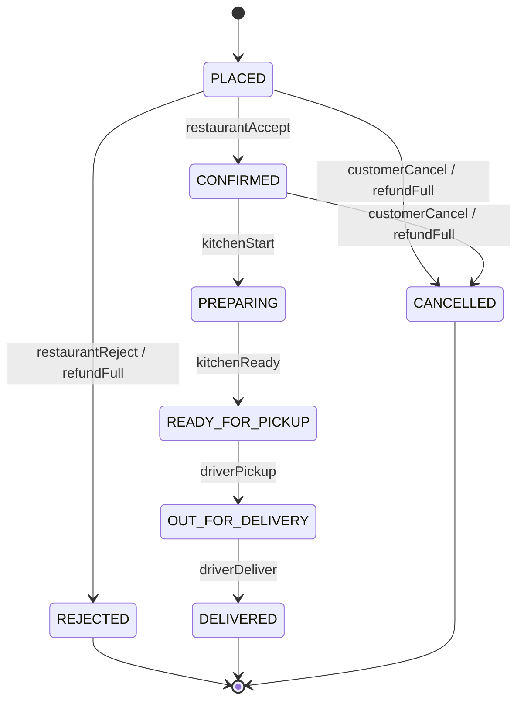
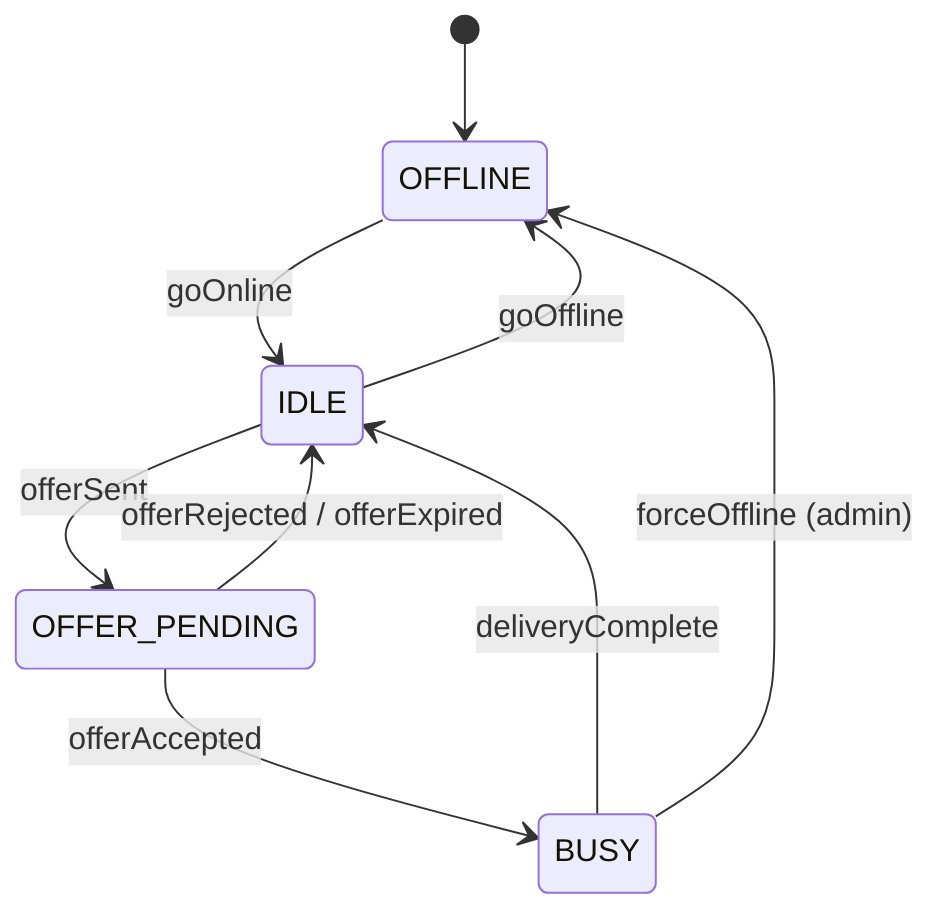
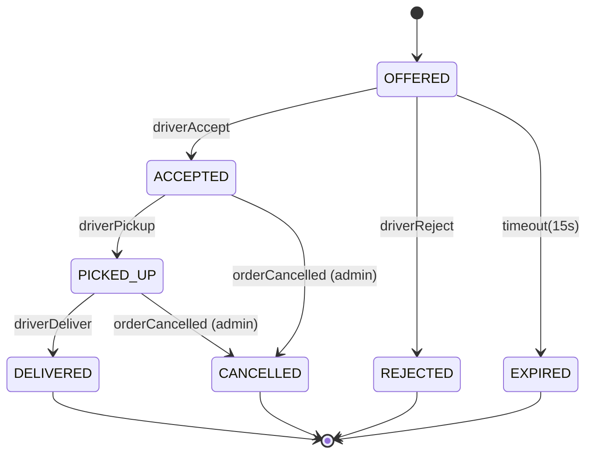

# 09 · Food Delivery — State Machines

State machines are the single most-tested LLD concept in this domain. We design **two**:

1. **Order** lifecycle.
2. **Driver** lifecycle.
3. **DeliveryAssignment** lifecycle (bonus).

For each, we show the diagram, the transition table, the guards, the effects, and the implementation.

---

## 1. Order state machine



### Transition table

| From | Event | To | Guard | Effect |
| --- | --- | --- | --- | --- |
| PLACED | restaurantAccept | CONFIRMED | restaurant active | publish OrderConfirmed; notify customer |
| PLACED | restaurantReject | REJECTED | reason provided | refund full; release inventory; notify customer |
| PLACED | customerCancel | CANCELLED | within window | refund full; release inventory |
| CONFIRMED | kitchenStart | PREPARING | order has assignment OR will get one | publish OrderPreparing |
| CONFIRMED | customerCancel | CANCELLED | within cancel window | refund full; cancel assignment if exists |
| PREPARING | kitchenReady | READY_FOR_PICKUP | items prepared | publish OrderReadyForPickup; ping assigned driver |
| READY_FOR_PICKUP | driverPickup | OUT_FOR_DELIVERY | assignment ACCEPTED | publish OrderOutForDelivery; start tracking |
| OUT_FOR_DELIVERY | driverDeliver | DELIVERED | OTP verified | publish OrderDelivered; settle earnings |

### What is **not** allowed?

Anything else. Examples:

- PLACED → DELIVERED (skips kitchen)  ← `IllegalStateException`
- DELIVERED → CANCELLED (already complete)
- READY_FOR_PICKUP → PREPARING (no time travel)
- CANCELLED → anything (terminal)
- OUT_FOR_DELIVERY → CANCELLED (must be admin-initiated; we don't allow user cancel here)

We encode this **once**, in a transition map.

### Implementation

```java
public enum OrderStatus {
  PLACED, CONFIRMED, PREPARING, READY_FOR_PICKUP,
  OUT_FOR_DELIVERY, DELIVERED, REJECTED, CANCELLED
}

public final class OrderStateMachine {
  private static final Map<OrderStatus, Set<OrderStatus>> ALLOWED = Map.of(
    PLACED,           Set.of(CONFIRMED, REJECTED, CANCELLED),
    CONFIRMED,        Set.of(PREPARING, CANCELLED),
    PREPARING,        Set.of(READY_FOR_PICKUP),
    READY_FOR_PICKUP, Set.of(OUT_FOR_DELIVERY),
    OUT_FOR_DELIVERY, Set.of(DELIVERED),
    DELIVERED,        Set.of(),
    CANCELLED,        Set.of(),
    REJECTED,         Set.of()
  );

  public static void requireTransition(OrderStatus from, OrderStatus to) {
    if (!ALLOWED.getOrDefault(from, Set.of()).contains(to))
      throw new IllegalStateException("Illegal transition " + from + " -> " + to);
  }
}
```

### Where to put state-dependent behavior?

Two options:

#### A. Enum + transition map (preferred)

```java
public class Order {
  private OrderStatus status;
  public void confirm() {
    OrderStateMachine.requireTransition(status, CONFIRMED);
    status = CONFIRMED;
  }
}
```

Simple, correct, fast. Use this for 80 % of cases.

#### B. State pattern (when behavior diverges heavily)

If many methods diverge per state (e.g., `cancel()` differs by state):

```java
public interface OrderState {
  OrderState cancel(Order o, CancelReason r);
  OrderState confirm(Order o);
  OrderStatus tag();
}

public class PlacedState implements OrderState {
  public OrderState confirm(Order o) { return new ConfirmedState(); }
  public OrderState cancel(Order o, CancelReason r) {
    o.refundFull(r);
    o.releaseInventory();
    return new CancelledState();
  }
  public OrderStatus tag() { return PLACED; }
}

public class CancelledState implements OrderState {
  public OrderState cancel(Order o, CancelReason r) { return this; }
  public OrderState confirm(Order o) { throw new IllegalStateException(); }
  public OrderStatus tag() { return CANCELLED; }
}
```

Use this when:
- Cancel logic differs per state (refund full vs partial).
- Each state has many specific operations.
- You want compile-time enforcement of state-specific contracts.

Tradeoff: more classes, more indirection.

### Cancellation policy summary

| Order state | Customer can cancel? | Charge to customer |
| --- | --- | --- |
| PLACED | yes | full refund |
| CONFIRMED (within 60 s) | yes | full refund |
| CONFIRMED (after 60 s) | yes, with cancel fee | partial refund |
| PREPARING | no | n/a |
| READY_FOR_PICKUP | no | n/a |
| OUT_FOR_DELIVERY | no (admin only) | n/a |
| DELIVERED | no | n/a |

This policy is implemented in `Order.canCancel()` and `Order.cancellationFee()`.

---

## 2. Driver state machine



### Transition table

| From | Event | To | Guard | Effect |
| --- | --- | --- | --- | --- |
| OFFLINE | goOnline | IDLE | location ping fresh | add to Redis geo |
| IDLE | goOffline | OFFLINE | no active assignment | remove from Redis geo |
| IDLE | offerSent | OFFER_PENDING | none | hold for 15 s |
| OFFER_PENDING | offerAccepted | BUSY | assignment present | bind to assignment |
| OFFER_PENDING | offerRejected | IDLE | none | release; try next |
| OFFER_PENDING | offerExpired | IDLE | timeout reached | publish DeliveryExpired |
| BUSY | deliveryComplete | IDLE | assignment in DELIVERED | record stats |
| BUSY | forceOffline | OFFLINE | admin only | reassign order |

### Implementation

```java
public class Driver {
  private DriverStatus status;
  private long version;

  public void goOnline()       { transition(OFFLINE, IDLE); }
  public void goOffline()      { requireOneOf(IDLE, OFFER_PENDING); status = OFFLINE; bumpVersion(); }
  public void reserveForOffer(){ transition(IDLE, OFFER_PENDING); }
  public void acceptOffer()    { transition(OFFER_PENDING, BUSY); }
  public void releaseOffer()   { transition(OFFER_PENDING, IDLE); }
  public void completeDelivery(){ transition(BUSY, IDLE); }

  private void transition(DriverStatus required, DriverStatus next) {
    if (status != required)
      throw new IllegalStateException("driver " + id + " in " + status);
    status = next;
    version++;
  }
}
```

The `version` is checked at the SQL update layer for optimistic locking.

---

## 3. DeliveryAssignment lifecycle



The Assignment is the **bridge** between Order and Driver. When it transitions:

- ACCEPTED → Driver: IDLE → BUSY; Order stays.
- PICKED_UP → Order: READY_FOR_PICKUP → OUT_FOR_DELIVERY.
- DELIVERED → Order: OUT_FOR_DELIVERY → DELIVERED; Driver: BUSY → IDLE.

These are **separate aggregates** transacting separately, coordinated via events.

---

## Concurrency in transitions

Every state transition is implemented as:

```java
@Transactional
public Order confirm(UUID orderId) {
  Order o = orderRepo.findById(orderId).orElseThrow();
  o.confirm();                                       // domain check
  long prev = o.version();
  o.bumpVersion();
  int rows = jdbc.update(
    "UPDATE orders SET status=?, version=? WHERE id=? AND version=?",
    o.status().name(), o.version(), o.id(), prev);
  if (rows == 0) throw new OptimisticLockException();
  outbox.write(new OrderConfirmed(o.id()));
  return o;
}
```

If a concurrent transition has bumped `version`, our update fails. We re-read and retry up to N times.

---

## Auditing transitions

Every transition appends to `order_events`:

```sql
CREATE TABLE order_events (
  id          BIGSERIAL PRIMARY KEY,
  order_id    UUID NOT NULL,
  from_status VARCHAR(20) NOT NULL,
  to_status   VARCHAR(20) NOT NULL,
  actor_id    UUID,
  reason      TEXT,
  occurred_at TIMESTAMPTZ DEFAULT now()
);
```

Useful for:
- Customer support timeline.
- Forensics.
- Re-creating state on a stale replica.

---

## Common interviewer trick: orphan states

> "What if the customer's payment was captured but the order row never persisted?"

This is the classic **dual-write** problem. Our defenses:

1. **Insert order before charge** in some flows (you may swap order and payment depending on priority).
2. **Outbox pattern** atomically commits the OrderPlaced event with the order.
3. **Reconciliation jobs** every 5 minutes check `payments` with `gateway_ref` but no matching order in the right state, and either re-create the order or refund.

Mention all three and you've demonstrated staff-level rigor.

---

## Output

We have:

- 3 state machines documented with diagrams + tables.
- A single source-of-truth transition map per machine.
- Concurrency strategy at the SQL level.
- An audit trail for every transition.

Move to `10_design_patterns.md`.
