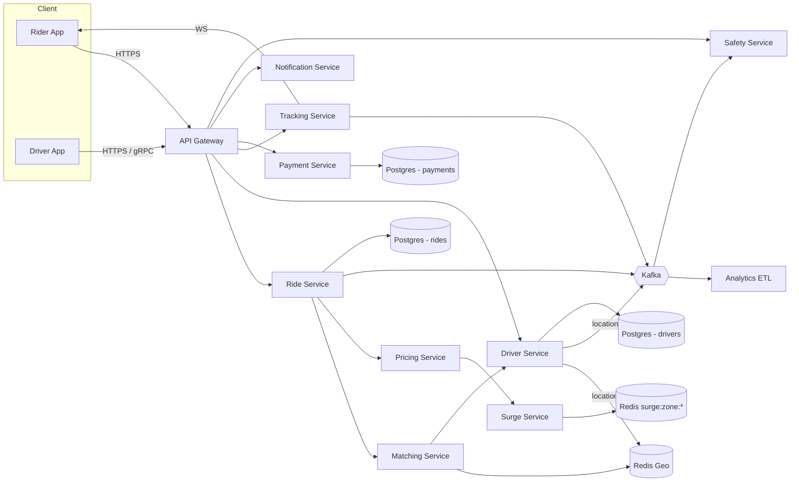

# 03 · Ride Booking — High Level Architecture

## Diagram



## Service responsibilities

| Service | Owns |
| --- | --- |
| **Ride Service** | Ride aggregate, lifecycle, idempotency |
| **Driver Service** | Driver profile, online/offline state |
| **Matching Service** | Driver ↔ ride match, candidate selection, scoring |
| **Pricing Service** | Fare estimate + final billing |
| **Surge Service** | Per-zone surge factor over time |
| **Tracking Service** | Live driver location → rider WebSocket |
| **Payment Service** | Authorization at booking, capture at end |
| **Notification Service** | Push, SMS |
| **Safety Service** | SOS, anomaly detection, audio recording |

## Why these services?

The decomposition follows distinct **rates of change** and **SLAs**:

- **Matching** is latency-critical (sub-second).
- **Pricing/surge** is read-heavy with 1-min update cycles.
- **Tracking** is high-throughput, fan-out heavy.
- **Payments** is correctness-critical, low RPS.
- **Safety** is rare but high-stakes.

Each can scale independently.

---

## Booking flow (sync)

```
Rider → POST /v1/rides {pickup, drop, type, idempotencyKey}
  Ride.fareEstimate via PricingService (sync, ~50 ms)
  Validate payment method has authorization headroom
  Insert Ride(REQUESTED) + outbox event "RideRequested"
  Return 201 with rideId, fareEstimate, fareUpperBound
```

## Match flow (async, event-driven)

```
Kafka(RideRequested) → MatchingService:
  candidates = redisGeo.findNearby(pickup, radiusKm, type)
  scored     = scoringStrategy.rank(candidates, ride)
  for top driver D in order:
    atomic transition: D.status IDLE → OFFER_PENDING (CAS)
    push DELIVERY_OFFER to D's app
    wait 15 s
    if accepted: bind ride.driverId; ride.status = MATCHED; publish RideMatched
    if declined / expired: try next
  if exhausted: publish NoDriverAvailable; ride.status = CANCELLED
```

## Trip lifecycle

```
RideMatched → driver navigates to pickup → POST :arrived
RideArrived → rider gets notification → POST :start (driver) → RideStarted
RideStarted → driver navigates to drop → POST :end → RideCompleted
PaymentCaptured event → settle driver earnings, update ride.status=PAID
```

## External integrations

| Integration | Pattern |
| --- | --- |
| Maps / Routing | Sync; cache for short TTL; fall back if down |
| SMS / Push | Async fire-and-forget with retries + DLQ |
| Payment gateway | Sync `authorize`, sync `capture` at end, async webhook |
| Background check service | Async on driver onboarding only |

---

## Failure modes & mitigations

| Failure | Mitigation |
| --- | --- |
| Match engine slow | Circuit breaker; serve "looking for a driver" indefinitely (rider can cancel) |
| Driver app loses GPS | Continue with last known; mark stale after 60 s |
| Rider GPS jumps wildly | Anomaly filter; re-request at pickup |
| Payment auth fails | Block ride; rider retries with new method |
| Kafka outage | Outbox holds events; resume on restore |
| Postgres failover | App retries idempotent commands |
| Driver loses connection mid-trip | Tracking continues from rider GPS; SOS still works |
| SOS hardware misuse / accidental | Confirmation prompt; safety team triages |

---

## Output

This HLD names every service, its responsibilities, and the hot data paths. Subsequent files dive into each component.
