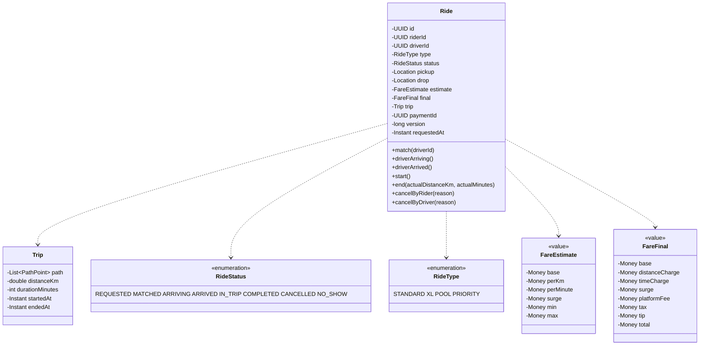
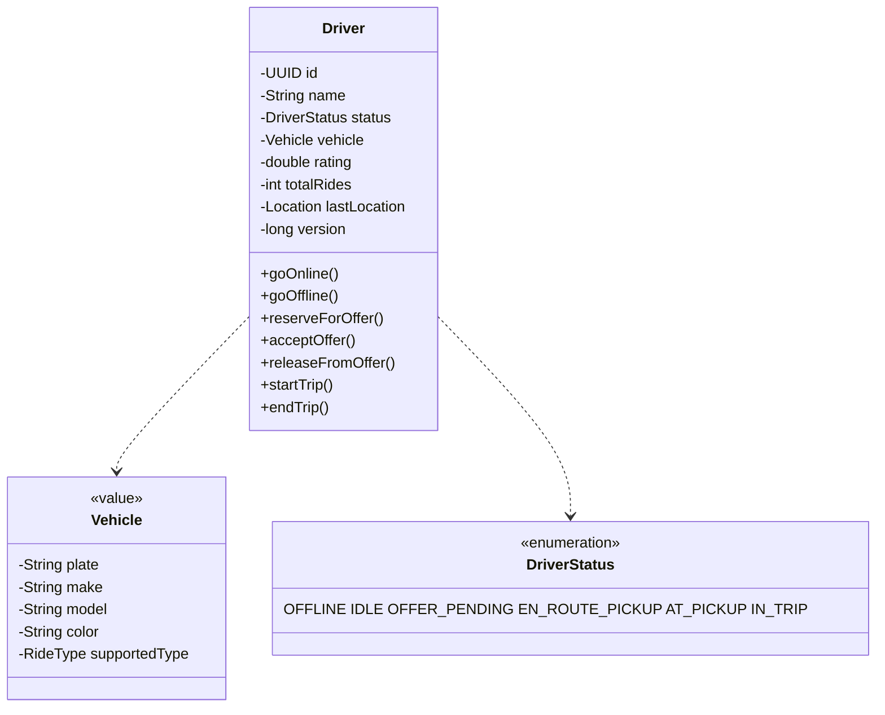

# 04 · Ride Booking — Domain Model

## Aggregates

```
1. Rider
2. Driver (with Vehicle as value)
3. Ride            ⭐
4. Trip            (sub-entity within Ride aggregate)
5. PaymentAuth/Capture (separate aggregate)
6. SurgeZone       (read-only aggregate; updated by Surge Service)
```

We have one big aggregate (Ride) with the trip details, and several reference-only aggregates.

---

## Entities





---

## Invariants

### Ride

1. `pickup != drop`.
2. `type` is fixed at request; cannot change after.
3. `state` transitions follow the ride state machine.
4. `driverId` is null until `MATCHED`, never null after.
5. `final.total >= estimate.min` and `<= estimate.max + tip`.
6. `version` monotonically increasing.
7. Idempotency key unique.

### Driver

1. Only an `IDLE` driver can become `OFFER_PENDING`.
2. Only an `OFFER_PENDING` driver can become `EN_ROUTE_PICKUP`.
3. Trip ends only after `IN_TRIP`.
4. A driver in `OFFLINE` cannot be matched.
5. `lastLocation` is updated by location stream; not transactional with status.

### Surge

1. Surge factor `f >= 1.0`.
2. Surge has a per-zone `last_updated_at`. Reads use a small TTL cache (~5 s).
3. Surge per ride is **locked at request time**, not at end.

---

## Value objects

`Location`, `Vehicle`, `Money`, `FareEstimate`, `FareFinal`, `PathPoint` — all immutable.

Why important: keeping fares as value objects (no setters, no identity) prevents accidental mutation across the lifecycle.

---

## Surge model

A `SurgeZone` is a (geohash7, ride_type) tuple with:

```
factor: 1.0..3.0
updated_at: timestamp
ttl: 60 s (recomputed every minute by Surge Service)
```

The Surge Service consumes:
- Real-time supply (idle drivers per zone, from Redis)
- Real-time demand (pending requests per zone, from rides DB / Kafka)
- Historical calibration (machine-learned baseline)

It writes to Redis `surge:<zone>:<type>` with TTL.

The PricingService reads this hash; if missing, falls back to 1.0.

---

## Cancellation policy

| Who cancels | Ride state | Fee to rider | Compensation to driver |
| --- | --- | --- | --- |
| Rider | REQUESTED | none | none |
| Rider | MATCHED (within 60 s) | none | none |
| Rider | MATCHED (after 60 s) or ARRIVING | flat ₹30 | half-fee |
| Rider | ARRIVED (no-show after 5 min wait) | flat ₹50 | full-fee |
| Driver | MATCHED | none | penalty (rating) |
| Driver | ARRIVING / ARRIVED | none | penalty (rating + temp ban) |
| System | NO_DRIVER | none | none |

This policy is encoded in `CancellationPolicyService`, a `Strategy`-driven component (different cities have different policies).

---

## Domain events

```
RideRequested(rideId, riderId, pickup, drop, type)
RideMatched(rideId, driverId)
RideArriving(rideId, driverId, etaMinutes)
RideArrived(rideId, at)
RideStarted(rideId, at)
RideCompleted(rideId, distance, duration, fareTotal)
RideCancelledByRider(rideId, fee, reason)
RideCancelledByDriver(rideId, reason)
RideNoShow(rideId, fee)
DriverOnline / DriverOffline
DriverOfferSent / Accepted / Declined / Expired
PaymentAuthorized / PaymentCaptured / PaymentFailed / PaymentRefunded
SurgeUpdated(zone, type, factor)
```

Used by Tracking, Notification, Settlement, Analytics, Safety.

---

## Bounded contexts

| Context | Aggregates |
| --- | --- |
| Ride orchestration | Ride |
| Driver | Driver, Vehicle |
| Pricing | FareEstimate, SurgeZone |
| Payment | PaymentAuth, PaymentCapture |
| Safety | SOSEvent (event-only) |

Cross-context communication is via events.
