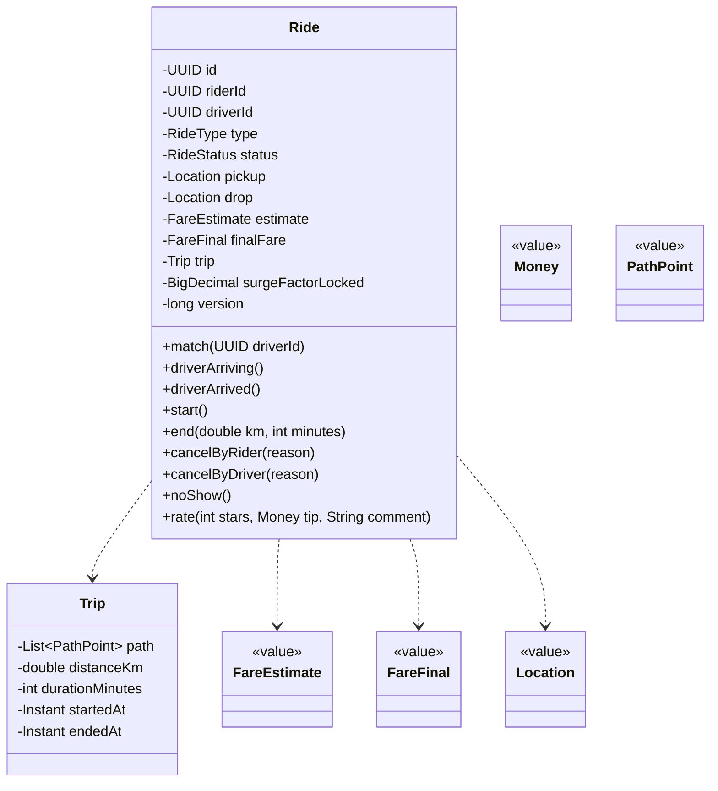
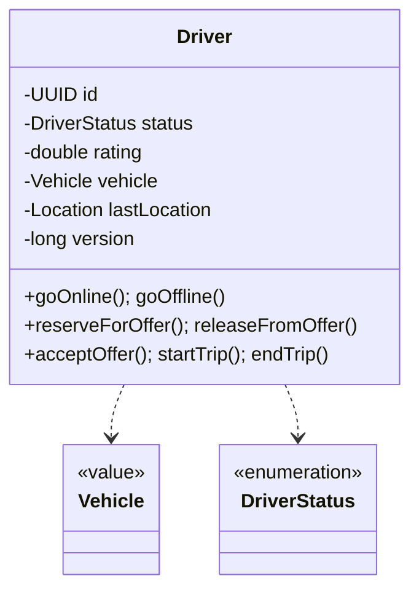
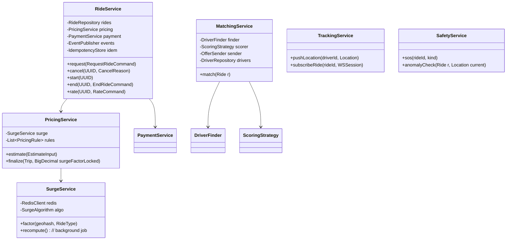
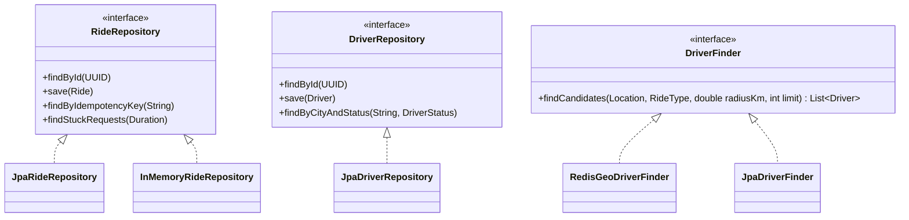
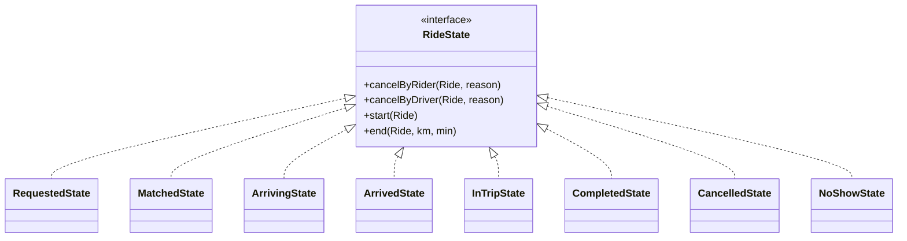

# 07 · Ride Booking — Class Diagrams

## Domain layer

---

## Application services

---

## Strategies

```mermaid
classDiagram
  class PricingRule {
    <<interface>>
    +apply(Trip, FareBuilder)
  }
  class BaseFareRule
  class DistanceTimeRule
  class SurgeRule
  class PlatformFeeRule
  class TaxRule
  class TipRule

  PricingRule <|.. BaseFareRule
  PricingRule <|.. DistanceTimeRule
  PricingRule <|.. SurgeRule
  PricingRule <|.. PlatformFeeRule
  PricingRule <|.. TaxRule
  PricingRule <|.. TipRule

  class ScoringStrategy {
    <<interface>>
    +score(Driver, Ride, Location pickup) double
  }
  class NearestFirstScoring
  class ETAFirstScoring
  class FairnessScoring
  ScoringStrategy <|.. NearestFirstScoring
  ScoringStrategy <|.. ETAFirstScoring
  ScoringStrategy <|.. FairnessScoring

  class SurgeAlgorithm {
    <<interface>>
    +compute(int idleDrivers, int pendingRides, double historicalBaseline) BigDecimal
  }
  class DemandSupplyAlgorithm
  class MLAlgorithm
  SurgeAlgorithm <|.. DemandSupplyAlgorithm
  SurgeAlgorithm <|.. MLAlgorithm

  class CancellationPolicy {
    <<interface>>
    +feeFor(Ride r, CancelActor actor) Money
  }
  class IndiaCancellationPolicy
  class USCancellationPolicy
  CancellationPolicy <|.. IndiaCancellationPolicy
  CancellationPolicy <|.. USCancellationPolicy
```

---

## Repositories

---

## State pattern (Ride)

For `Ride.cancelByRider()`:

Each state encodes legal operations. We use full State pattern here (vs enum + map) because cancellation **fee depends on state**, and `start()` validity depends on state. Encapsulating in state classes keeps domain logic local.

---

## Layering

```mermaid
flowchart LR
  subgraph api
    RideController; DriverController; AdminController
  end
  subgraph application
    RideService; MatchingService; PricingService; SurgeService; TrackingService; SafetyService
  end
  subgraph domain
    Ride; Driver; FareEstimate
    RideRepository_int[<<interface>> RideRepository]
  end
  subgraph infra
    JpaRideRepository; RedisGeoDriverFinder; KafkaPublisher; StripeGateway
  end

  api --> application
  application --> domain
  application --> infra
  infra --> domain
```

---

## Take-aways

- **Ride** is the central aggregate; `Trip` is composed inside it.
- **Strategy** for pricing rules, scoring, surge algo, cancellation policy — every variation point.
- **State pattern** for `Ride` because cancellation fees and legal operations are state-dependent.
- All cross-service comms via `EventPublisher` (Outbox + Kafka in production).
