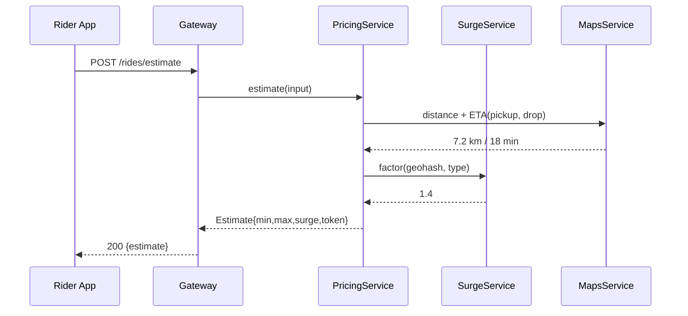
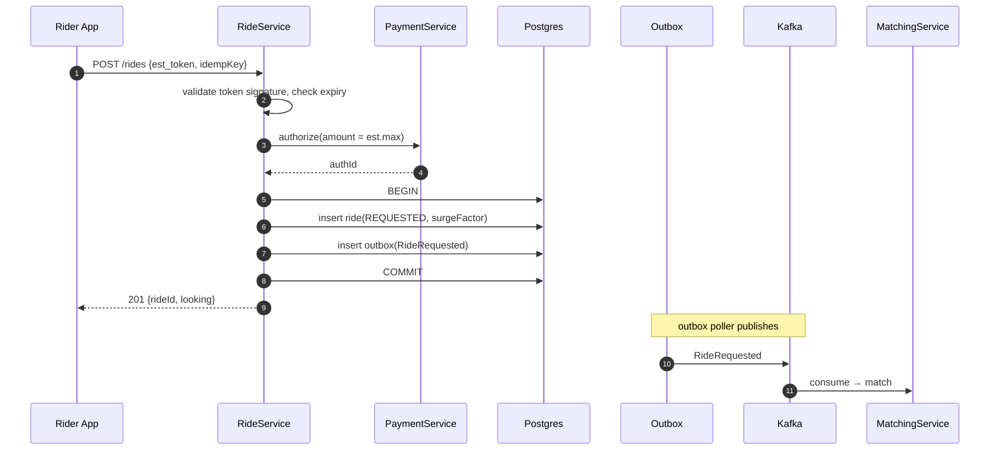
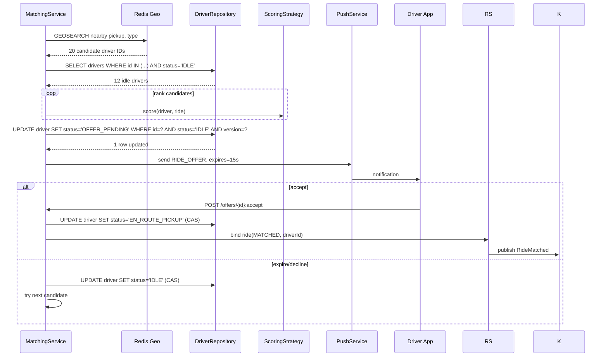
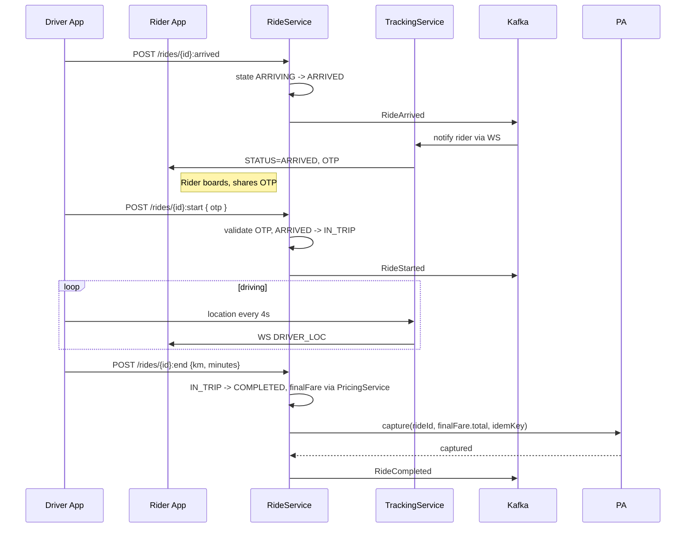
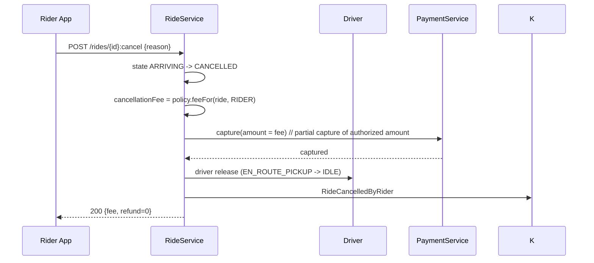
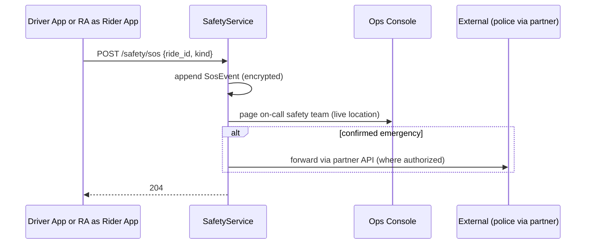
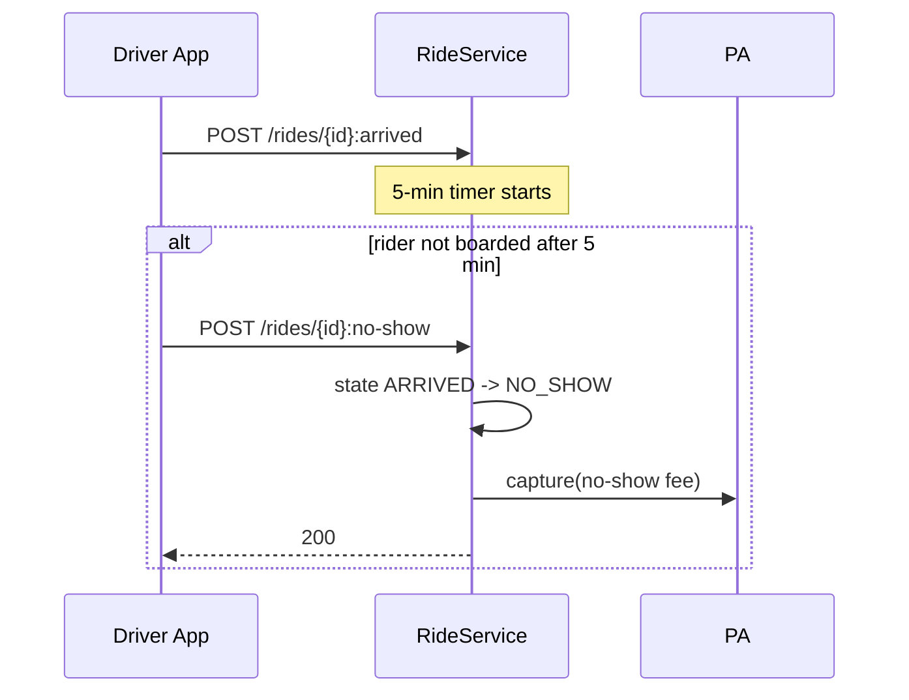

# 08 · Ride Booking — Sequence Diagrams

## 1. Fare estimate

`token` is HMAC-signed by the server so the rider can't fake a low surge later.

---

## 2. Request ride (happy path)

We **authorize** at request time (not capture). Capture happens at trip end with the actual amount.

---

## 3. Match flow

---

## 4. Trip lifecycle

---

## 5. Rider cancels mid-arrival

Driver gets compensated for distance traveled (out of the fee, plus base subsidy).

---

## 6. SOS

Safety is fail-closed: if the safety service is down, we still record locally and try alternative channels.

---

## 7. No-show

We don't auto-fire NO_SHOW — driver explicitly requests it after waiting; the timer just makes the button visible.

---

## What these reveal

- All state transitions follow a deterministic pattern: **read → guard → CAS → publish event**.
- Authorization at request, capture at end (partial on cancel) — standard for hold-style payments.
- Tracking is a separate fan-out concern; not in the request path.
- Safety integrates via events but with the highest priority queue.
