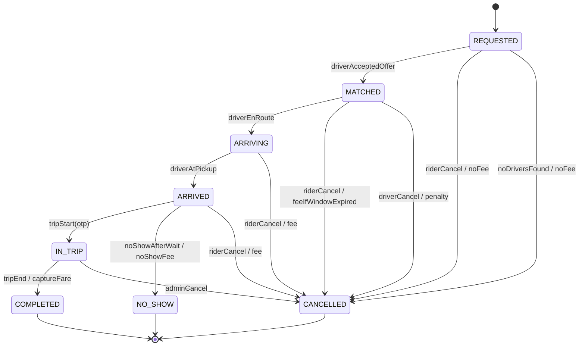
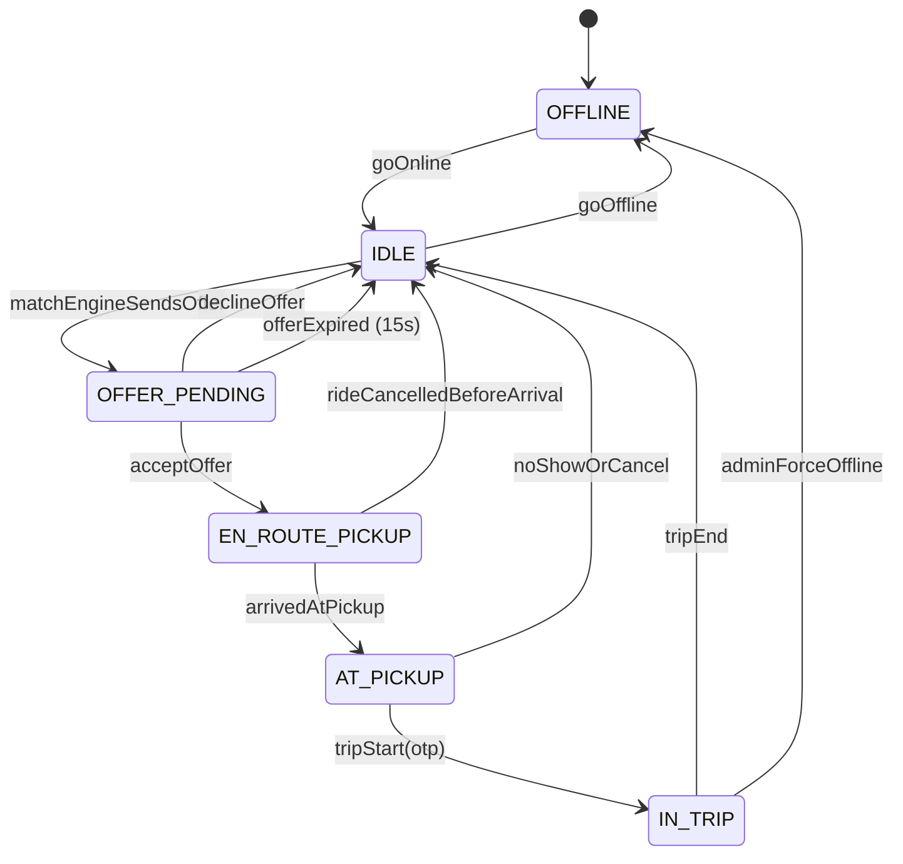
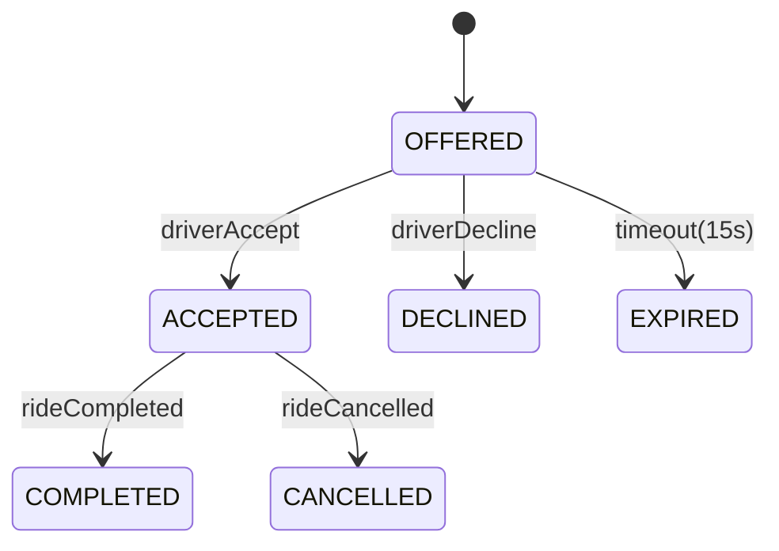

# 09 · Ride Booking — State Machines

## Ride state machine



### Transition table

| From | Event | Guard | To | Effect |
| --- | --- | --- | --- | --- |
| REQUESTED | driverAcceptedOffer | driver in OFFER_PENDING | MATCHED | bind driver, publish RideMatched |
| REQUESTED | riderCancel | within window | CANCELLED | no fee |
| REQUESTED | noDriversFound | match exhausted | CANCELLED | no fee, void auth |
| MATCHED | driverEnRoute | none | ARRIVING | start ETA tracking |
| MATCHED | riderCancel | window expired? | CANCELLED | conditional fee |
| MATCHED | driverCancel | none | CANCELLED | driver penalty; reassign? |
| ARRIVING | driverAtPickup | none | ARRIVED | publish ARRIVED, OTP |
| ARRIVING | riderCancel | none | CANCELLED | fee, partial driver compensation |
| ARRIVED | tripStart | OTP matches | IN_TRIP | record start time, start meter |
| ARRIVED | noShowAfterWait | waited 5 min | NO_SHOW | no-show fee |
| IN_TRIP | tripEnd | none | COMPLETED | compute final fare; capture payment |
| IN_TRIP | adminCancel | admin role | CANCELLED | manual review |

### Why State pattern here (vs enum-only)

Cancellation behavior **differs heavily by state**:
- REQUESTED / MATCHED-within-window: free.
- MATCHED / ARRIVING: cancellation fee.
- ARRIVED: cancellation fee + driver compensation.
- IN_TRIP: admin-only.
- COMPLETED / CANCELLED: not allowed.

Encoding this in `if/switch(status)` becomes a 200-line method. State pattern delegates to a per-state class:

```java
public interface RideState {
  RideStatus tag();
  void cancelByRider(Ride r, CancelReason reason);
  void cancelByDriver(Ride r, CancelReason reason);
  void start(Ride r, String otp);
  void end(Ride r, double km, int minutes);
}

public class ArrivedState implements RideState {
  public RideStatus tag() { return RideStatus.ARRIVED; }
  public void cancelByRider(Ride r, CancelReason reason) {
    Money fee = r.policy().feeFor(r, CancelActor.RIDER);
    r.applyCancellationFee(fee);
    r.transitionTo(new CancelledState());
  }
  public void start(Ride r, String otp) {
    if (!r.otp().equals(otp)) throw new InvalidOtpException();
    r.transitionTo(new InTripState());
  }
  public void end(Ride r, double km, int min) {
    throw new IllegalStateException("trip not started yet");
  }
  // ...
}
```

For an enum-driven map, we'd have to encode all this logic externally with `instanceof`-style branching; state classes keep it cohesive.

---

## Driver state machine



### Concurrency-critical guards

- IDLE → OFFER_PENDING **must** use optimistic CAS to prevent two matches.
- OFFER_PENDING → EN_ROUTE_PICKUP must check `assignment_id` matches.
- IN_TRIP → IDLE only via `RideCompleted` event, not direct API.

Implementation:

```sql
UPDATE drivers
SET status = 'OFFER_PENDING', version = version + 1, current_offer_id = ?
WHERE id = ? AND status = 'IDLE' AND version = ?;
```

If 0 rows → another match took this driver → try next.

---

## Offer (assignment) state machine



We track offers in their own table because:
- They expire (separate lifecycle from ride).
- Multiple offers may be sent for the same ride (after declines).
- Audit important.

---

## Composite invariants across machines

These cross-aggregate invariants matter:

1. Ride in `MATCHED` ⟺ exactly one Driver in `EN_ROUTE_PICKUP` for this ride.
2. Ride in `IN_TRIP` ⟺ exactly one Driver in `IN_TRIP` for this ride.
3. Driver leaves `EN_ROUTE_PICKUP` only via Ride state transition events.
4. Driver in `IN_TRIP` cannot accept new offers.

How we enforce:
- Each ride state transition publishes an event.
- Driver state subscribes; transitions accordingly.
- A reconciliation cron every 5 min checks for divergence (e.g., Driver IN_TRIP but no active Ride). Alerts SRE.

---

## Audit table

```sql
CREATE TABLE ride_state_history (
  ride_id     UUID NOT NULL,
  from_status VARCHAR(20),
  to_status   VARCHAR(20) NOT NULL,
  actor_id    UUID,
  reason      TEXT,
  occurred_at TIMESTAMPTZ DEFAULT now()
);
```

This is the audit log for compliance and customer support timelines. Append-only.

---

## Common interviewer trick: stuck states

> "What if a driver accepts an offer and then their app dies?"

Defenses:

1. **Ping freshness** — `last_ping_at` < 30 s. If stale, mark driver `STALE` (a soft state in app code, not DB).
2. **Ride watchdog cron** — if Ride in `MATCHED` for > 10 min without progress, system cancels and re-matches.
3. **Driver re-login** — when the driver app reconnects, server pushes their current ride id; app resumes UI.
4. **Force re-dispatch** — admin button.

State machines help us recognize "stuck" as `(state, time_since_last_transition)`.
