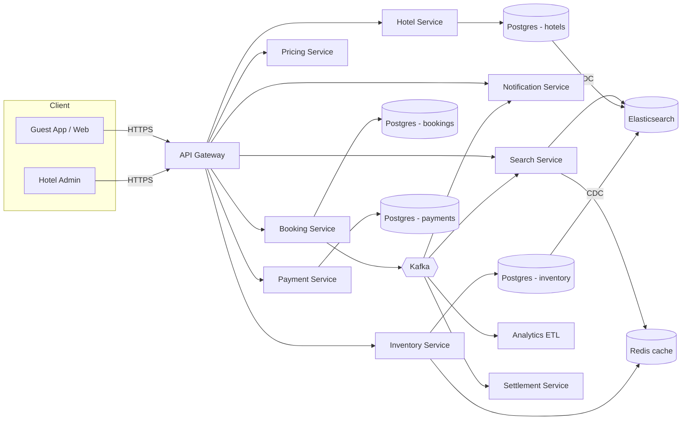

# 03 · Hotel Booking — High Level Architecture



## Service responsibilities

| Service | Owns |
| --- | --- |
| **Hotel Service** | Hotel + rooms + amenities |
| **Inventory Service** | Per-(hotel, room_type, date) availability and price |
| **Pricing Service** | Compose nightly price (base + seasonal + demand-based + promo + tax) |
| **Search Service** | Read-store fronted by Elasticsearch; date-range filtering |
| **Booking Service** | Booking aggregate + lifecycle |
| **Payment Service** | Charge / capture / refund |
| **Notification Service** | Confirmations, reminders |
| **Settlement Service** | Hotel pay-outs, reconciliations |

## Why these services?

- **Search** must scale read-heavy with low latency.
- **Inventory** must be strongly consistent (no oversell).
- **Pricing** runs cold compute; can be its own service.
- **Booking** is the transactional brain.
- **Settlement** is async and runs on a schedule.

## Data flows

### 1. Search flow

```
GuestApp → SearchService:
  ES query (city + date range + filters) → top-N hotels
  For each, check Redis for cached price/availability
  If miss → Inventory service → cache result
  Compose result list and return
```

Search **does not lock** anything. It returns a snapshot. The booking flow re-validates atomically.

### 2. Booking flow

```
GuestApp → BookingService:
  1. validate dates, guests, room
  2. get final price snapshot (signed token from Pricing)
  3. atomic reserve all room-nights (DB CAS per night)
  4. authorize payment
  5. persist Booking(CONFIRMED) + outbox(BookingConfirmed)
  6. return 201
```

If **any** night fails CAS → rollback (release any reserved nights), return 409 NOT_AVAILABLE.

### 3. Modification

```
GuestApp → BookingService.modify:
  compute delta (added/removed nights, changed rooms)
  reserve new nights atomically
  release old nights
  re-charge or refund difference
  update Booking row + version
```

### 4. Cancellation

```
Cancel within free-window → full refund, release inventory.
Cancel after window → policy fee, partial refund.
```

### 5. Hotel inventory updates (write)

```
HotelOwner → InventoryService.bulkUpdate:
  validate ranges
  upsert per-night availability + price
  publish InventoryChanged → CDC propagates to ES → search reflects in ~30s
```

## External integrations

| Integration | Pattern |
| --- | --- |
| Payment gateway | Sync auth + capture + async webhook |
| PMS (some hotels) | Polling / webhook for inventory sync |
| Email / SMS / Push | Async with retry + DLQ |
| Maps API | Sync (geocoding) |
| Channel managers (V2) | Two-way sync |

## Failure modes & mitigations

| Failure | Mitigation |
| --- | --- |
| Inventory DB primary failover | Booking returns 503 with retry-after; no oversell because writes paused |
| Payment gateway down | Booking degraded; notify guests; use circuit breaker |
| ES out of date | Search may show wrong availability; booking re-validates |
| Hotel PMS desync | Daily reconciliation job |
| Outbox lag | Notifications delayed; compensated by retry |

## Output

The system has clear write boundaries (Booking + Inventory + Payment) and read-heavy serving via Search + Cache.
