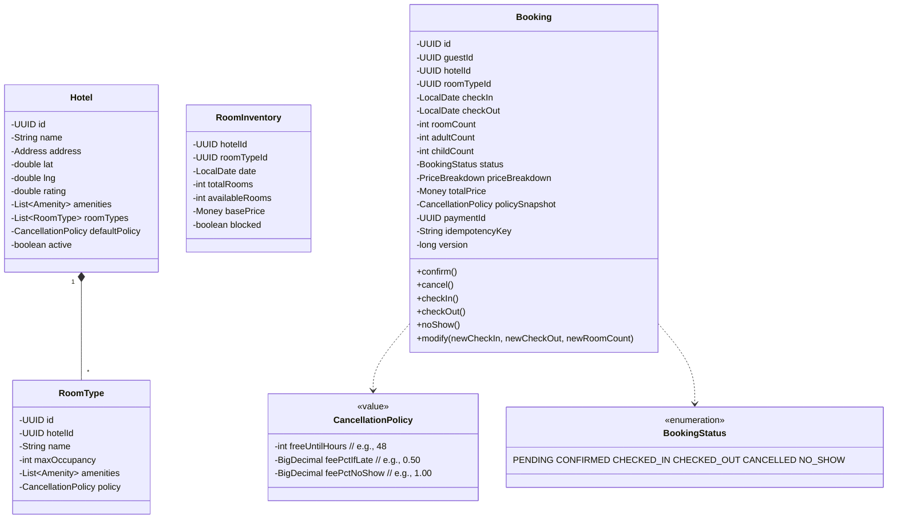

# 04 · Hotel Booking — Domain Model

## Aggregates

```
1. Hotel              (root) — properties + rooms
2. RoomType           — within Hotel
3. RoomInventory      (root) — calendar slot per (hotel, room_type, date)  ⭐ critical
4. Booking            (root) — guest's reservation, lifecycle
5. PaymentTransaction (root) — auth/capture/refund history
6. CancellationPolicy — value object referenced by Hotel/RoomType
7. Review             (V2)
```

The **central design choice** in hotel booking LLD is the **calendar inventory model**. Almost all questions reduce to it.

---

## Calendar inventory model

Naive approach (does not work):

```
Hotel { rooms: 50 }
Booking { hotel, checkIn, checkOut }
```

How do we know if a room is available on a given date? Search all bookings for overlap. **Slow and racy.**

### Correct approach: **per-night row**

For every (hotel × room_type × date), we have a row:

```sql
room_inventory (
  hotel_id, room_type_id, date,
  total_rooms,        -- e.g., 50
  available_rooms,    -- e.g., 12
  base_price,         -- e.g., 4000
  blocked            -- e.g., maintenance
)
```

A 5-night booking decrements `available_rooms` on each of 5 rows, atomically.

**Atomic decrement** SQL:

```sql
UPDATE room_inventory
SET available_rooms = available_rooms - 1
WHERE hotel_id = ? AND room_type_id = ? AND date = ?
  AND available_rooms >= 1 AND blocked = FALSE;
```

If 0 rows updated → no availability. If we did 5 nights and night 3 fails → roll back nights 1-2 (release).

This model:
- Allows **per-date varying inventory** (some rooms taken).
- Allows **per-date pricing** (seasonal, demand-driven).
- Allows **per-date blocking** (maintenance).
- Atomic decrement is one SQL call with no locks held.

### Pre-population

Inventory rows for a hotel exist for the next ~365 days. A daily cron rolls forward (creates day +365) and drops past dates (or archives them).

---

## Entities



---

## Invariants

### RoomInventory

1. `available_rooms ≥ 0`.
2. `available_rooms ≤ total_rooms`.
3. `blocked = TRUE` ⇒ no new bookings consume this row.
4. Inventory rows pre-exist for next 365 days.

### Booking

1. `checkOut > checkIn`.
2. `roomCount ≥ 1`.
3. Status transitions follow Booking state machine.
4. `totalPrice = sum_per_night(price) × roomCount + tax + fees - discount`.
5. Once `CONFIRMED`, the corresponding inventory has been decremented.
6. Cancellation refund follows `policySnapshot`.
7. `version` monotonically increasing.

### Hotel

1. `active = FALSE` ⇒ no new bookings; existing bookings remain valid.

---

## Pricing model

For each booking:

```
priceBreakdown:
  nights[]:
    date, baseRate, seasonalAdj, demandAdj, finalRate
  subtotal = sum(nights[i].finalRate × roomCount)
  taxes
  fees
  discount (promo)
  total = subtotal + taxes + fees - discount
```

The **per-night final rate** is computed at booking time and snapshotted into the booking. Rate changes after don't affect existing bookings.

Pricing rules are Strategies:
- `SeasonalRule` — date-based markup.
- `OccupancyRule` — markup as availability drops.
- `LastMinuteRule` — discount near check-in.
- `LengthOfStayRule` — discount for 7+ nights.
- `PromoCodeRule` — coupon applied.
- `TaxRule` — region-specific.

---

## Cancellation policies (value objects)

Three standard policies (simplified):

```
FlexiblePolicy:    free until 48h before checkIn; else 50% fee
StrictPolicy:      free until 7d before; else 100% fee
NonRefundablePolicy: 0% refund anytime
```

Real systems have many more. The Strategy pattern lets us add without rewriting.

```java
public interface CancellationPolicy {
  Money refundFor(Booking b, Instant cancelAt);
}
```

The Booking snapshots the policy at booking time. If the hotel changes their policy tomorrow, existing bookings still get the original terms.

---

## Domain events

```
HotelOnboarded(hotelId)
HotelDeactivated(hotelId)
RoomTypeAdded(hotelId, roomTypeId)
InventoryUpdated(hotelId, roomTypeId, dateRange, available, price)

BookingPending(bookingId)
BookingConfirmed(bookingId)
BookingCancelled(bookingId, refundAmount)
BookingCheckedIn(bookingId)
BookingCheckedOut(bookingId)
BookingNoShow(bookingId)

PaymentAuthorized / PaymentCaptured / PaymentRefunded
```

Search index, notification service, settlement service all react to these.

---

## Multi-room single hotel

A guest might book 2 deluxe + 1 suite at the same hotel. We model this with **separate Booking rows** linked by a **booking group**:

```
booking_group (
  id,
  guest_id,
  hotel_id,
  status,
  total_price
)

booking (
  id, group_id, room_type_id, check_in, check_out, room_count, ...
)
```

Group is the customer-visible unit; each booking row is per room type. Inventory is decremented per (room_type, date) atomically across the group.

For V1 we can simplify with a single `Booking` having `roomTypeId + roomCount` for one type only, and defer multi-type.

---

## Bounded contexts

| Context | Aggregates |
| --- | --- |
| Hotels | Hotel, RoomType |
| Inventory | RoomInventory |
| Booking | Booking, BookingGroup |
| Payment | PaymentTransaction |
| Search | (read store) |

Cross-context comms via events.
