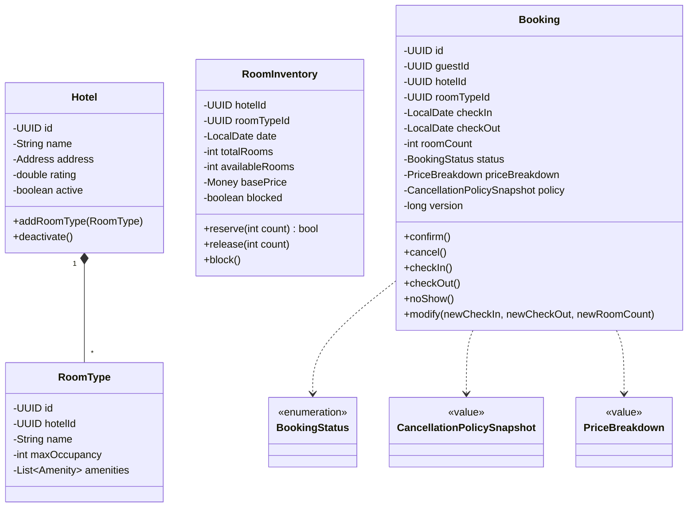
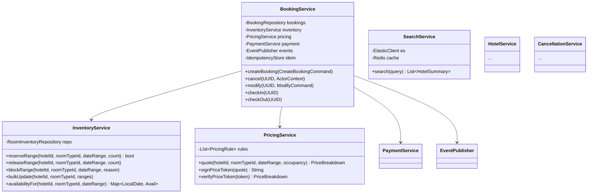
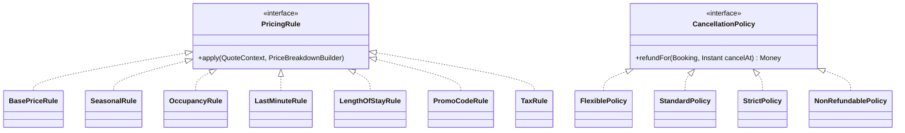
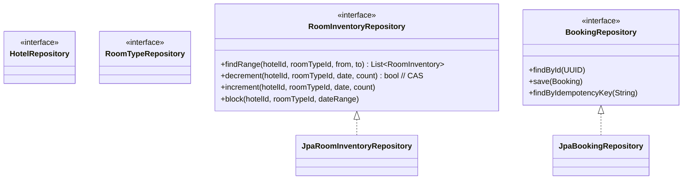
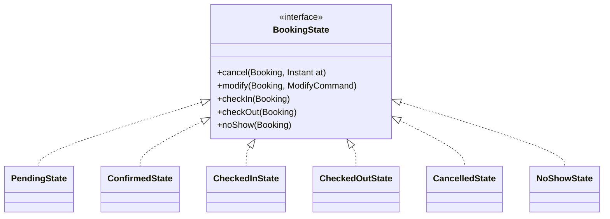

# 07 · Hotel Booking — Class Diagrams

## Domain layer

---

## Application services

---

## Strategies

---

## Repositories

---

## State pattern (Booking)

We use the State pattern because:
- Cancellation logic differs significantly per state (PENDING/CONFIRMED can free-cancel; CHECKED_IN cannot).
- Modify operations are state-restricted.
- Each state encapsulates its allowed transitions.

---

## Layering

```mermaid
flowchart LR
  subgraph api
    BookingController; HotelController; SearchController
  end

  subgraph application
    BookingService; InventoryService; PricingService; SearchService; HotelService
  end

  subgraph domain
    Booking; RoomInventory; Hotel; PricingRule
    BookingState
    BookingRepository_int[<<interface>> BookingRepository]
  end

  subgraph infra
    JpaBookingRepository; JpaInventoryRepository; ElasticSearchClient; KafkaPublisher; StripeGateway
  end

  api --> application
  application --> domain
  application --> infra
  infra --> domain
```

---

## Take-aways

- **Booking** + **RoomInventory** are the two critical aggregates.
- Strategy for pricing rules + cancellation policies — both vary widely.
- State pattern for Booking lifecycle to encapsulate state-dependent logic.
- Repository abstraction keeps domain pure.
- Search is a separate read-store; eventually consistent.
