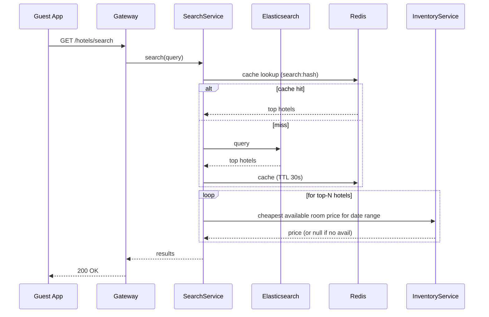
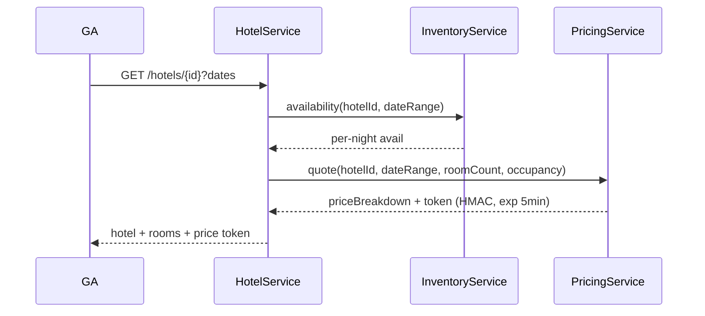
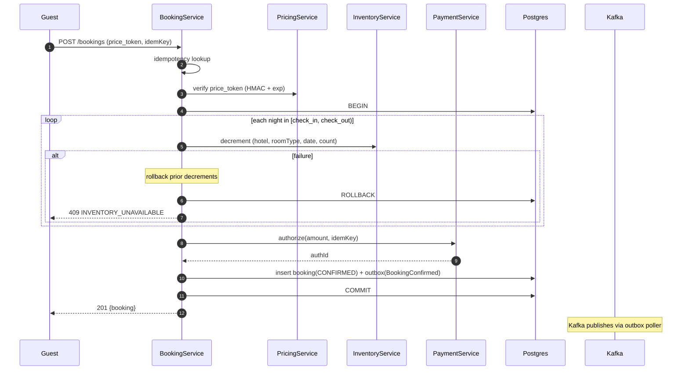
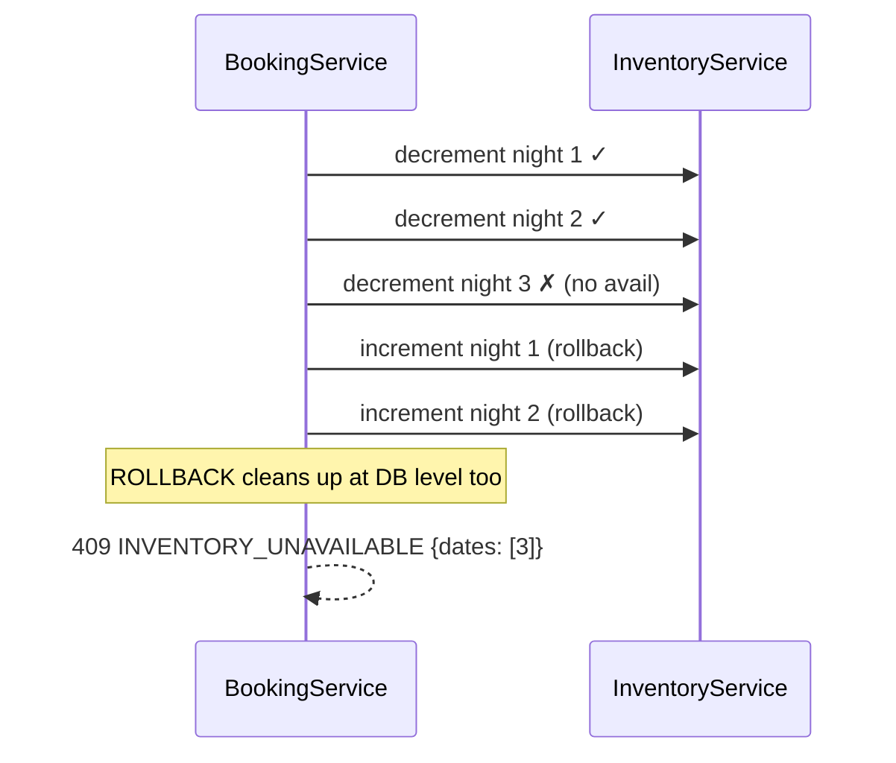
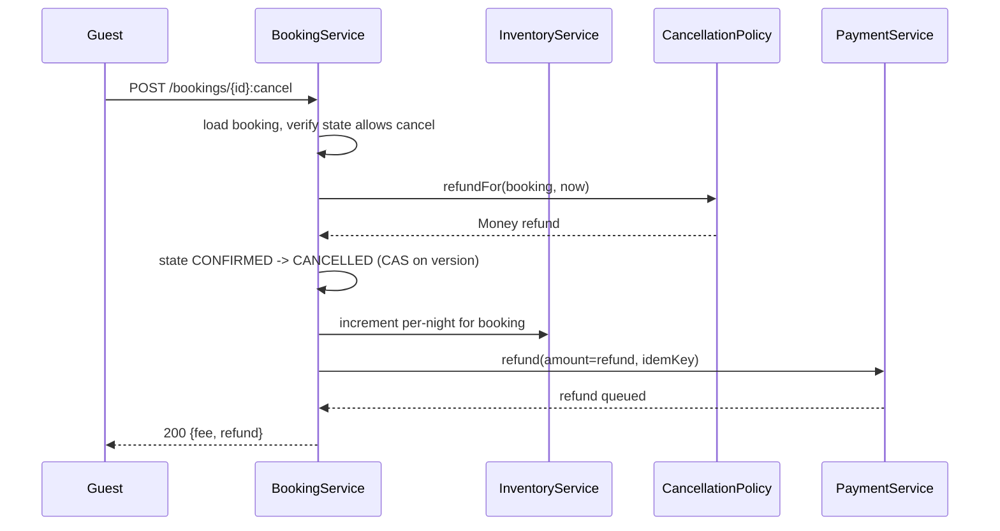
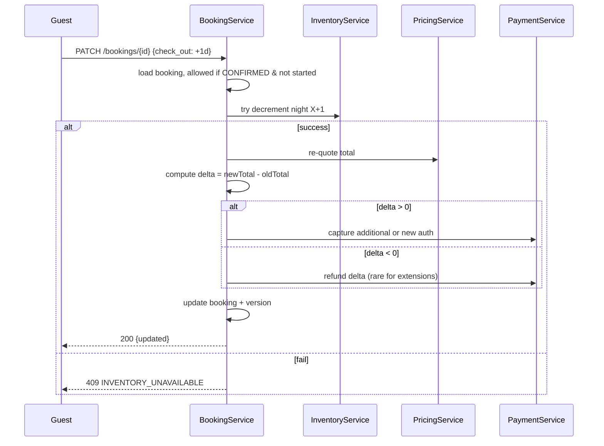
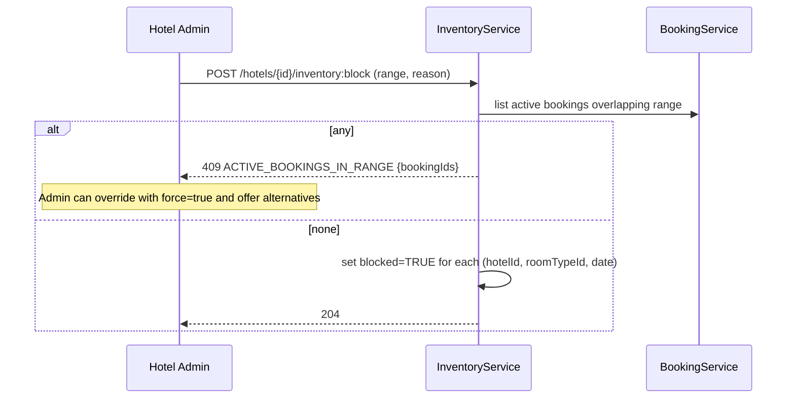
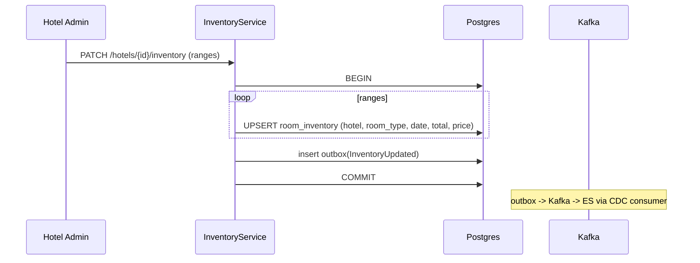

# 08 · Hotel Booking — Sequence Diagrams

## 1. Search

---

## 2. Get hotel + availability

---

## 3. Create booking — happy path

The transaction is "all nights or none" via Postgres atomicity.

---

## 4. Booking — partial inventory failure

Postgres ROLLBACK is enough since all three UPDATEs happened in one transaction. We listed the manual increments here for clarity if you do it across services without a single TX.

---

## 5. Cancel booking

The cancellation policy snapshot lives in the booking, so applying it is deterministic.

---

## 6. Modify booking (extend by 1 night)

For shrinking (early checkout), we release inventory and refund per cancellation policy on the released nights.

---

## 7. Block dates with active bookings

We never silently invalidate confirmed bookings.

---

## 8. Hotel inventory bulk update

The CDC consumer ensures Search reflects within seconds.

---

## What these reveal

- The booking transaction is the single most important transaction in this system.
- Inventory decrement uses atomic SQL — no locks held for I/O.
- Cancellation policy is deterministic because it's snapshotted.
- Search is eventually consistent; booking re-validates.
- The Outbox pattern keeps events durable and consistent with DB state.
