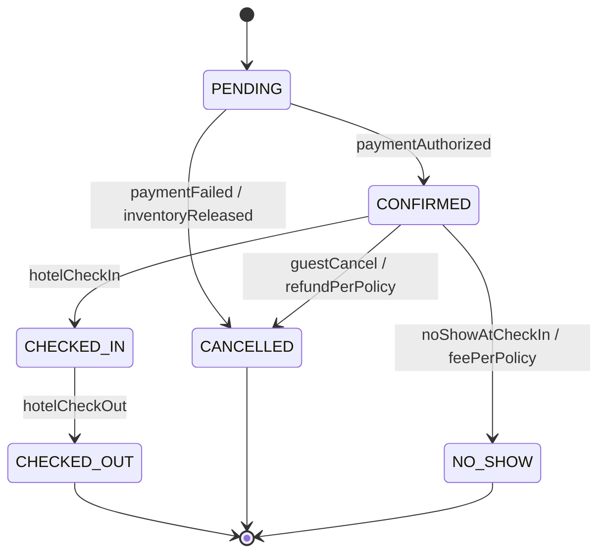

# 09 · Hotel Booking — State Machines

## Booking state machine



### Transition table

| From | Event | Guard | To | Effect |
| --- | --- | --- | --- | --- |
| PENDING | paymentAuthorized | inventory reserved | CONFIRMED | publish BookingConfirmed |
| PENDING | paymentFailed | none | CANCELLED | release inventory, refund auth |
| CONFIRMED | guestCancel | before check-in | CANCELLED | apply policy, refund, release |
| CONFIRMED | hotelCheckIn | check-in date reached | CHECKED_IN | record arrival |
| CONFIRMED | noShowAtCheckIn | end-of-day passed | NO_SHOW | charge no-show fee |
| CHECKED_IN | hotelCheckOut | none | CHECKED_OUT | settle bill, capture remaining |
| CHECKED_IN | guestCancel | not allowed |  | reject `409 CANNOT_CANCEL_AFTER_CHECK_IN` |

### Why State pattern

Cancel logic differs heavily by state:
- PENDING: free cancel (no inventory yet held in commit).
- CONFIRMED: apply cancellation policy (refund partial or none).
- CHECKED_IN: not allowed.
- CHECKED_OUT / CANCELLED / NO_SHOW: terminal.

Putting this in `if/switch` per method is messy. State pattern colocates per-state behavior.

```java
public interface BookingState {
  BookingStatus tag();
  void cancel(Booking b, Instant at);
  void modify(Booking b, ModifyCommand cmd);
  void checkIn(Booking b);
  void checkOut(Booking b);
}

public class ConfirmedState implements BookingState {
  public BookingStatus tag() { return CONFIRMED; }
  public void cancel(Booking b, Instant at) {
    Money refund = b.policySnapshot().refundFor(b, at);
    b.applyCancellation(refund);
    b.transitionTo(new CancelledState());
  }
  public void modify(Booking b, ModifyCommand cmd) {
    if (b.checkIn().isBefore(LocalDate.now())) throw new IllegalStateException();
    // ... compute delta, apply
  }
  public void checkIn(Booking b) {
    if (LocalDate.now().isBefore(b.checkIn())) throw new IllegalStateException("too early");
    b.transitionTo(new CheckedInState());
  }
  public void checkOut(Booking b) {
    throw new IllegalStateException("not checked in yet");
  }
}

public class CheckedInState implements BookingState {
  public BookingStatus tag() { return CHECKED_IN; }
  public void cancel(Booking b, Instant at) {
    throw new IllegalStateException("cannot cancel after check-in");
  }
  public void modify(Booking b, ModifyCommand cmd) {
    // limited modifications: extend stay, add adults
  }
  public void checkIn(Booking b)  { /* idempotent no-op */ }
  public void checkOut(Booking b) {
    b.settle();
    b.transitionTo(new CheckedOutState());
  }
}
```

This scales well as states grow.

---

## Inventory transitions

Inventory itself doesn't have a "state machine" but it has invariants:
- `available_rooms ∈ [0, total_rooms]` always.
- `blocked` flag toggles via admin, atomically.

Atomic mutations:

```sql
-- reserve N rooms for a date
UPDATE room_inventory
SET available_rooms = available_rooms - $n, updated_at = now()
WHERE hotel_id=$h AND room_type_id=$r AND date=$d
  AND blocked=FALSE AND available_rooms >= $n;

-- release N rooms
UPDATE room_inventory
SET available_rooms = LEAST(available_rooms + $n, total_rooms), updated_at = now()
WHERE hotel_id=$h AND room_type_id=$r AND date=$d;

-- block
UPDATE room_inventory SET blocked=TRUE WHERE ...;
```

`LEAST(... + n, total_rooms)` defends against double-release bugs that would push available > total.

---

## Cross-aggregate invariants

| Invariant | How enforced |
| --- | --- |
| Booking `CONFIRMED` ⇒ inventory decremented for all dates | Single transaction at booking time |
| Booking `CANCELLED` ⇒ inventory released | Booking cancel handler updates inventory in same TX |
| Sum of CONFIRMED+CHECKED_IN bookings × roomCount ≤ total_rooms - blocked | Reconciliation cron checks daily |

The reconciliation is a safety net. It rarely finds drift, but when it does, we have a paper trail.

---

## Timezone caveat

Hotels operate in their **local timezone**, but our DB stores `DATE` (no TZ). Conventions:
- Dates in the DB represent the hotel's local calendar.
- Check-in is at hotel local 15:00 (default).
- All UI conversions go through hotel TZ.
- Cron jobs (e.g., no-show after 11 PM) run per hotel TZ.

This avoids "the night of June 1" being ambiguous across regions.

---

## Auditing

```sql
CREATE TABLE booking_events (
  booking_id  UUID NOT NULL,
  from_status VARCHAR(20),
  to_status   VARCHAR(20) NOT NULL,
  actor_id    UUID,
  reason      TEXT,
  occurred_at TIMESTAMPTZ DEFAULT now()
);
```

Append-only. Used for:
- Customer support timeline.
- Disputes (refund amount evidence).
- Settlement reconciliation.

---

## Common interviewer trick: dirty transitions

> "What if the guest cancels at the same instant the hotel marks them no-show?"

Defense: the guard "is now > end-of-check-in-day" is computed once at the start of the cancel/no-show transaction. The CAS ensures only one wins.

> "What if the booking is checked in but the inventory says no rooms used (drift)?"

Reconciliation finds it. We log a `DriftDetected` event for SRE.

State machines explicit make it easy to detect such issues — every transition is a row in `booking_events`.
