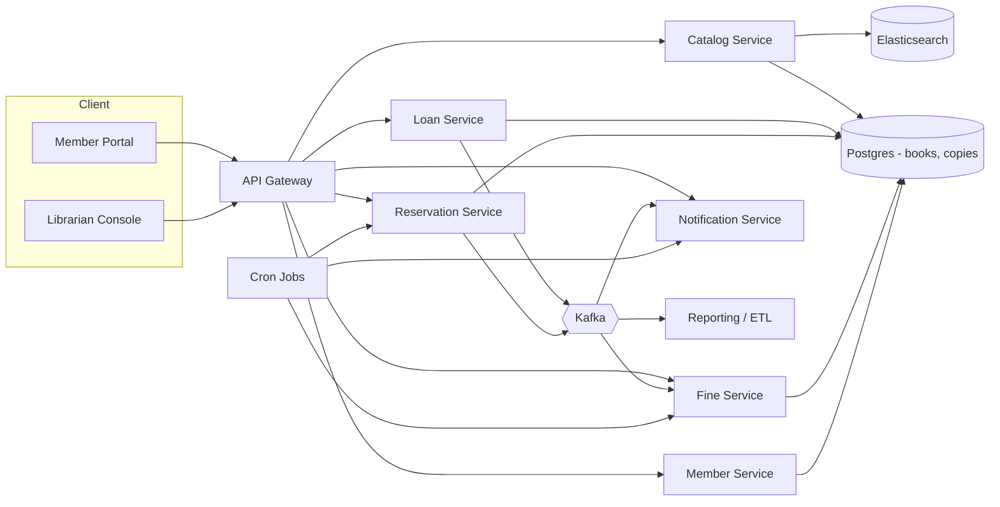

# 03 · Library — HLD



## Service responsibilities

| Service | Owns |
| --- | --- |
| **Catalog Service** | Books, copies, branches, search index |
| **Loan Service** | Loan aggregate, borrow/return |
| **Reservation Service** | Reservation queues per book |
| **Fine Service** | Fine calculation + payment |
| **Member Service** | Member accounts, limits, history |
| **Notification Service** | Reminders, queue notifications |

We could consolidate into 1-2 services for V1. Splitting is for clarity.

## Data flows

### Search
```
Member → CatalogService:
  Query ES → top books
  For each, check copy availability (Postgres)
  Return list with branch-level availability
```

### Borrow
```
Member → LoanService.borrow:
  1. validate member: active, no fines, under limit
  2. find available copy at preferred branch (or any) via DB CAS
  3. insert Loan(BORROWED, due_date)
  4. publish LoanIssued event
```

### Return
```
Member → LoanService.return:
  1. find loan by copy id
  2. mark loan RETURNED, set returnedAt
  3. compute fine if late, persist Fine
  4. mark copy AVAILABLE (or IN_TRANSIT if returned at different branch)
  5. publish LoanReturned event
  6. ReservationService consumes → promote next reservation if exists
```

### Reservation
```
Member → ReservationService.reserve:
  if no available copy at any branch:
    insert Reservation(QUEUED, position)
  else:
    suggest direct borrow

On copy available:
  ReservationService picks head of queue → notify member → reservation TTL 24h
  if no pickup in 24h: promote next
```

### Fine
```
CronJob (nightly) → FineService.computeOverdues:
  for each loan where due_date < today and status=BORROWED:
    update fine on the loan or insert Fine row

Member → pay fine via Payment Gateway
```

## External integrations

| Integration | Pattern |
| --- | --- |
| Notifications | async via Kafka |
| Payment for fines | sync auth + capture |
| ES | indexed via CDC |

## Failure modes

| Failure | Mitigation |
| --- | --- |
| DB primary failover | App retries idempotent commands |
| Kafka outage | Outbox holds events |
| Payment failure | Retry with idempotency; show fine still due |
| Notification provider failure | DLQ retry |
| Notification missed at reservation availability | Promotion still happens; notification re-tried |

## Output

The system is small enough for a monolith but we describe service boundaries for evolution.
