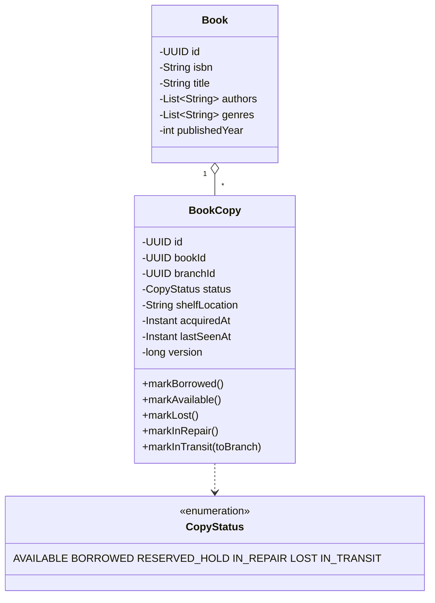
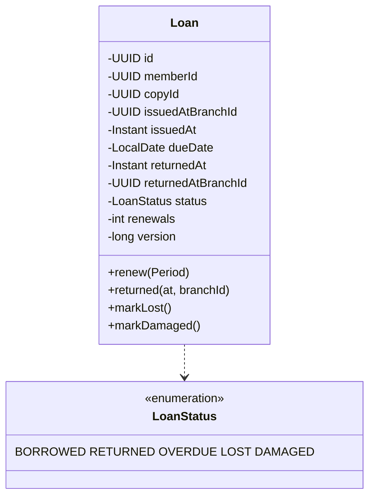
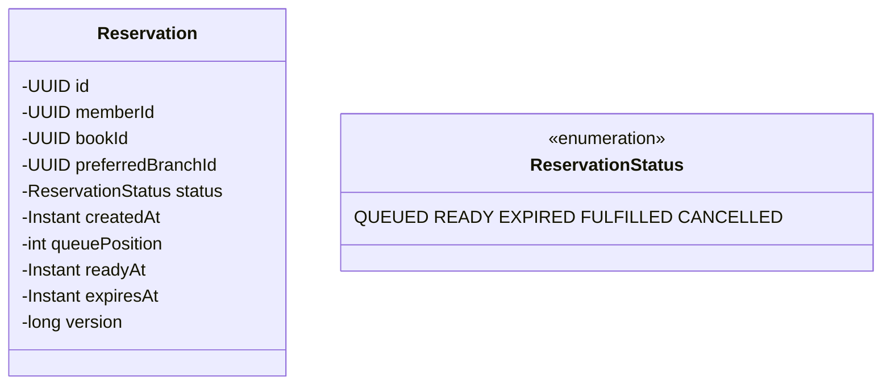
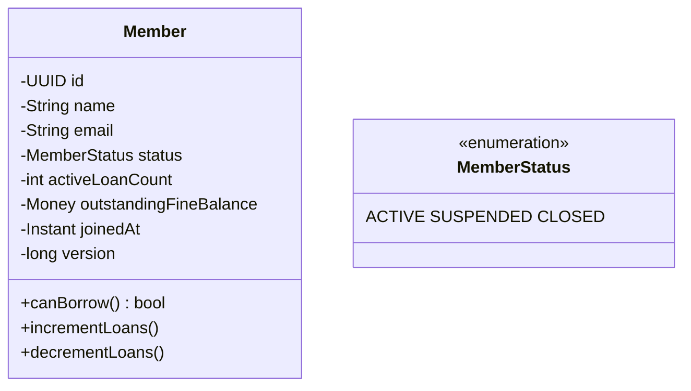
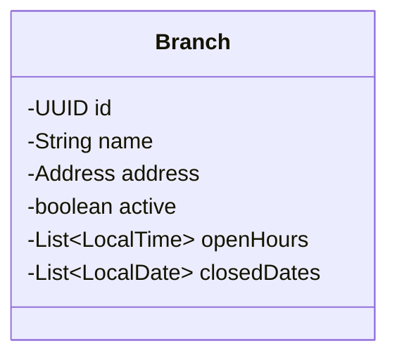
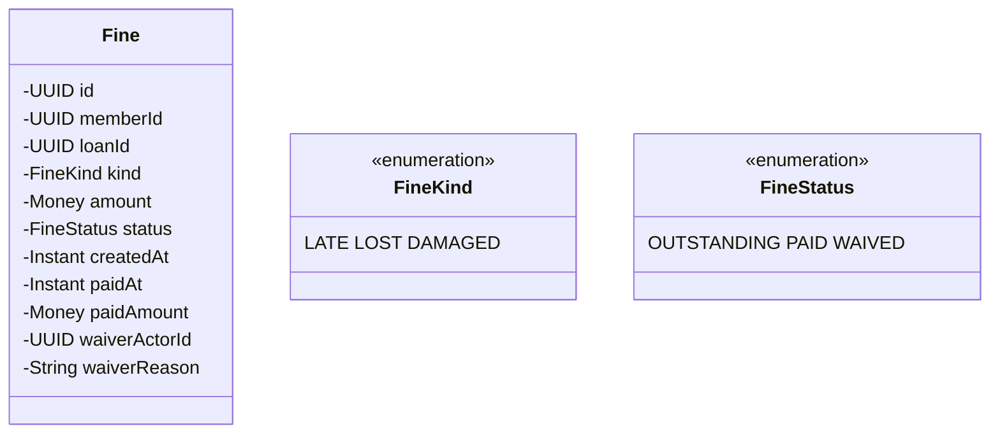

# 04 · Library — Domain Model

## Aggregates

```
1. Book        (root) — title, author, ISBN — the catalog entry
2. BookCopy    (root) — physical instance of a Book at a branch
3. Branch      (root) — location
4. Member      (root) — borrower
5. Loan        (root) — a borrow event with lifecycle
6. Reservation (root) — wait-list entry for a book
7. Fine        (root) — financial event
```

The most important modeling choice: **Book vs Copy**.

---

## Book vs Copy — the central insight

A `Book` is a **catalog entry** — title, author, ISBN, genre, publication year. It's metadata, not inventory.

A `BookCopy` is a **physical book on a shelf** — it has an ID, a branch, and a state (`AVAILABLE`, `BORROWED`, `RESERVED_HOLD`, `LOST`, `IN_REPAIR`, `IN_TRANSIT`).

A library has **many copies of one book**. Without this separation:
- "Is this book available?" requires complex queries.
- Tracking who has which copy is impossible.
- Branch-level inventory becomes a denormalization nightmare.



When a borrow happens, we transition a **specific copy** from `AVAILABLE → BORROWED` via an atomic UPDATE. The book itself doesn't change.

---

## Loan



Invariants:
- A copy can have at most one active Loan (`BORROWED` or `OVERDUE`).
- `dueDate > issuedAt`.
- `returnedAt` is null iff status ∈ {BORROWED, OVERDUE}.
- `version` monotonic.

Note: `OVERDUE` is conceptually a status that's a function of `(BORROWED, due_date < today)`. We can either store it explicitly or derive it. We store it for query efficiency.

---

## Reservation



A reservation is **per book** (not per copy). When a copy becomes available, the head of the queue is promoted (`QUEUED → READY`) and gets 24 hours to pick up.

If they don't pick up by `expiresAt`, the reservation transitions to `EXPIRED` and the next member is promoted.

When the member borrows the held copy, `READY → FULFILLED`.

---

## Member



`canBorrow()` checks: status == ACTIVE, activeLoanCount < limit, outstandingFineBalance == 0 (or below threshold).

---

## Branch



Closed dates matter for fine computation (we don't fine on days the library was closed).

---

## Fine



Fines are a separate aggregate so they have their own lifecycle. A loan can accumulate multiple fines (LATE + DAMAGED).

---

## Pricing of fines (Strategy)

```java
public interface FineCalculator {
  Money compute(Loan loan, LocalDate today, Branch branch);
}

class LateFeeCalculator implements FineCalculator {
  // ₹5 per day past due (excluding closed days)
}

class LostBookCalculator implements FineCalculator {
  // 1.5× book replacement cost
}

class DamagedBookCalculator implements FineCalculator {
  // 50% of replacement cost
}

class CompositeFineCalculator implements FineCalculator {
  // delegates to the right calculators
}
```

The strategy lets policies vary per branch / member tier without if-else trees.

---

## Borrow limits and policies (configurable)

```
DefaultBorrowPolicy:
  maxActiveLoans: 5
  loanPeriodDays: 14
  renewalsAllowed: 1
  renewalDays: 7
  reservationHoldDays: 1
  fineCapMultiplier: 3.0   // fine cannot exceed 3x book cost
```

Different member tiers can have different policies (e.g., students vs faculty).

---

## Domain events

```
BookAdded / BookUpdated
CopyAdded / CopyMarkedLost / CopyTransferred / CopyInRepair
LoanIssued / LoanRenewed / LoanReturned / LoanOverdue / LoanLost / LoanDamaged
ReservationCreated / ReservationReady / ReservationExpired / ReservationFulfilled
FineAccrued / FinePaid / FineWaived
MemberSuspended / MemberReinstated
```

These drive notifications, reporting, and reservation promotion.

---

## Bounded contexts

| Context | Aggregates |
| --- | --- |
| Catalog | Book, BookCopy, Branch |
| Loans | Loan |
| Reservations | Reservation |
| Members | Member |
| Fines | Fine |

For V1, all in one DB. Microservices later if needed.
