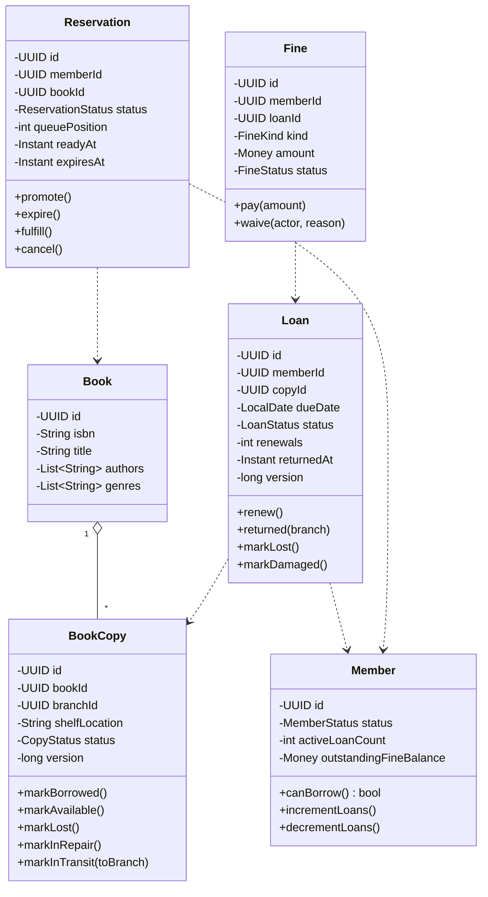
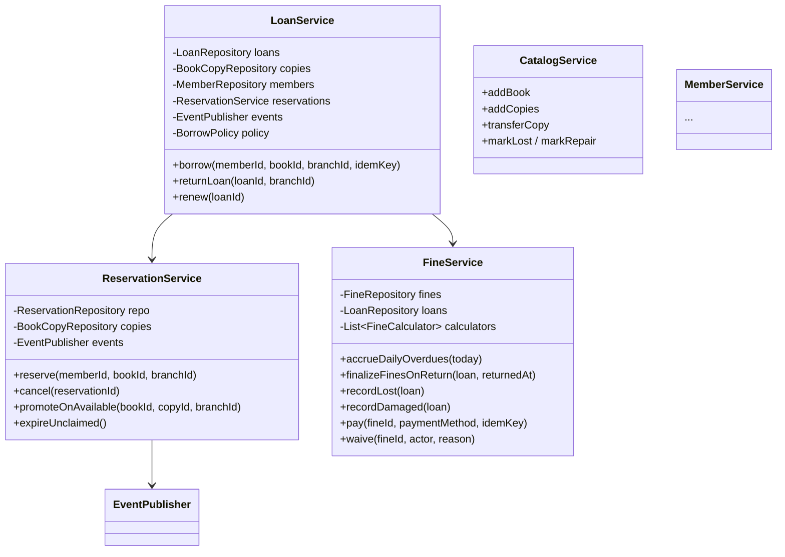
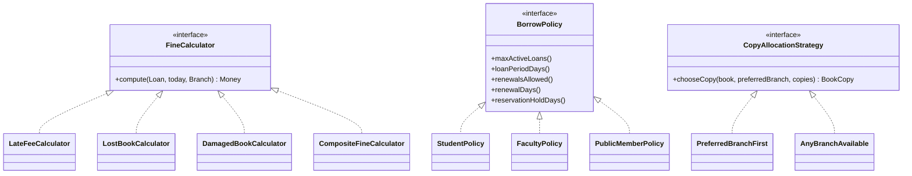
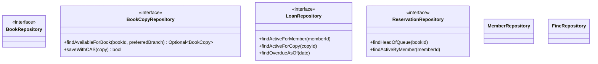
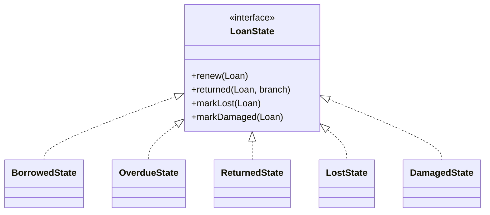
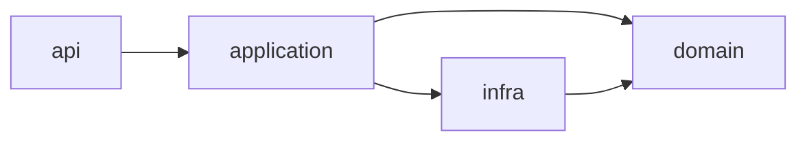

# 07 · Library — Class Diagrams

## Aggregated class diagram

A single view of every class, interface, and enum in the system — fields and methods included. Source of truth: the Java skeleton under `12_machine_coding_skeleton/`. Use this when you want the whole system on one page; the categorical diagrams below break out individual concerns (Domain / Services / Strategies / Repositories / State) for focused reading.

```mermaid
classDiagram
    %% ===== Value objects & enums =====
    class Money {
      -long amountMinor
      -String currency
      +inr(rupees) Money$
      +zero(currency) Money$
      +add(other) Money
      +isPositive() boolean
      +amountMinor() long
      +currency() String
    }
    class CopyStatus {
      <<enumeration>>
      AVAILABLE
      BORROWED
      RESERVED_HOLD
      LOST
      DAMAGED
      IN_REPAIR
      IN_TRANSIT
    }
    class LoanStatus {
      <<enumeration>>
      ACTIVE
      RETURNED
      OVERDUE
      LOST
      DAMAGED
    }
    class ReservationStatus {
      <<enumeration>>
      QUEUED
      READY
      FULFILLED
      EXPIRED
      CANCELLED
    }
    class MemberStatus {
      <<enumeration>>
      ACTIVE
      SUSPENDED
    }
    class FineStatus {
      <<enumeration>>
      PENDING
      PAID
      WAIVED
    }
    class FineKind {
      <<enumeration>>
      OVERDUE
      LOST
      DAMAGED
    }

    %% ===== Domain entities =====
    class Book {
      -UUID id
      -String isbn
      -String title
      -List~String~ authors
      +id() UUID
      +isbn() String
      +title() String
      +authors() List~String~
    }
    class BookCopy {
      -UUID id
      -UUID bookId
      -UUID branchId
      -CopyStatus status
      -long version
      +id() UUID
      +bookId() UUID
      +branchId() UUID
      +status() CopyStatus
      +version() long
    }
    class Loan {
      -UUID id
      -UUID memberId
      -UUID copyId
      -UUID branchId
      -LocalDate dueDate
      -LoanStatus status
      -int renewals
      -Instant returnedAt
      -long version
      +renew(days)
      +returned()
      +markLost()
      +markDamaged()
      +memberId() UUID
      +copyId() UUID
      +status() LoanStatus
    }
    class Reservation {
      -UUID id
      -UUID memberId
      -UUID bookId
      -UUID branchId
      -ReservationStatus status
      -int queuePosition
      -Instant readyAt
      -Instant expiresAt
      +promote(copyId)
      +fulfill()
      +cancel()
      +expire()
    }
    class Member {
      -UUID id
      -String name
      -MemberStatus status
      -int activeLoanCount
      -Money outstandingFines
      +canBorrow() boolean
      +incrementLoans()
      +decrementLoans()
      +active() boolean
      +activeLoanCount() int
      +outstandingFines() Money
    }
    class Fine {
      -UUID id
      -UUID memberId
      -UUID loanId
      -FineKind kind
      -Money amount
      -FineStatus status
      +pay(amount)
      +waive(actor, reason)
    }

    %% ===== Strategies =====
    class BorrowPolicy {
      <<interface>>
      +maxActiveLoans() int
      +loanPeriodDays() int
      +renewalsAllowed() int
      +renewalDays() int
      +reservationHoldDays() int
    }
    class StandardPolicy
    BorrowPolicy <|.. StandardPolicy

    class FineCalculator {
      <<interface>>
      +compute(loan, today) Money
    }
    class LateFeeCalculator
    class LostBookCalculator
    class DamagedBookCalculator
    FineCalculator <|.. LateFeeCalculator
    FineCalculator <|.. LostBookCalculator
    FineCalculator <|.. DamagedBookCalculator

    %% ===== Repositories =====
    class BookRepository {
      <<interface>>
      +findById(id) Optional~Book~
      +save(book) Book
    }
    class BookCopyRepository {
      <<interface>>
      +findById(id) Optional~BookCopy~
      +findFirstAvailable(bookId, branchId) Optional~BookCopy~
      +trySetStatusCAS(id, expected, next, version) boolean
      +save(copy) BookCopy
    }
    class LoanRepository {
      <<interface>>
      +findById(id) Optional~Loan~
      +findActiveForMember(memberId) List~Loan~
      +findActiveForCopy(copyId) Optional~Loan~
      +findOverdueAsOf(date) List~Loan~
      +save(loan) Loan
    }
    class ReservationRepository {
      <<interface>>
      +findHeadOfQueue(bookId) Optional~Reservation~
      +findActiveByMember(memberId) List~Reservation~
      +save(reservation) Reservation
    }
    class MemberRepository {
      <<interface>>
      +findById(id) Optional~Member~
      +save(member) Member
    }
    class FineRepository {
      <<interface>>
      +findById(id) Optional~Fine~
      +findPendingForMember(memberId) List~Fine~
      +save(fine) Fine
    }

    %% ===== Application services =====
    class LoanService {
      -LoanRepository loans
      -BookCopyRepository copies
      -MemberRepository members
      -BorrowPolicy policy
      -ReservationService reservations
      +borrow(memberId, bookId, branchId) Optional~Loan~
      +returnLoan(loanId) Loan
      +renew(loanId, days) Loan
    }
    class ReservationService {
      -ReservationRepository repo
      -BookCopyRepository copies
      +reserve(memberId, bookId, branchId) Reservation
      +cancel(reservationId)
      +tryPromote(bookId, copyId, version) UUID
      +hasQueued(bookId) boolean
      +expireUnclaimed()
    }
    class FineService {
      -FineRepository fines
      -LoanRepository loans
      -List~FineCalculator~ calculators
      +accrueDailyOverdues(today)
      +finalizeFinesOnReturn(loan, returnedAt)
      +recordLost(loan)
      +recordDamaged(loan)
      +pay(fineId, paymentMethod) Fine
      +waive(fineId, actor, reason) Fine
    }

    %% ===== Relationships =====
    Book "1" o-- "*" BookCopy : has copies
    Loan ..> BookCopy : tracks
    Loan ..> Member : borrowed by
    Reservation ..> Book : queued for
    Reservation ..> Member : placed by
    Fine ..> Loan : derives from
    Fine ..> Member : owed by

    Member ..> Money
    Fine ..> Money

    LoanService ..> LoanRepository
    LoanService ..> BookCopyRepository
    LoanService ..> MemberRepository
    LoanService ..> BorrowPolicy
    LoanService ..> ReservationService
    ReservationService ..> ReservationRepository
    ReservationService ..> BookCopyRepository
    FineService ..> FineRepository
    FineService ..> LoanRepository
    FineService o-- "*" FineCalculator
```

---

## Domain

---

## Application services

---

## Strategies

---

## Repositories

---

## State pattern (Loan)

OVERDUE behaves mostly like BORROWED for return; we still split for clarity (different fine accrual).

---

## Layering

Same Clean Architecture as other systems.
