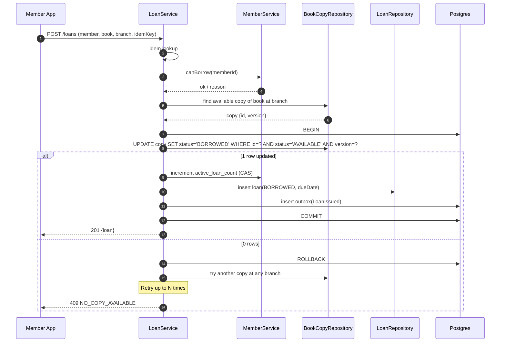
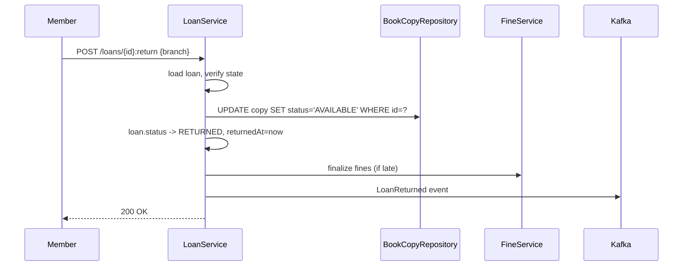
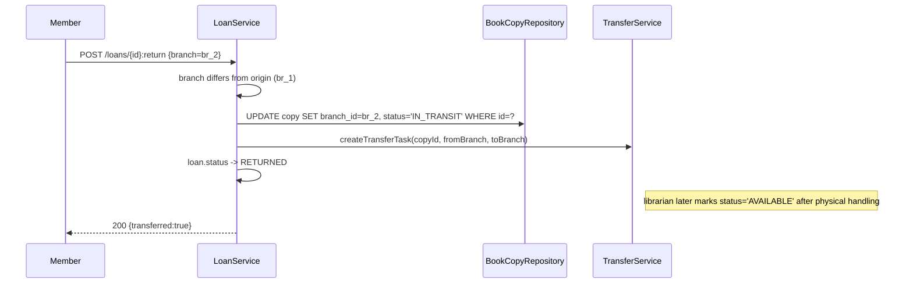
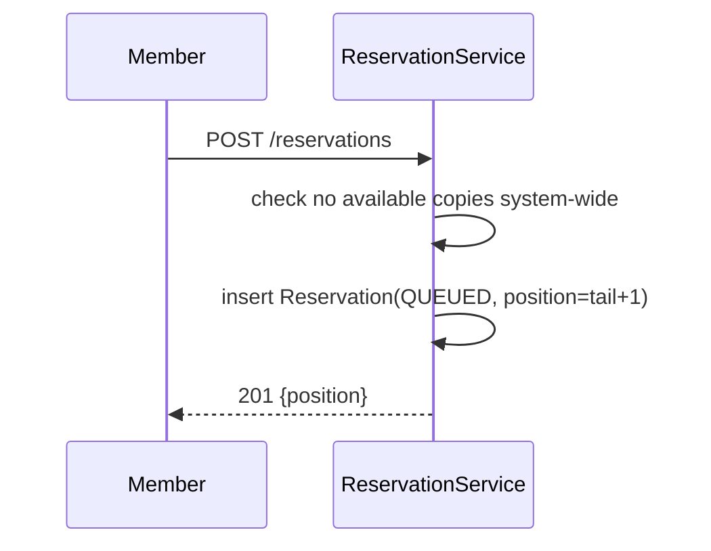
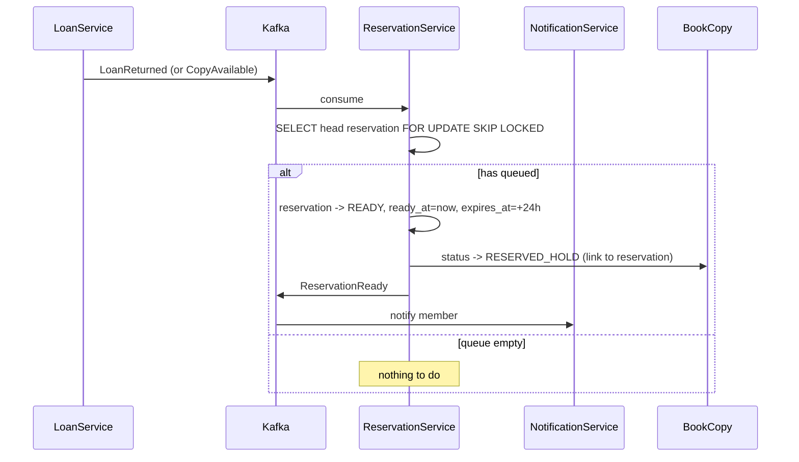
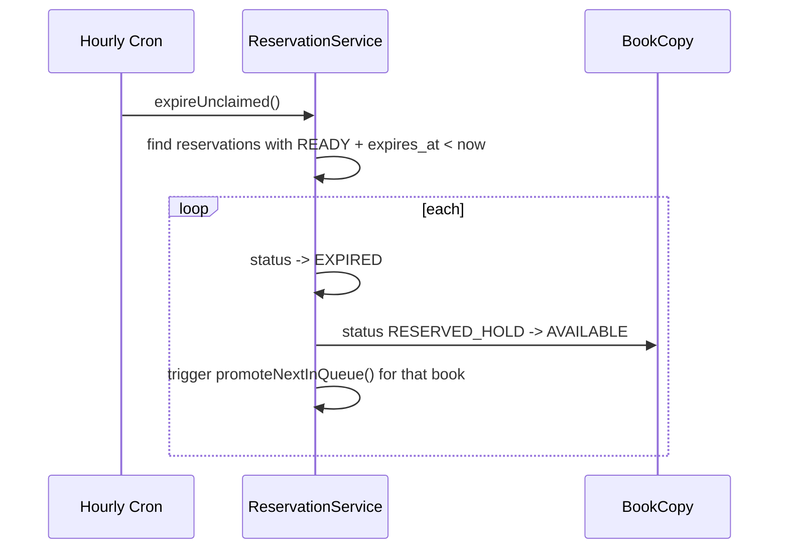
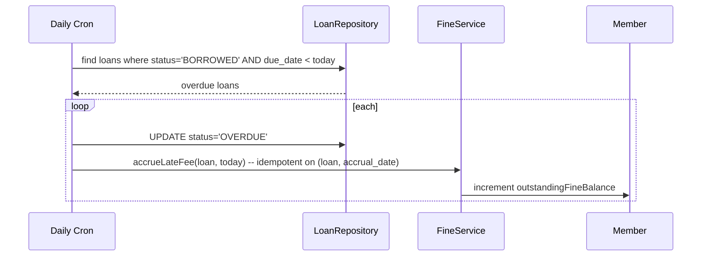
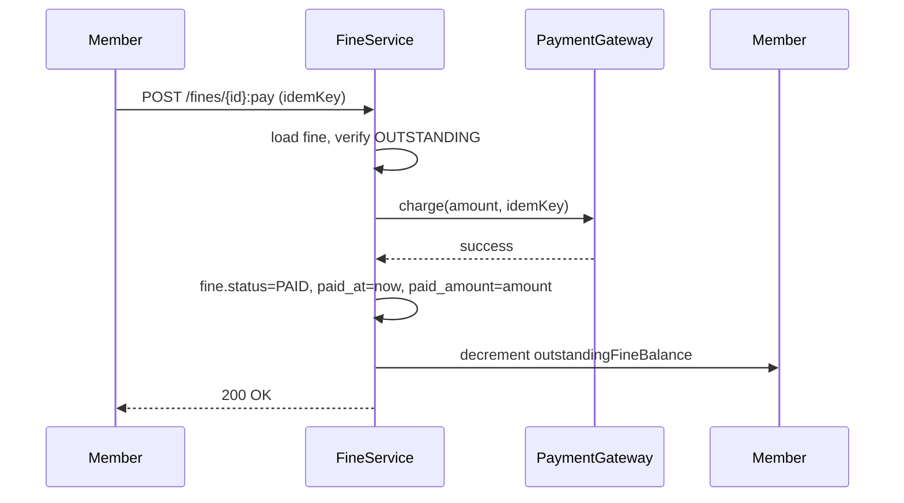
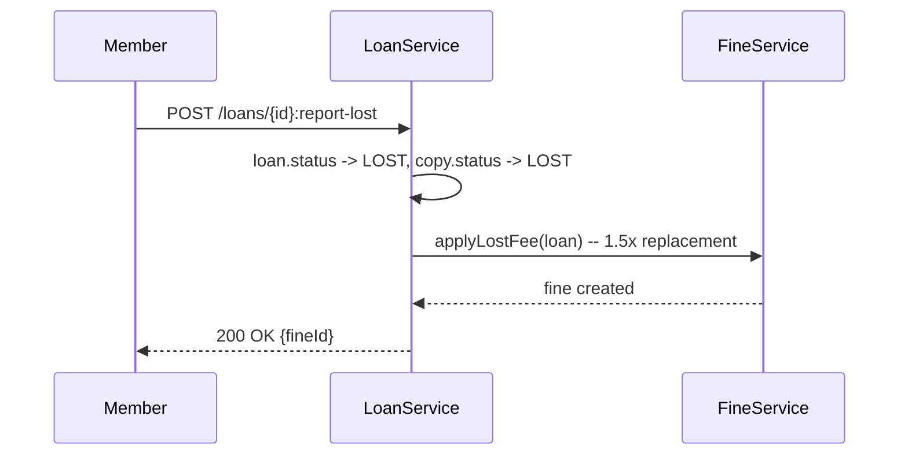

# 08 · Library — Sequence Diagrams

## 1. Borrow — happy path

---

## 2. Return — same branch

---

## 3. Return — different branch (transfer)

The library staff confirms the physical move and flips status to AVAILABLE later.

---

## 4. Reserve — no copies available

---

## 5. Promote on return (reservation queue)

The `RESERVED_HOLD` prevents random borrowing of the held copy. Only the reservation's member can borrow it.

---

## 6. Reservation expires (no pickup)

A small chain of expirations may unwind, but each expiry promotes one new reservation; the queue stays correct.

---

## 7. Fine accrual — daily

Idempotency: the `fine_accruals` table has `UNIQUE(loan_id, accrual_date)`, so re-running the cron the same day doesn't double-charge.

---

## 8. Pay fine

---

## 9. Lost book

---

## What these reveal

- Borrow is the most contentious flow; CAS is essential.
- Return triggers a chain (fine accrual finalize, queue promotion, transfer if needed).
- Reservation queue uses `SELECT FOR UPDATE SKIP LOCKED` to avoid races.
- Daily crons must be idempotent (unique constraints).
- Every state transition emits an event for audit and downstream services.
