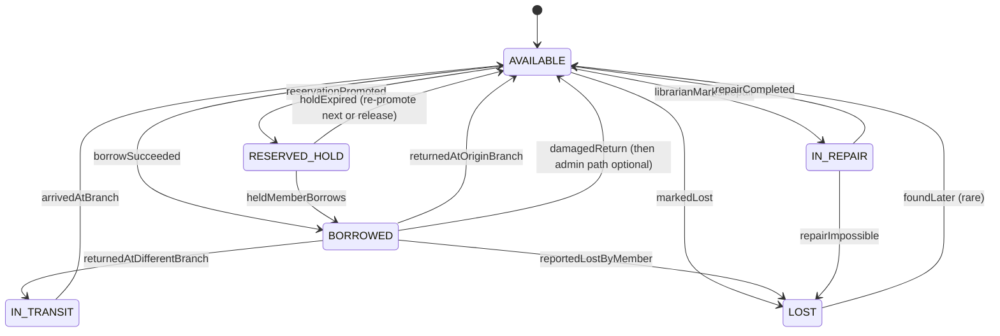
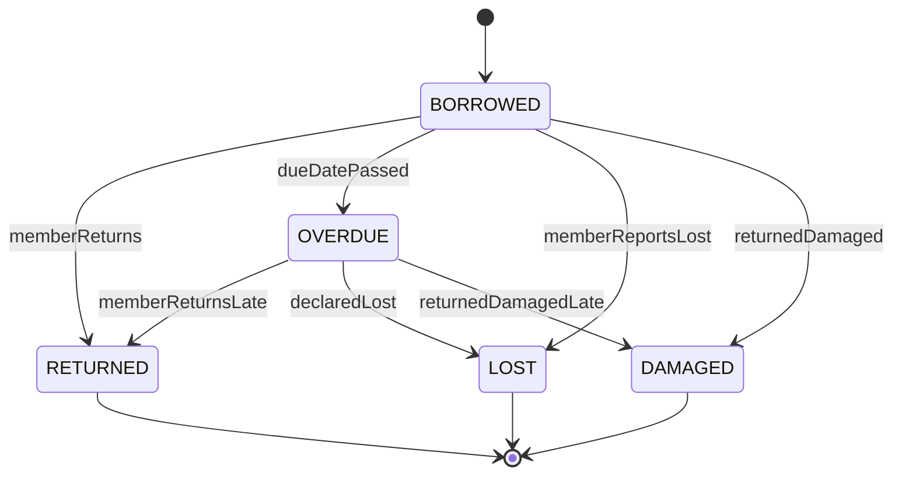
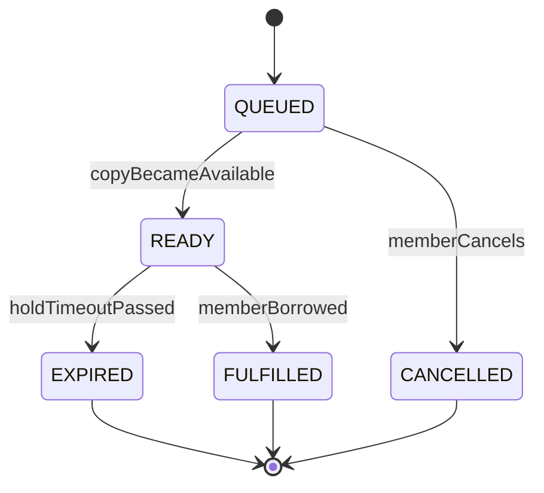
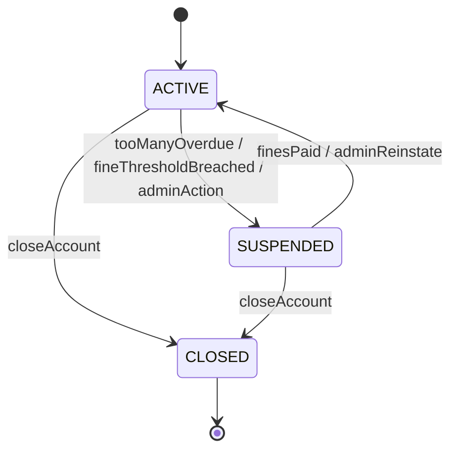
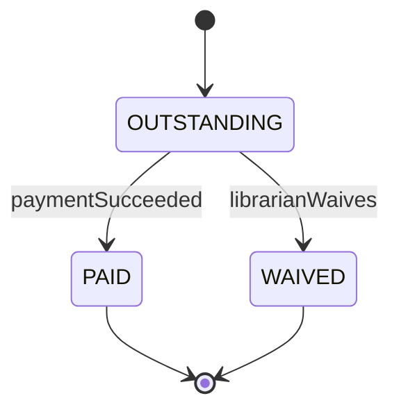

# 09 · Library — State Machines

## BookCopy



Notes:
- A copy can NEVER go from BORROWED → RESERVED_HOLD directly. It must pass through AVAILABLE.
- IN_REPAIR is for damaged but recoverable copies.
- IN_TRANSIT is between branches; when it arrives, librarian flips to AVAILABLE.

---

## Loan



OVERDUE is set by the daily cron. Some teams skip OVERDUE and just compute it from `BORROWED + due_date`. We store it for index efficiency and reporting.

---

## Reservation



When a reservation transitions QUEUED → READY:
- Set `ready_at = now`, `expires_at = now + 24h`.
- Reserve a specific copy (`status = RESERVED_HOLD`).
- Notify member.

When EXPIRED:
- Release the held copy (RESERVED_HOLD → AVAILABLE).
- Promote the next QUEUED reservation.

---

## Member



Suspended members:
- Existing loans remain.
- New borrows / reservations rejected.

---

## Fine



Why a separate Fine aggregate: fines have their own lifecycle (payment, waivers, partial payments in V2).

---

## Cross-aggregate invariants

| Invariant | Enforcement |
| --- | --- |
| Copy in BORROWED ⇒ exactly one active Loan for it | UNIQUE partial index on `loans(copy_id) WHERE status IN (BORROWED, OVERDUE)` |
| Member's `active_loan_count` matches reality | reconciliation cron |
| Reservation in READY ⇒ one Copy in RESERVED_HOLD pointing to it | application-enforced + audit |
| Member's `outstandingFineBalance` matches sum of OUTSTANDING fines | reconciliation cron |

---

## Transitions and concurrency

The borrow flow is the most concurrency-sensitive transition: AVAILABLE → BORROWED must be atomic.

```sql
UPDATE book_copies SET status='BORROWED', version=version+1
WHERE id=? AND status='AVAILABLE' AND version=?;
```

If 0 rows → another member won → retry with another copy.

The reservation promotion is single-writer with `SELECT FOR UPDATE SKIP LOCKED`:

```sql
SELECT id FROM reservations
WHERE book_id=? AND status='QUEUED'
ORDER BY queue_position ASC
FOR UPDATE SKIP LOCKED
LIMIT 1;
```

Multiple promotion workers don't trip over each other.

---

## State logging

Every transition writes to `loan_events` / `copy_events` / `reservation_events` tables (or unified `domain_events`). Append-only, used for audit, dispute resolution, reporting.

---

## Common interviewer trick

> "Member's app crashes after borrow request but before they receive 201."

Idempotency-Key + UNIQUE constraint ensures a retry returns the same loan, not a new one. The user sees the loan eventually; no double-borrow.

> "Copy is BORROWED but the loan was deleted somehow."

The UNIQUE partial index won't allow the loan to be deleted while still active. Retention drops only RETURNED/LOST/DAMAGED loans. Reconciliation finds drift and alerts.

State machines combined with strong DB constraints make these classes of bugs preventable.
