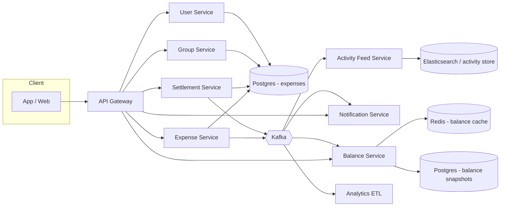

# 03 · Splitwise — HLD



## Service responsibilities

| Service | Owns |
| --- | --- |
| **Expense Service** | Expense aggregate, CRUD, splits |
| **Settlement Service** | Settlement aggregate, recorded payments |
| **Balance Service** | Per-pair balances; computes from event log; caches |
| **Group Service** | Group lifecycle, members |
| **User Service** | User profile, friends |
| **Activity Feed** | Per-user feed of expenses/settlements |
| **Notification Service** | Pushes to participants |

## Data flow — add an expense

```
User → ExpenseService.create:
  validate group, participants, splits
  insert expense + participants + outbox event in one transaction
  return 201

Outbox poller publishes ExpenseCreated to Kafka.
  → BalanceService consumes; updates in-memory + Redis caches; persists snapshots periodically.
  → ActivityFeedService consumes; writes feed entries.
  → NotificationService consumes; pushes to other participants.
```

## Data flow — view balance

```
User → BalanceService.getBalance(user, friend):
  redis lookup (key = pair-canonical(user, friend))
  if hit, return
  if miss, replay from snapshot + recent events; cache; return
```

## Data flow — settle up

```
User → SettlementService.create:
  validate amounts, currencies
  insert settlement row + outbox event
  → BalanceService updates (settlement reduces debt)
  → notify other party
```

## Data flow — debt simplification

```
User → BalanceService.simplifyForGroup(groupId):
  load per-pair net balances for group
  build directed graph of debts
  run min-cash-flow algorithm
  return list of suggested transfers
```

## Why these services

- **Expense** is the write workhorse.
- **Balance** is the read workhorse (much heavier read traffic).
- **Settlement** is small but money-critical.
- **Activity feed** has different SLA (eventual) and storage (append-only).
- **Group / User** are slow-changing reference data.

## External integrations

| Integration | Pattern |
| --- | --- |
| Currency snapshot | Daily fetch from FX provider |
| Push / Email | Async via Kafka + retries |
| OCR (V2) | Async; expense gets parsed line items |

## Failure modes

| Failure | Mitigation |
| --- | --- |
| BalanceService lag | Stale balance shown briefly; updates within seconds |
| Kafka down | Outbox holds events; eventual delivery |
| Postgres failover | App retries idempotent commands |
| Redis down | Recompute from DB; slower but correct |
| Notification provider down | DLQ retry |

## Output

The HLD separates write-heavy (Expense, Settlement) from read-heavy (Balance) services with eventual consistency where acceptable. Strong consistency on the expense write itself (DB transaction).
