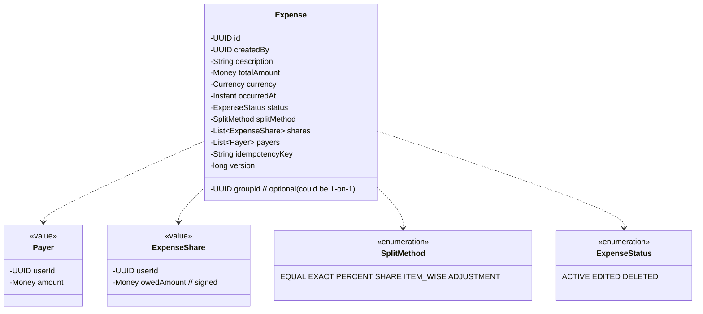
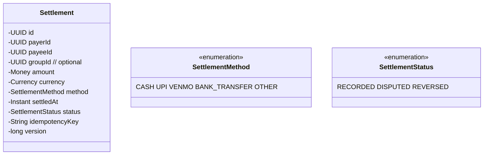
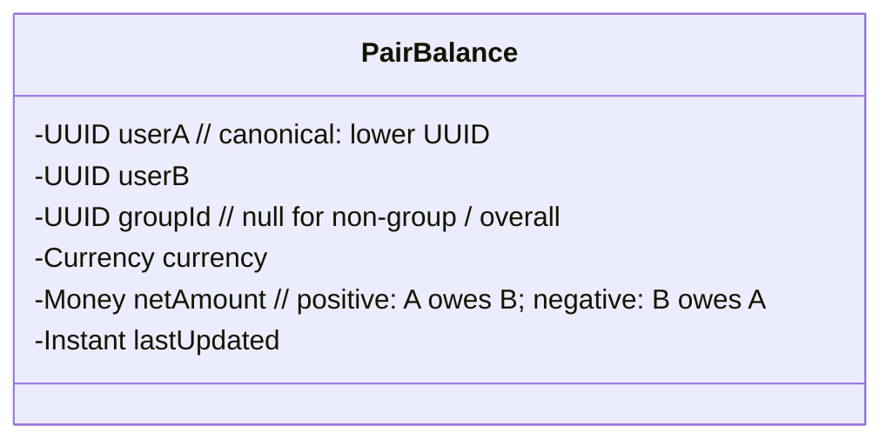
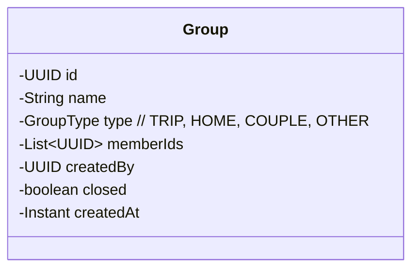
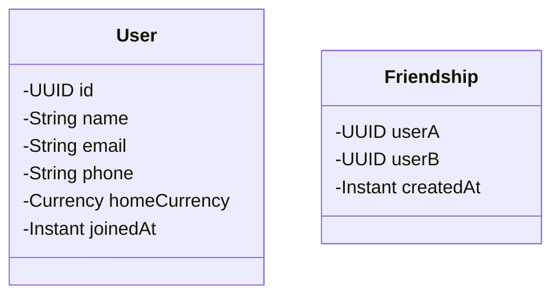

# 04 · Splitwise — Domain Model

## Aggregates

```
1. User
2. Group       (root)
3. Expense     (root) ⭐
4. Settlement  (root)
5. Balance     (computed; derived view, not really a root, but cached as snapshot)
6. Friendship  (value or row)
```

The **central design choice** is the `Expense` aggregate with split rules as Strategies.

---

## Expense



The expense has both:
- **Payers** — who paid out of pocket (could be multiple).
- **Shares** — who owes how much (the split).

Invariants:
- `sum(payers.amount) == totalAmount`.
- `sum(shares.owedAmount) == totalAmount`.
- All in the same currency.
- `version` monotonic; idempotency key unique.

### Split methods (Strategies)

```
EQUAL    : split equally; rounding remainder distributed
EXACT    : explicit amounts per participant
PERCENT  : percentages summing to 100
SHARE    : ratios (e.g., 2:1:1 for 4-share split)
ITEM_WISE: list of items, each with own split
ADJUSTMENT: equal-base + per-user adjustments (rare)
```

Each is an algorithm that consumes input and returns shares. We use the Strategy pattern.

---

## Settlement



A settlement reduces what the payer owes to the payee. We don't actually move money; we just record the user-asserted payment.

---

## Balance

Balance is a derived view from expenses + settlements. Two physical representations:

- **Live** (Redis): per-pair balance, updated on each expense/settlement.
- **Snapshot** (Postgres): per-pair balance row updated periodically.



Why pair-level? Because all balances are between two users. The global "I owe my friends X" is a sum across pairs.

---

## Group



Members can be added/removed. Cannot remove a member with non-zero balance.

---

## User



Symmetric friendship row stored once with canonical ordering.

---

## Currency

Each user has a `homeCurrency`. Each expense has its own currency. Balances are kept **per currency** — we never convert between currencies in balances, only at the display layer using a daily snapshot.

Why? Conversion at write time loses information. A debt of $100 today shouldn't change just because USD/INR moved tomorrow.

```
PairBalance(A,B):
  USD: 100
  INR: -3000     // B owes A in USD; A owes B in INR
```

---

## Split algorithms — deep dive

### EQUAL

```
shareEach = totalAmount / N
remainder = totalAmount - shareEach * N
distribute remainder cents to first |remainder| participants (deterministic order)
```

Why determine order: avoid floating-point inconsistency.

```java
class EqualSplit implements SplitStrategy {
  public List<ExpenseShare> compute(Money total, List<UUID> participants, Map<String,Object> meta) {
    int n = participants.size();
    BigDecimal cents = total.amount().movePointRight(2);
    long totalCents = cents.longValueExact();
    long perEach = totalCents / n;
    long extra = totalCents - perEach * n;
    List<ExpenseShare> shares = new ArrayList<>();
    for (int i = 0; i < n; i++) {
      long c = perEach + (i < extra ? 1 : 0);
      Money owed = Money.fromCents(c, total.currency());
      shares.add(new ExpenseShare(participants.get(i), owed));
    }
    return shares;
  }
}
```

### EXACT

User specifies amount per participant. Validate sum == total.

### PERCENT

User specifies percentages. Validate sum == 100. Compute amounts; distribute rounding remainder.

### SHARE

Ratios. Compute amounts proportionally; distribute remainder.

### ITEM_WISE

For a restaurant bill with itemized split. Each item has its own list of consumers and is split among them. Sum item shares per participant.

### ADJUSTMENT

Equal-base + per-user adjustment (e.g., everyone pays equally but Alice owes ₹50 extra because she had an extra drink).

```
adjusted_share[i] = (total - sum(adjustments)) / N + adjustments[i]
```

---

## Debt simplification — the algorithm

### Problem

In a group of N people, after many expenses, every pair may owe each other. The total cash flow can be reduced.

Example:
```
A owes B 100
B owes C 100
A owes C 50
Net: A owes 150 total, B is even, C is owed 150.
Optimal: A pays C 150. (1 transaction instead of 3)
```

### Approach: net balance + min-cash-flow

1. Compute net balance per user: positive = should receive, negative = should pay.
   ```
   net[A] = -150
   net[B] = 0
   net[C] = +150
   ```
2. Run a min-cash-flow algorithm:
   - Pop the user with most negative balance (`max_debtor`) and the user with most positive balance (`max_creditor`).
   - Transfer `min(|max_debtor|, |max_creditor|)` from debtor to creditor.
   - Adjust balances; if zero, remove from heap.
   - Repeat until all zero.

This produces at most N-1 transactions, often fewer.

### Java sketch

```java
class DebtSimplifier {
  public List<Transfer> simplify(Map<UUID, Long> netBalanceCents) {
    PriorityQueue<Entry> debtors  = new PriorityQueue<>(Comparator.comparingLong(e -> e.amount));
    PriorityQueue<Entry> creditors = new PriorityQueue<>(Comparator.comparingLong((Entry e) -> e.amount).reversed());
    for (var e : netBalanceCents.entrySet()) {
      if (e.getValue() < 0) debtors.add(new Entry(e.getKey(), e.getValue()));
      else if (e.getValue() > 0) creditors.add(new Entry(e.getKey(), e.getValue()));
    }
    List<Transfer> out = new ArrayList<>();
    while (!debtors.isEmpty() && !creditors.isEmpty()) {
      Entry d = debtors.poll();
      Entry c = creditors.poll();
      long amount = Math.min(-d.amount, c.amount);
      out.add(new Transfer(d.user, c.user, amount));
      long dRem = d.amount + amount;   // less negative
      long cRem = c.amount - amount;
      if (dRem < 0) debtors.add(new Entry(d.user, dRem));
      if (cRem > 0) creditors.add(new Entry(c.user, cRem));
    }
    return out;
  }
}
```

### Why this isn't optimal in NP-sense

The general "minimum number of transactions" problem (with constraints like "only certain pairs can transact") is NP-hard. Splitwise's pragmatic algorithm gives "good enough" — typically optimal in practice.

We **don't** mutate underlying expenses; we only suggest transfers. The user records actual settlements when they happen.

---

## Domain events

```
ExpenseCreated / ExpenseEdited / ExpenseDeleted
SettlementRecorded / SettlementReversed / SettlementDisputed
GroupCreated / GroupClosed / MemberAdded / MemberRemoved
FriendAdded / FriendRemoved
```

Used by Balance (recompute), Activity (feed), Notification.

---

## Bounded contexts

| Context | Aggregates |
| --- | --- |
| Expenses | Expense |
| Settlements | Settlement |
| Balances | PairBalance |
| Groups | Group |
| Users | User, Friendship |
| Activity | (read store) |
