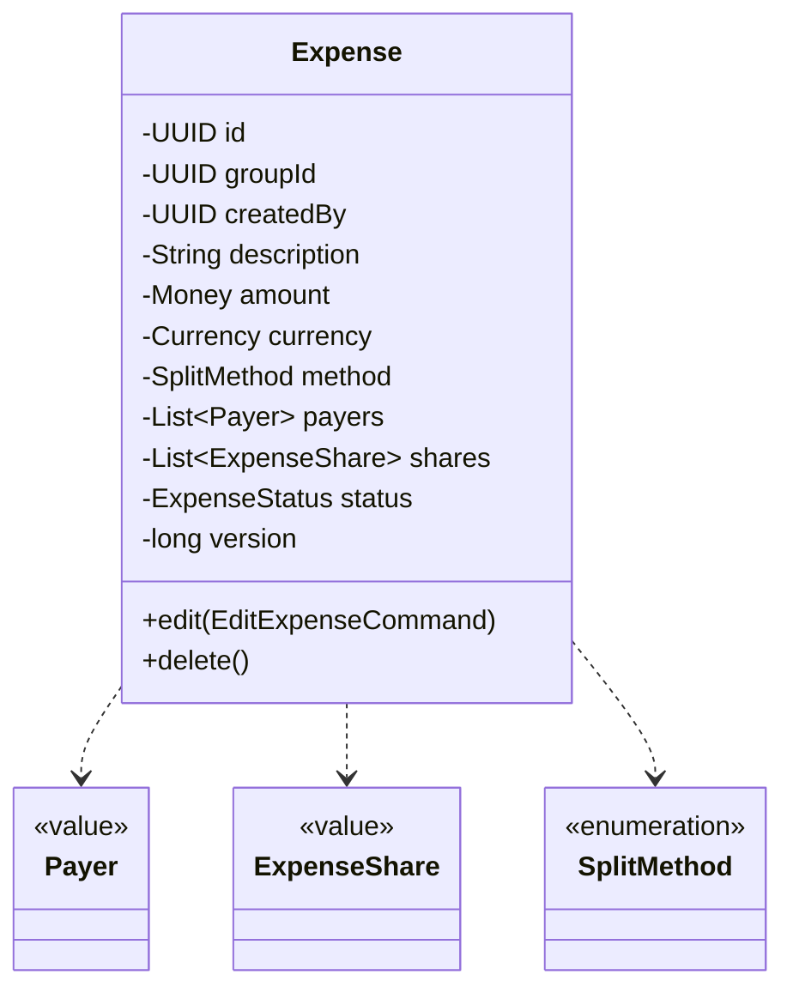
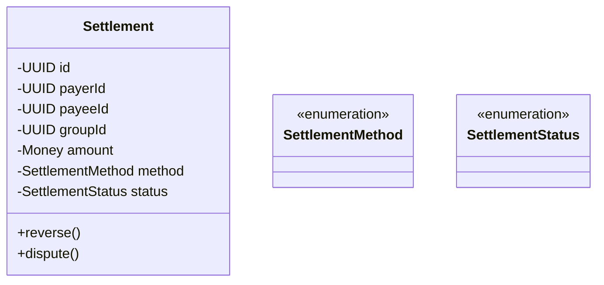
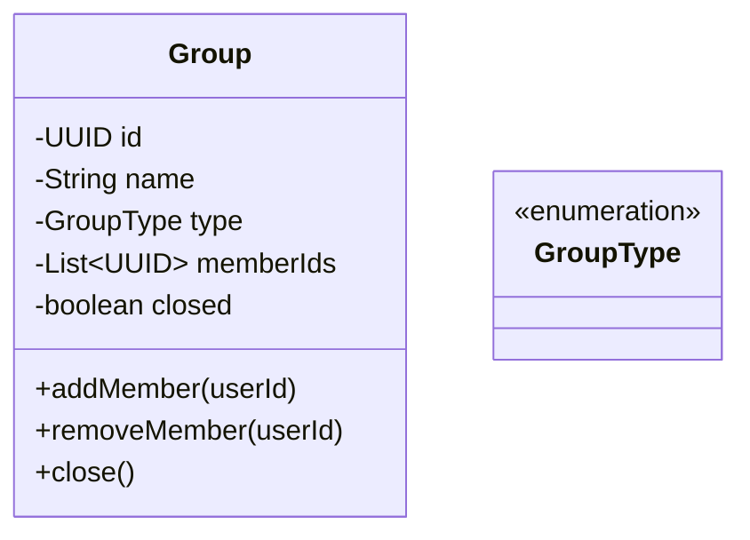
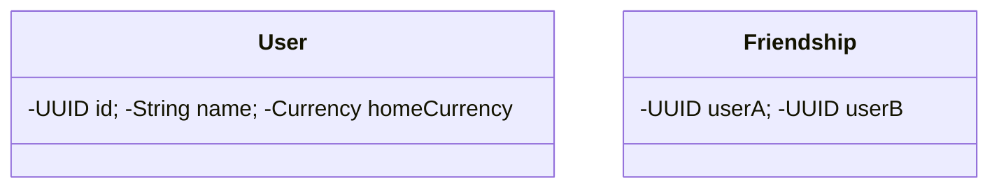
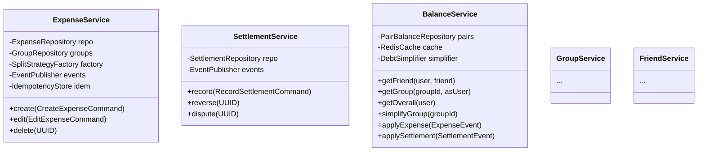
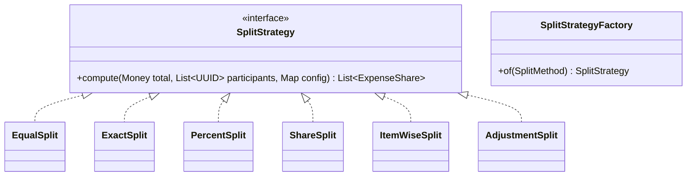
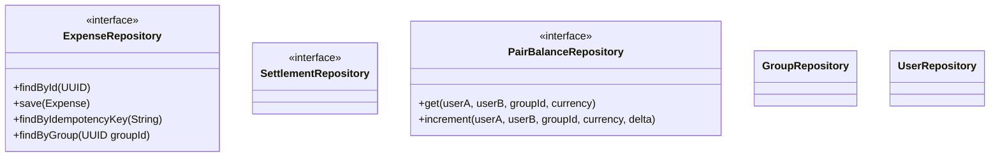
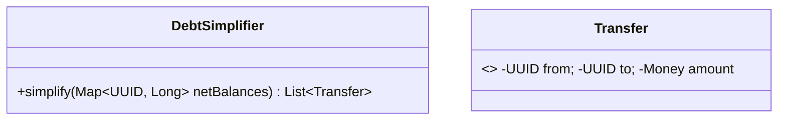

# 07 · Splitwise — Class Diagrams

## Domain

---

## Application services

---

## Strategies

---

## Repositories

---

## Debt simplification

---

## State pattern (Expense — light)

Most state behavior is in `status` (ACTIVE → DELETED). We use enum + transition map; the differences are small enough.

For `Settlement` (RECORDED → DISPUTED → REVERSED), same approach.

---

## Layering

```mermaid
flowchart LR
  subgraph api
    ExpenseController; SettlementController; BalanceController; GroupController
  end

  subgraph application
    ExpenseService; SettlementService; BalanceService; GroupService
  end

  subgraph domain
    Expense; Settlement; Group; SplitStrategy; DebtSimplifier
    ExpenseRepository_int[<<interface>> ExpenseRepository]
  end

  subgraph infra
    JpaExpenseRepository; KafkaPublisher; RedisCache
  end

  api --> application
  application --> domain
  application --> infra
  infra --> domain
```

---

## Take-aways

- **Strategy** for split methods is the most-used pattern.
- Balance is a derived view — kept as cache + snapshot.
- **DebtSimplifier** is a focused algorithm class.
- Idempotent expense creation via key.
- All cross-aggregate communication via events.
