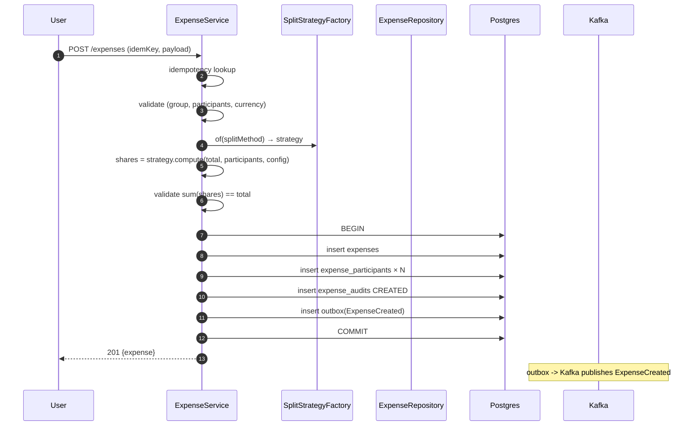
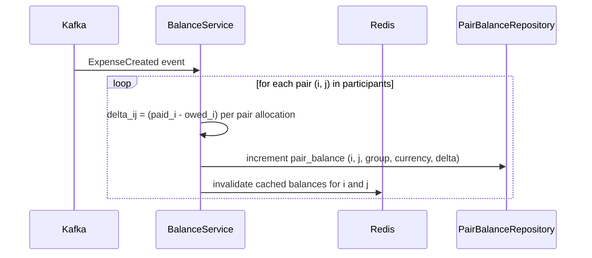
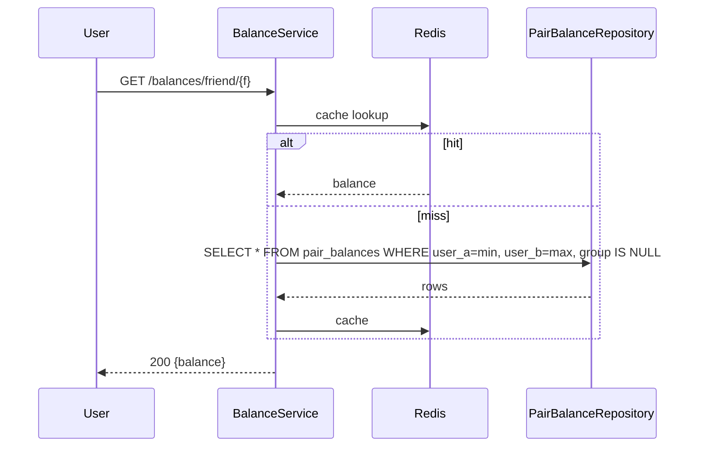
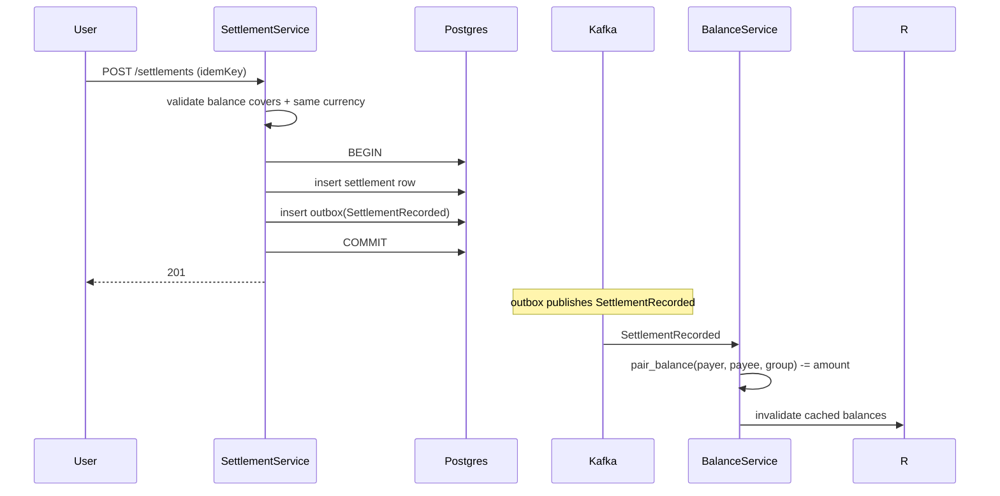
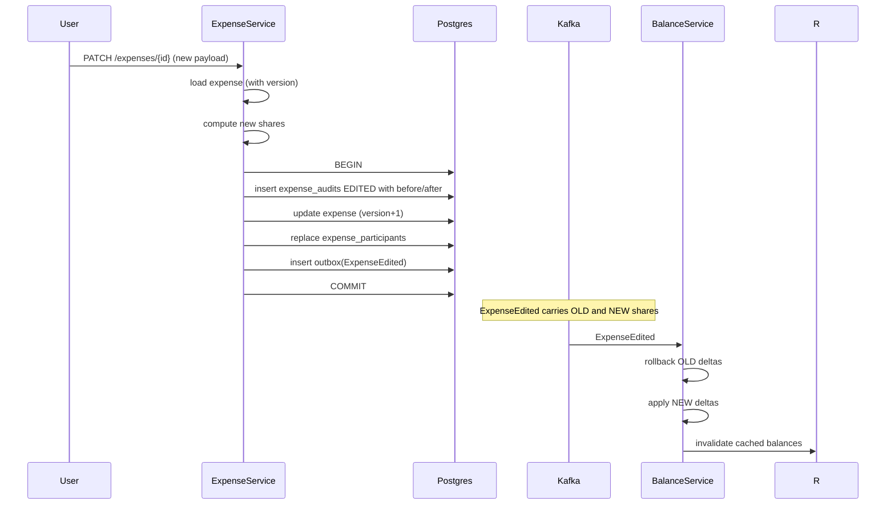
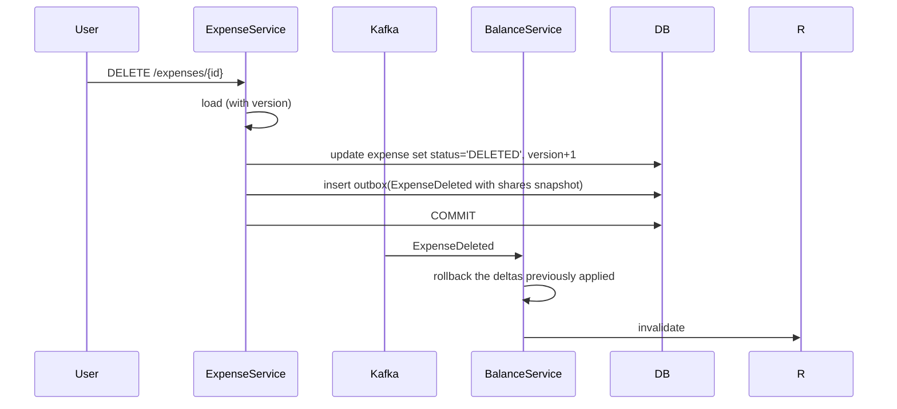
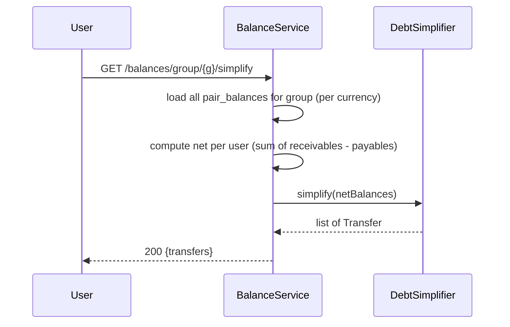
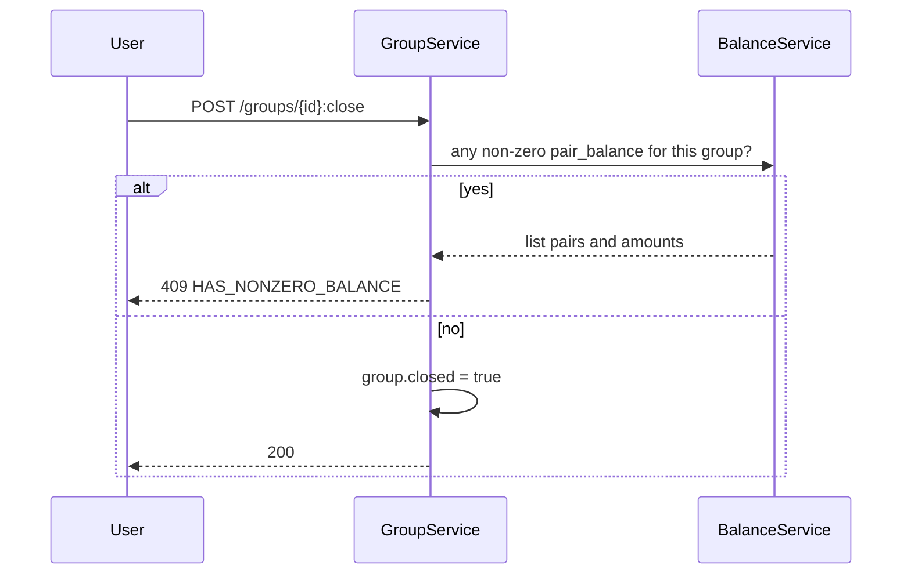

# 08 · Splitwise — Sequence Diagrams

## 1. Create expense



---

## 2. Apply expense to balances (async)



For per-pair allocation: when one person pays for many, the debt is "owed by each participant to the payer." We compute pair-level deltas:
```
For each participant p:
  For each payer q:
    delta(p->q) = participant.owedAmount × (payer.paidAmount / total)
```

A single user paying everything is the simple case: each participant owes the payer their share.

---

## 3. View balance (cached)



---

## 4. Settlement



---

## 5. Edit expense



The edit event carries both old and new state so balance updates are deterministic — no need to re-query the previous version.

---

## 6. Delete expense



We always **soft-delete**. The expense row stays for audit. Balances are recomputed by reversing the prior deltas.

---

## 7. Debt simplification



The algorithm runs at request time (not stored). For groups < 50 members, it's instant. For larger groups, we cache the result for 1 minute.

---

## 8. Group close with active balances



We never silently delete data with money implications.

---

## What these reveal

- The Expense write is one transaction; balance update is async.
- All edit/delete events carry both old and new state for deterministic balance updates.
- Debt simplification is a stateless algorithm.
- Cache invalidation happens on every balance change.
- Idempotency keys + outbox = reliability.
