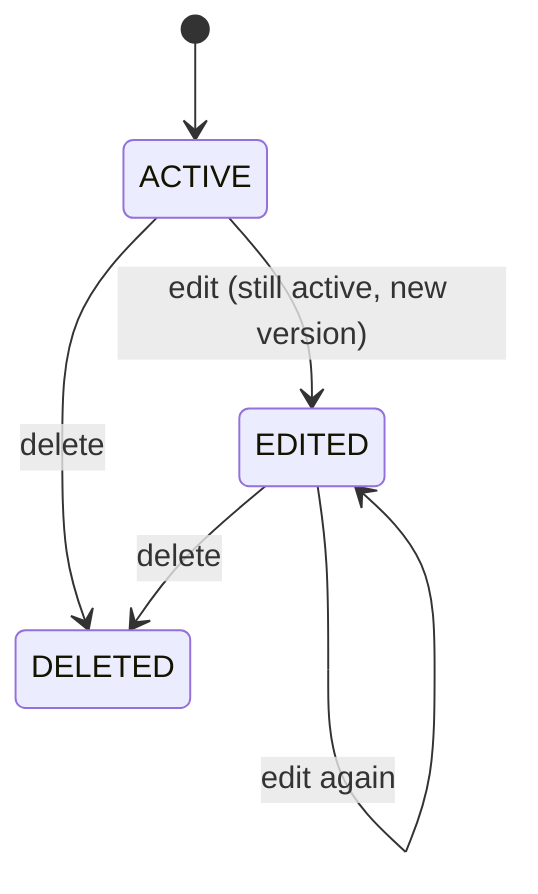
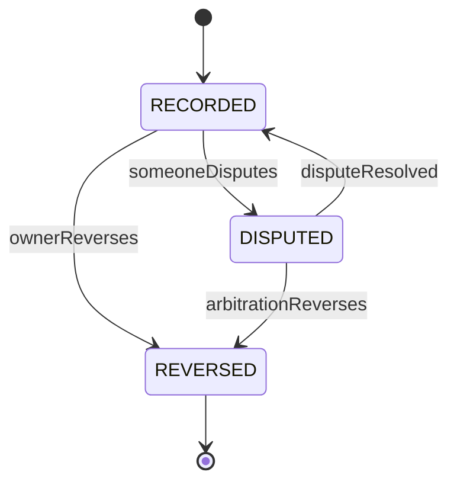
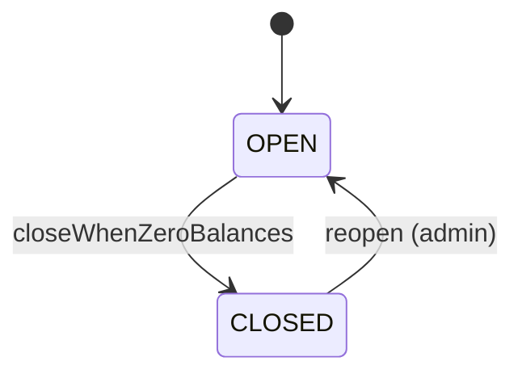
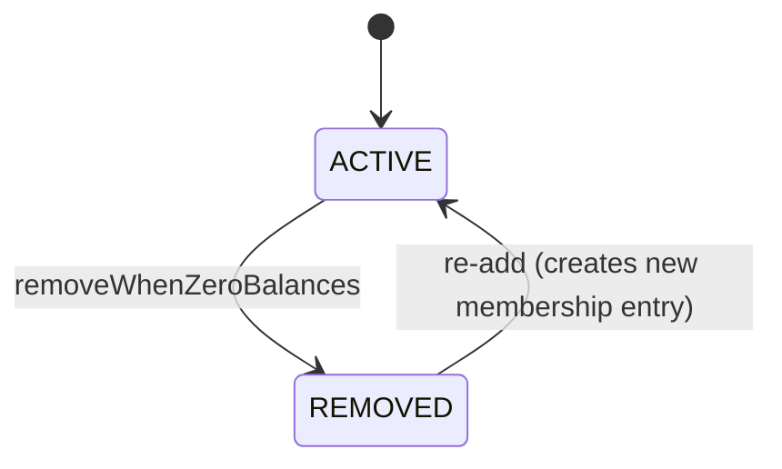

# 09 · Splitwise — State Machines

## Expense



Note: `EDITED` is functionally `ACTIVE` with `version > 1`. Some teams keep just `ACTIVE` and `DELETED` (i.e., "edited" is a property, not a state). We made it explicit for audit clarity.

### Transition table

| From | Event | Effect |
| --- | --- | --- |
| ACTIVE | edit | new audit, new version, balance reverse-old + apply-new |
| ACTIVE | delete | new audit, status=DELETED, balance reverse |
| EDITED | edit | same |
| EDITED | delete | same |
| DELETED | (terminal) | restore is a separate admin path, optional |

### Why audits matter

Each transition writes to `expense_audits` with `before_json` and `after_json`. This is the dispute resolution paper trail.

---

## Settlement



### Why these states

- **RECORDED** is the normal path.
- **DISPUTED** marks "this payment is contested"; balances are not undone yet (we don't auto-revert because the payer claims it happened). Both parties get prompted.
- **REVERSED** finalizes the undo; balance gets the money put back.

The exact policy can vary; we make `disputed` informational and let users resolve manually.

---

## Group



A closed group:
- No new expenses.
- Settlements still allowed (to fix mistakes).
- Read-only for members.

---

## Member of group



We keep historical memberships (`removed_at` not null) so old expenses still link to a valid user-group association.

---

## Why simple state machines

Splitwise's complexity is in the **algorithms** (split, simplify) and the **balance pipeline** (consistency under concurrent edits), not in lifecycles. Most lifecycles are 2-3 states.

We keep state machines as enums + transition guards inside the aggregate. State pattern is overkill here.

---

## Cross-aggregate invariants

| Invariant | Enforcement |
| --- | --- |
| Sum of pair balances per group per currency = 0 | Reconciliation cron |
| Each expense's shares sum to amount | Domain validation at create/edit |
| Closed group has no expenses dated after close time | Domain validation |
| Removed member has no active balance with anyone in group | Pre-check at remove |

The "sum to zero" invariant is **fundamental**:

> If everyone in a group records all expenses honestly, the net debt always sums to zero.

A reconciliation cron checks this nightly. If drift > ₹0.01 (rounding), alert SRE.

---

## Common interviewer trick

> "Two users edit the same expense at the same time."

Optimistic version on the expense row:
```sql
UPDATE expenses SET ..., version=version+1 WHERE id=? AND version=$expected;
```

If 0 rows → conflict. The second editor gets `409 CONFLICT_VERSION`. They re-fetch and try again.

> "What if the balance worker crashes mid-event?"

The Kafka consumer commits offsets only after applying. If it crashes before commit, on restart it re-reads the event and applies it again. Application is idempotent: each event has `event_id` and `last_event_id` is tracked per pair. We skip re-application of already-applied events.

> "What if a user deletes an expense after it's been settled?"

The user can still delete (we don't prevent it). The balance reverses — they may now owe (or be owed) extra. Settlement remains as-is. The user is notified and may need to re-settle.

This reveals an advanced design choice: settlements **don't lock** specific expenses; they reduce overall balance.
