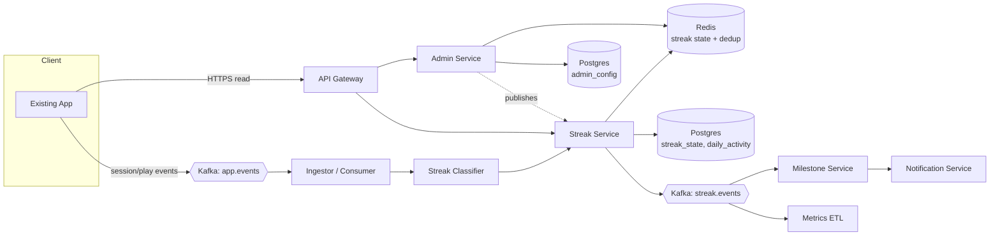

# 03 · Streak System — High Level Architecture

## Diagram



## Service responsibilities

| Service | Owns |
| --- | --- |
| **Ingestor** | Consumes raw app events from Kafka; transforms to canonical `ActivityEvent`. |
| **Classifier** | Decides whether an event qualifies for the **active streak type** per admin policy. |
| **Streak Service** | Updates `streak_state` and `daily_activity` per user; serves reads. |
| **Admin Service** | CRUD for admin policy (active streak type, milestones). |
| **Milestone Service** | Watches streak events; fires push when threshold crossed. |
| **Notification Service** | External push/email plumbing (we treat as black box). |

## Two paths

### Write path (event-driven)

```
App → Kafka(app.events) → Ingestor → Classifier → StreakService.recordActivity
                                                       │
                                                       ├── Redis: dedup check (user, day)
                                                       ├── if first event of day for type:
                                                       │   ├── upsert daily_activity
                                                       │   └── update streak_state (Redis + Postgres)
                                                       └── publish StreakUpdated event (if changed)
```

Most events short-circuit at the dedup check.

### Read path (sync)

```
App → API Gateway → StreakService.getStreak(userId)
                       │
                       ├── Redis: streak:{userId}:{activeType}
                       └── if miss → Postgres → Redis (TTL until user's next midnight)
```

Calendar reads similarly:
```
App → StreakService.getCalendar(userId, year, month)
         └── Postgres: SELECT day, count FROM daily_activity
                       WHERE user_id=? AND type=? AND date BETWEEN ?
```

## Why these boundaries?

- **Ingestor is separate** because we want to absorb upstream backpressure without affecting reads. Ingestor scales independently and writes through Streak Service via in-process call (or another internal queue).
- **Classifier is conceptually distinct** from Ingestor. Today's policy says "any session" qualifies; tomorrow it's "listening for ≥30s." Keeping classification in its own component makes Strategy injection clean.
- **Admin Service is separate** because admin operations are rare but high-stakes (changing streak type globally must invalidate caches). Keeping it isolated avoids accidental coupling.
- **Milestone Service is separate** because it has a different SLA (eventual; minutes lag is fine) and different fan-out (push providers).

## Data flows in detail

### Recording activity (cache-first)

```
1. ActivityEvent arrives: { user, type, timestamp, tz }
2. Compute event-day = floor_to_day(timestamp, tz)
3. Redis SETNX  dedup:{user}:{type}:{event-day}  →  if already set, RETURN.
4. Upsert daily_activity row (user, type, day, count++, last_at).
5. Read streak_state from Redis (or DB).
6. Compute new streak:
     if last_active_day == event-day:        no change (handled by step 3)
     elif last_active_day == event-day - 1:  current += 1
     else:                                    current = 1   // broken
   longest = max(longest, current)
7. Write streak_state to Redis + Postgres.
8. If milestone reached, publish StreakMilestoneReached event.
9. ACK Kafka offset.
```

Steps 3 and 4 are the only ones that hit storage 99 % of the time. Steps 5–8 hit only on the **first event of the day** (~1 of 8 events).

### Reading streak (cache-first)

```
GET /v1/me/streak
  redis = streak:{user}:{type}
  if hit: return
  if miss:
     row = SELECT * FROM streak_state WHERE user_id=? AND type=?
     compute is_alive = (today_in_user_tz - row.last_active_day) <= 1
     redis SET with TTL=until_user_midnight
     return
```

`is_alive=false` displays "you broke your streak" without resetting the row. The reset happens lazily on next activity.

### Reading calendar

```
GET /v1/me/streak/calendar?year=2025&month=6
  return SELECT day, count FROM daily_activity
         WHERE user_id=? AND type=? AND day BETWEEN '2025-06-01' AND '2025-06-30'
```

This is a partition-pruned index scan on the `daily_activity_2025_06` partition. Fast.

### Admin switching streak type

```
PATCH /v1/admin/streak-config { active_type: "LISTENING" }
  validate
  UPDATE admin_config SET active_type='LISTENING' WHERE id=DEFAULT
  publish AdminConfigChanged event
  invalidate Redis: streak:* (or version-bump cache prefix)
```

After a switch, users see their **LISTENING** streak (which we've been tracking in parallel — see `04_domain_model.md` for why we always track both).

## External integrations

| Integration | Pattern |
| --- | --- |
| App events (upstream) | Kafka topic `app.events` |
| Streak events (downstream) | Kafka topic `streak.events` |
| Push provider | async via NotificationService |
| Time / TZ | injectable Clock + IANA tz database |

## Failure modes

| Failure | Mitigation |
| --- | --- |
| Kafka backlog | Ingestor scales horizontally; events are independent and idempotent — replay safely |
| Redis down | Reads fall back to Postgres (slower but correct); writes still go to Postgres |
| Postgres failover | Ingestor pauses ~10 s, then resumes; idempotency key on (user, day, type) absorbs replays |
| Classifier slow / OOM | Circuit breaker; events queue in Kafka; backfill on recovery |
| Clock skew on client | Server clamps to [now-5m, now+5m]; rejects far-future events |
| User TZ unknown | Fallback to UTC; operationally rare |
| Admin config write race | Single row with version; UPDATE WHERE version=? |
| Streak read during admin switch | Cache invalidated; next read goes to DB |

## Why we don't use a daily cron to "break" streaks

A naive design runs a midnight cron per timezone that scans users and resets `current_streak` to 0 if they were inactive. That's a 30 M-row scan, racy with concurrent updates, and you have to repeat for ~38 timezones.

**Our design**: streak break is computed on **read** (`is_alive = today - last_active_day <= 1`) and **applied lazily on next activity**. Storage shows the *last known good streak*, and the read path tells the user whether it's still alive.

This is a critical staff-level insight. State the alternative and reject it explicitly in interviews.

## Output

A clean separation: **ingest** (cheap, idempotent), **state** (per-user, O(1) updates), **read** (cache-first), and **admin/milestones** (slow path).
