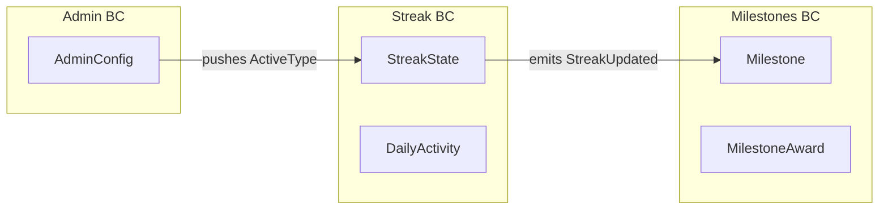

# 04 · Streak System — Domain Model

We use **Domain-Driven Design**: identify aggregates, value objects, domain events, and invariants. Two aggregates anchor this system: `StreakState` (small, hot, mutable) and `DailyActivity` (append-only log). They are tied together by the streak update algorithm.

## Bounded contexts



Three bounded contexts. They share concepts (UserId, StreakType) but own their own data and lifecycle.

## Aggregates

### 1. `StreakState` (aggregate root)

The hot, mutable per-user record. **One per (user, streakType)**. We track multiple types in parallel even when only one is "active" (admin switches don't lose history).

```text
StreakState
├── userId          : UserId
├── streakType      : StreakType            # APP_VISIT | LISTENING
├── current         : int                   # current consecutive days
├── longest         : int                   # personal best
├── lastActiveDay   : LocalDate?            # in user's TZ
├── userTimezone    : ZoneId                # snapshot
├── version         : long                  # optimistic locking
└── updatedAt       : Instant

Invariants:
  - current >= 0
  - longest >= current
  - if lastActiveDay == null then current == 0
  - lastActiveDay <= today_in_user_tz
```

#### Behavior (the entire algorithm)

```java
public StreakUpdate recordActivity(LocalDate eventDay, ZoneId userTz) {
    if (lastActiveDay != null && lastActiveDay.equals(eventDay)) {
        return StreakUpdate.noop(this);          // already counted today
    }
    int newCurrent;
    if (lastActiveDay == null || eventDay.isAfter(lastActiveDay.plusDays(1))) {
        newCurrent = 1;                           // broken or first ever
    } else if (eventDay.equals(lastActiveDay.plusDays(1))) {
        newCurrent = current + 1;                 // consecutive
    } else {
        // event is for an OLDER day (late arrival). Don't move current forward.
        return StreakUpdate.backfilled(this);
    }
    int newLongest = Math.max(longest, newCurrent);
    return StreakUpdate.advanced(
        new StreakState(userId, streakType, newCurrent, newLongest,
                        eventDay, userTz, version + 1, Instant.now()),
        previousCurrent: current, newCurrent
    );
}
```

That's the entire core algorithm. Every other complication (calendar view, milestones, admin config) is layered on top of this.

#### Why is "is alive" not stored?

```java
public boolean isAlive(LocalDate today) {
    if (lastActiveDay == null) return false;
    long gap = ChronoUnit.DAYS.between(lastActiveDay, today);
    return gap <= 1;     // today or yesterday
}
```

Computed on demand. Storing it would force a daily cron to flip it; we don't want that (see `03_hld.md`).

### 2. `DailyActivity` (aggregate root, append-only-ish)

One row per `(userId, streakType, day)`. Used for:
- the calendar view,
- audit / debugging,
- backfills (if we ever need to recompute streaks).

```text
DailyActivity
├── userId       : UserId
├── streakType   : StreakType
├── day          : LocalDate            # in user's TZ
├── eventCount   : int                  # how many qualifying events that day
├── firstEventAt : Instant
├── lastEventAt  : Instant
└── userTimezone : ZoneId

Invariants:
  - eventCount >= 1 (we don't store zero-rows)
  - firstEventAt <= lastEventAt
  - day == day-of(firstEventAt, userTimezone)
```

Operations:
- `incrementOrCreate(day, eventAt, tz)` — idempotent on (user, type, day).
- `findByMonth(userId, type, ym)` → calendar view.

### 3. `AdminConfig` (aggregate root)

Singleton-ish (one row globally for V1; per-segment in V2).

```text
AdminConfig
├── activeStreakType : StreakType
├── milestones       : List<int>     # [7, 30, 100, 365]
├── version          : long
└── updatedBy / At
```

Operations:
- `setActiveType(StreakType)` (with optimistic lock).
- `addMilestone(int days)`.

### 4. `MilestoneAward` (aggregate root)

```text
MilestoneAward
├── userId        : UserId
├── streakType    : StreakType
├── milestoneDays : int
├── achievedAt    : Instant
└── (uniqueness on user+type+milestoneDays)
```

Idempotent per (user, type, milestone) — user can only earn the 7-day milestone once for a given streak type.

> Subtle: if user reaches 7 days, breaks the streak, then reaches 7 days again — do we re-award? **V1 says no** (lifetime achievement). V2 could re-award per-streak (see extensions). Decision is captured here, not buried in code.

## Value objects

```java
record UserId(UUID value) { }

enum StreakType { APP_VISIT, LISTENING }

record ActivityEvent(
    UserId userId,
    StreakType type,         // already classified
    Instant occurredAt,
    ZoneId userTimezone,
    String dedupeKey         // (user, type, day) or upstream eventId
) { }

record StreakSnapshot(            // returned to clients
    StreakType type,
    int current,
    int longest,
    LocalDate lastActiveDay,
    boolean isAlive,
    LocalDate today
) { }

record CalendarDay(
    LocalDate day,
    boolean active,
    int eventCount
) { }
```

`Instant` for absolute time, `LocalDate` + `ZoneId` for "user-local day." Don't mix them.

## Domain events

```
- ActivityRecorded         (user, type, day, isFirstOfDay)
- StreakAdvanced           (user, type, prev, current, longest)
- StreakBroken             (user, type, previousLongest, brokenAt)
- StreakMilestoneReached   (user, type, milestoneDays)
- AdminConfigChanged       (newActiveType, oldActiveType)
```

Published to `streak.events` Kafka topic. Consumers: Milestone Service, Metrics ETL, Notification.

## Why two aggregates and not one big "User Streak" entity?

| Concern | StreakState | DailyActivity |
| --- | --- | --- |
| Size | tiny (~150 B) | grows daily, retained 5 yr |
| Mutation rate | once per day per user | once per day per user (similar) |
| Read pattern | hot single-row | range scan (calendar) |
| Consistency | strict | eventually fine |
| Lock contention | high (one row, multiple events) | low (one row per day) |

Splitting them lets each be optimized independently:
- `streak_state` is a small table, fits in RAM, indexed by `(user_id, type)`.
- `daily_activity` is a large partitioned table optimized for range scans.

This is the **read/write decomposition** pattern from `00_End_To_End_LLD_Tutorial/03_structured_lld_framework.md`.

## Why classify *before* persisting?

Some upstream events are noise (e.g., a token refresh isn't an "app visit"). The Classifier (a Strategy implementation, see `10_design_patterns.md`) decides:

```java
public interface ActivityClassifier {
    Optional<StreakType> classify(RawAppEvent event);
}
```

A classifier returns `Optional.empty()` for non-qualifying events, which we drop *before* hitting Redis or Postgres. This saves the bulk of cost in capacity estimation (`02_capacity_estimation.md`).

## "Day basis" formally

A streak is a sequence `d_1, d_2, ..., d_n` where:
- `d_1 < d_2 < ... < d_n`,
- `d_{i+1} = d_i + 1 day` (no gaps),
- each `d_i` has at least one qualifying event,
- `d_i` is the user's local calendar day at the time of the qualifying event.

That's it. A rolling-window streak would replace the second condition with `eventTime_{i+1} - eventTime_i <= 24 hours`. We are explicitly **not** doing that.

## Output

The domain has two hot aggregates (`StreakState`, `DailyActivity`) plus admin and milestone aggregates. The streak math is a pure function on `(lastActiveDay, eventDay)`. Everything else is plumbing around that function.
