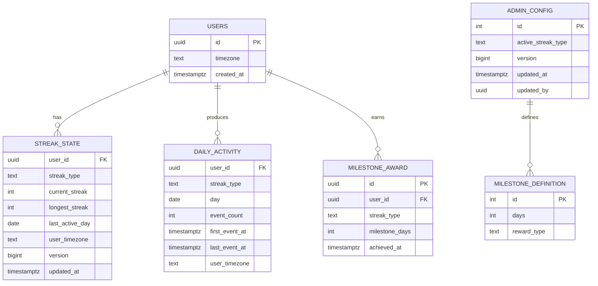

# 05 · Streak System — Database Design

We use **Postgres** as the system of record (transactional, partitionable, generous indexing, JSONB for flexibility) plus **Redis** for hot reads and dedup. We could equally use Cassandra/Scylla for `daily_activity` at scale; we'll defend Postgres + monthly partitioning as the V1 choice and call out the migration path.

## ER diagram



## Schema (Postgres DDL)

```sql
-- ── USERS (we don't own this; reference only)
-- ── STREAK_STATE: one row per (user, streak_type)
CREATE TABLE streak_state (
    user_id          UUID        NOT NULL,
    streak_type      TEXT        NOT NULL CHECK (streak_type IN ('APP_VISIT', 'LISTENING')),
    current_streak   INT         NOT NULL DEFAULT 0 CHECK (current_streak >= 0),
    longest_streak   INT         NOT NULL DEFAULT 0 CHECK (longest_streak >= current_streak),
    last_active_day  DATE        NULL,
    user_timezone    TEXT        NOT NULL DEFAULT 'UTC',
    version          BIGINT      NOT NULL DEFAULT 0,
    updated_at       TIMESTAMPTZ NOT NULL DEFAULT now(),
    PRIMARY KEY (user_id, streak_type)
);

CREATE INDEX idx_streak_state_longest      ON streak_state (streak_type, longest_streak DESC);
CREATE INDEX idx_streak_state_last_active  ON streak_state (streak_type, last_active_day);


-- ── DAILY_ACTIVITY: one row per (user, type, day). Partitioned by month.
CREATE TABLE daily_activity (
    user_id        UUID        NOT NULL,
    streak_type    TEXT        NOT NULL,
    day            DATE        NOT NULL,
    event_count    INT         NOT NULL DEFAULT 1,
    first_event_at TIMESTAMPTZ NOT NULL,
    last_event_at  TIMESTAMPTZ NOT NULL,
    user_timezone  TEXT        NOT NULL,
    PRIMARY KEY (user_id, streak_type, day)
) PARTITION BY RANGE (day);

-- Create monthly partitions (managed by pg_partman or app-side scheduler)
CREATE TABLE daily_activity_2025_06
  PARTITION OF daily_activity
  FOR VALUES FROM ('2025-06-01') TO ('2025-07-01');

CREATE INDEX idx_daily_activity_user_day
  ON daily_activity (user_id, streak_type, day);
-- The PK already covers this; index is redundant but explicit for clarity.


-- ── ADMIN_CONFIG: singleton-ish (id=1)
CREATE TABLE admin_config (
    id                  INT          PRIMARY KEY DEFAULT 1 CHECK (id = 1),
    active_streak_type  TEXT         NOT NULL DEFAULT 'APP_VISIT'
                                     CHECK (active_streak_type IN ('APP_VISIT', 'LISTENING')),
    version             BIGINT       NOT NULL DEFAULT 0,
    updated_at          TIMESTAMPTZ  NOT NULL DEFAULT now(),
    updated_by          UUID         NULL
);
INSERT INTO admin_config (id) VALUES (1) ON CONFLICT DO NOTHING;


-- ── MILESTONE_DEFINITION
CREATE TABLE milestone_definition (
    id           SERIAL PRIMARY KEY,
    days         INT  UNIQUE NOT NULL,
    reward_type  TEXT NOT NULL DEFAULT 'BADGE'
);
INSERT INTO milestone_definition (days) VALUES (7), (30), (100), (365)
  ON CONFLICT DO NOTHING;


-- ── MILESTONE_AWARD: idempotent per (user, type, milestone)
CREATE TABLE milestone_award (
    id              UUID         PRIMARY KEY DEFAULT gen_random_uuid(),
    user_id         UUID         NOT NULL,
    streak_type     TEXT         NOT NULL,
    milestone_days  INT          NOT NULL,
    achieved_at     TIMESTAMPTZ  NOT NULL DEFAULT now(),
    UNIQUE (user_id, streak_type, milestone_days)
);

CREATE INDEX idx_milestone_award_user ON milestone_award (user_id);
```

## Why monthly partitions on `daily_activity`?

- **Dataset is time-bounded**: calendar reads always touch the current and previous month.
- **Old data is cheap to drop**: detach a partition older than 13 months → S3 archive in seconds, no DELETE storm.
- **Vacuum and bloat**: each partition is small (~10 GB at scale) — vacuum runs fast, autovacuum keeps up.
- **Backups**: per-partition pg_dump for recent months only.

Without partitioning, a 4 TB single table is operationally painful (vacuum, replication lag, schema migrations).

## Why not Cassandra / DynamoDB for `daily_activity`?

- Postgres handles 1.5 K writes/sec on this table easily; we don't need horizontal scale yet.
- Calendar query is a tiny range scan within a partition — Postgres is great at that.
- Cassandra wins if writes >> 50 K/sec or if globally distributed; both are V2 problems.

If we did move: shard key would be `user_id`, clustering key `(streak_type, day DESC)`. Range scan on a single partition.

Captured in `13_extensions_and_tradeoffs.md`.

## Why not store `is_alive` on `streak_state`?

It's a derived value from `last_active_day` and today's date in the user's TZ. Storing it would force a daily cron to flip it for inactive users, which is exactly the design we rejected in `03_hld.md`.

## Optimistic locking on `streak_state`

```sql
UPDATE streak_state
   SET current_streak = $1,
       longest_streak = $2,
       last_active_day = $3,
       version = version + 1,
       updated_at = now()
 WHERE user_id = $4
   AND streak_type = $5
   AND version = $6;       -- expected version

-- 0 rows → CAS failed → re-read, re-apply, retry
```

Why? Multiple events for the same user can race (multi-device). With CAS on `version`, the loser retries; the retry is cheap because `recordActivity` is a pure function of `(state, eventDay)`.

We avoid `SELECT … FOR UPDATE` for the hot path because it serializes the bookkeeping per user and adds latency. Optimistic is faster; the retry rate at ~5 events/user/day is negligible.

## Idempotency on `daily_activity`

```sql
INSERT INTO daily_activity (user_id, streak_type, day, event_count, first_event_at, last_event_at, user_timezone)
VALUES ($1, $2, $3, 1, $4, $4, $5)
ON CONFLICT (user_id, streak_type, day) DO UPDATE
   SET event_count    = daily_activity.event_count + 1,
       last_event_at  = GREATEST(daily_activity.last_event_at, EXCLUDED.last_event_at);
```

Single statement, atomic, idempotent on PK. If our consumer re-delivers an event, `event_count` over-increments by 1 — fine for analytics, doesn't affect streak math. (If we cared about exact counts we'd dedup on upstream `event_id` via a side table.)

## Redis schema

```
streak:{user_id}:{type}            HASH    current, longest, last_active_day, tz, version
                                            TTL = until end of user's local day + 1h slack

dedup:{user_id}:{type}:{date}      STRING  "1"
                                            TTL = 26h    (covers TZ swing)

admin:active_type                  STRING  "APP_VISIT" or "LISTENING"
                                            no TTL; updated by admin

cal:{user_id}:{ym}:{type}          BITMAP  bit i set = day i+1 active   (optional)
                                            TTL = 7 days
```

The `dedup:*` key is the killer optimization: it short-circuits 7 of 8 events.

## Data retention

| Table | Retention | Why |
| --- | --- | --- |
| `streak_state` | forever (until account delete) | tiny; user expects history |
| `daily_activity` | 13 months online + 5 yr cold | calendar; analytics |
| `milestone_award` | forever | achievement record |
| `admin_config` audit log | 5 yr | compliance |

## Migrations

Use Flyway / Liquibase. Migrations are **forward-only**. For renames or type changes:
1. Add new column,
2. Backfill,
3. Switch reads,
4. Drop old.

Big-bang `ALTER` on `daily_activity` would require lock + rewrite of TBs. Per-partition migrations are tractable.

## Output

```
Hot table:    streak_state           (one row per user × type)
Big table:    daily_activity         (partitioned monthly)
Singleton:    admin_config           (id = 1)
Audit:        milestone_award        (unique per user × type × milestone)
Hot cache:    Redis (streak, dedup, active_type)
Locking:      optimistic CAS on version
Partition:    monthly on daily_activity, archive >13 mo
```
