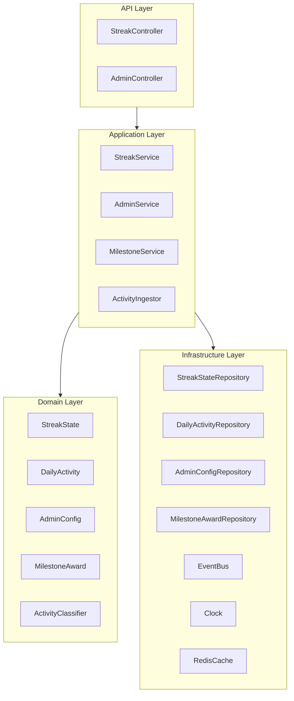
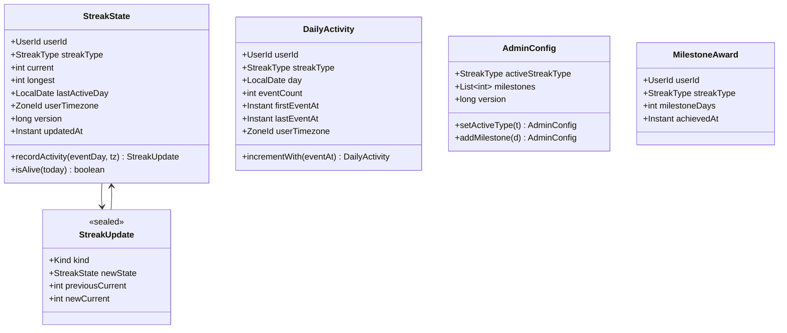
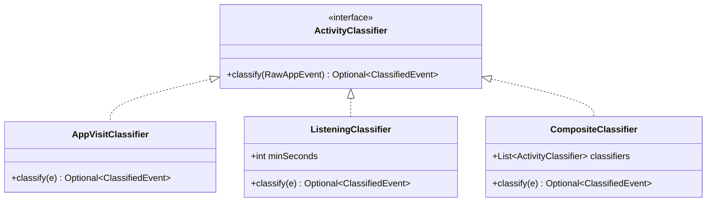
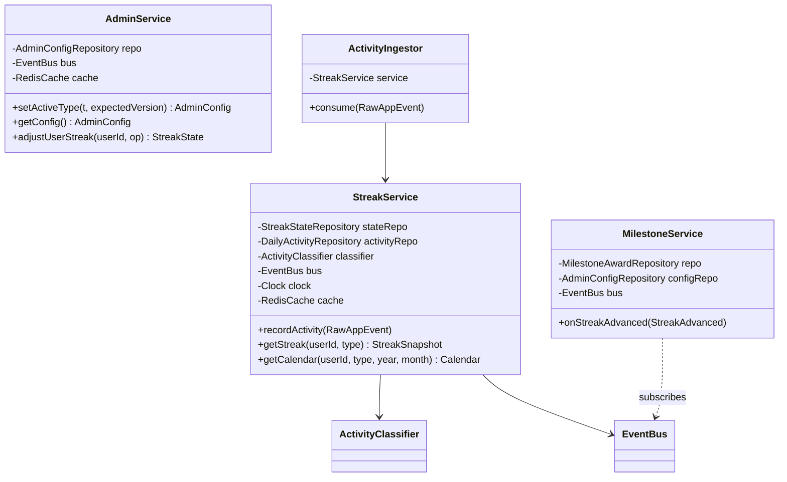
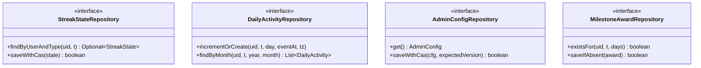
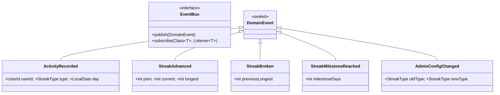
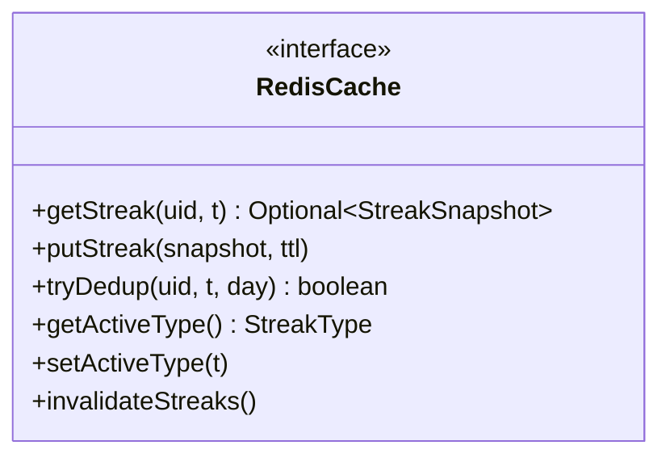

# 07 · Streak System — Class Diagrams

Class-level structure of the Streak Service, drawn at the granularity an interviewer expects you to whiteboard.

## Layered package map



## Core domain classes



`StreakState.recordActivity(...)` is **pure** — it returns a new `StreakState` and a `StreakUpdate` discriminated union. The application layer interprets the update.

## Strategy: classification



`CompositeClassifier` runs multiple classifiers in order; we use it because we *track both types in parallel* even though only one is "active." (Why: switching active type shouldn't lose history — see `04_domain_model.md`.)

## Application layer



### Why `StreakService` is one class with three methods

`recordActivity`, `getStreak`, and `getCalendar` share the same dependencies (cache, repos, clock). Splitting them across services would create cycles or duplicate wiring. Internally each method is small (≤ 30 lines) and delegates to repos; SRP is preserved by domain methods, not by service splitting.

## Repository interfaces (ports)



Repositories return domain objects, not rows. SQL/Redis details live in adapters.

## Event bus and events



In V1 the bus is in-process (delegates to a Kafka producer at the edge). In V2 we can replace with a Kafka-direct adapter without touching listeners.

## Cache abstraction



`tryDedup` returns `true` when this is the first event for `(user, type, day)` — driven by a Redis `SETNX`.

## Why `StreakState.recordActivity` returns a `StreakUpdate` (not void)

Returning a discriminated union forces the caller to handle each case explicitly:

```java
public sealed interface StreakUpdate permits NoOp, Advanced, Backfilled, Restarted {
    record NoOp(StreakState state) implements StreakUpdate {}
    record Advanced(StreakState newState, int previousCurrent, int newCurrent)
            implements StreakUpdate {}
    record Backfilled(StreakState state) implements StreakUpdate {}
    record Restarted(StreakState newState, int previousLongest)
            implements StreakUpdate {}
}
```

The application layer maps:
- `Advanced` → publish `StreakAdvanced`, persist new state.
- `Restarted` → publish `StreakBroken` first, then `StreakAdvanced(1)`, persist.
- `Backfilled` → upsert `daily_activity` only, leave `streak_state` alone.
- `NoOp` → ignore.

This is **encoding the state machine in types**. No `boolean` flags, no nulls, no implicit branches.

## Output

A clean separation: **domain** is small (algorithms, invariants), **application** is glue, **infrastructure** hides the DB/cache, **events** decouple downstream concerns. The whole core fits in ~300 lines of Java.
