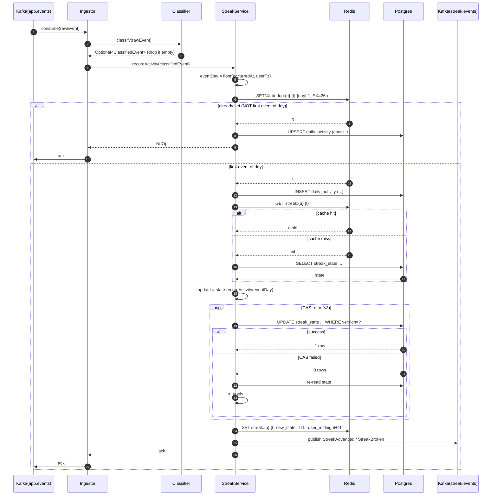
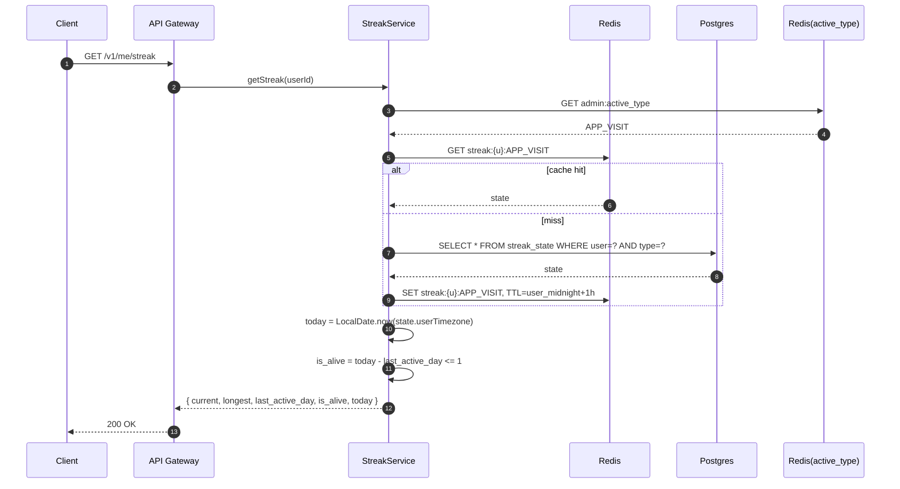
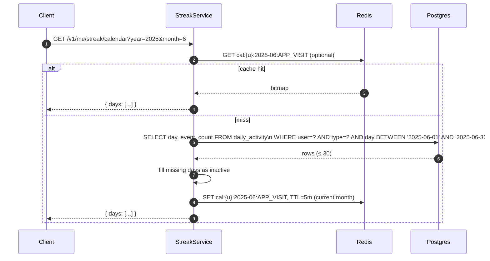
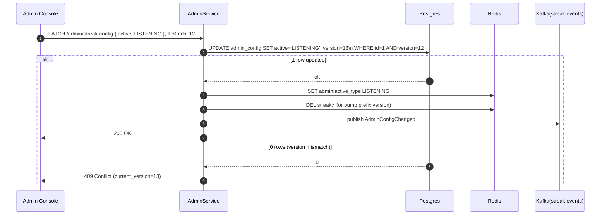
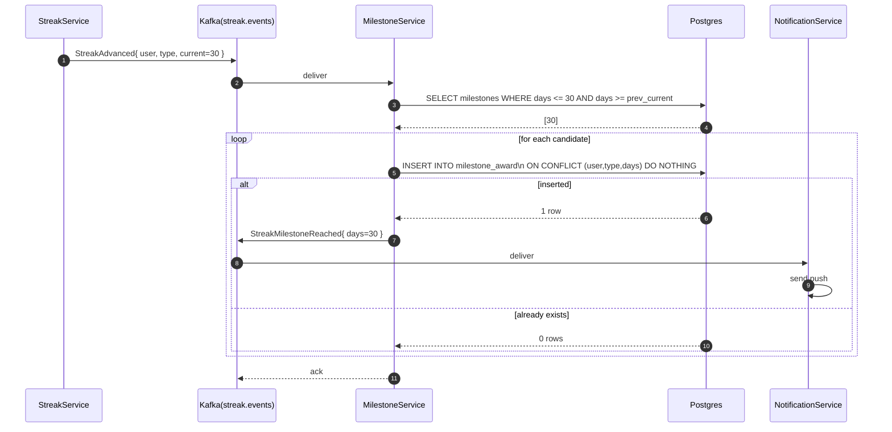
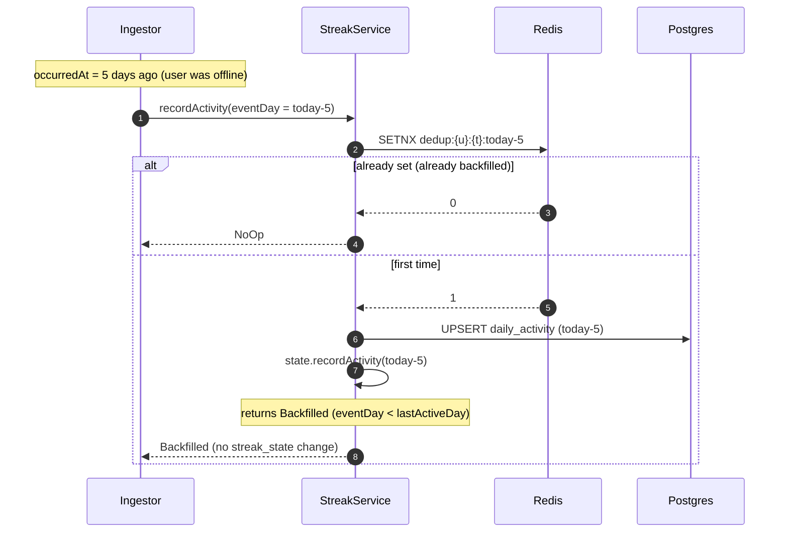

# 08 · Streak System — Sequence Diagrams

The four flows you must be able to whiteboard:
1. Recording activity (cache-first, idempotent).
2. Reading the streak.
3. Reading the calendar.
4. Admin switching the active streak type.
5. Milestone fire (async).

## 1. Recording activity (the hot path)



### Why the cache check first?

Most events are not the first of the day. SETNX is one Redis hop; failing fast avoids any DB work at all. Cost per non-first event ≈ 0.5 ms.

### Why CAS, not pessimistic lock?

Multi-device contention is rare (~1 in 1000 events) and short. Pessimistic locks add per-row latency on every event; CAS only pays the retry cost on actual conflict.

### What if the Kafka offset is acked before Postgres is committed?

It isn't. We commit the offset only **after** Postgres acks. If Ingestor crashes mid-flow, the same event is re-delivered; the dedup SETNX absorbs it (ttl > re-delivery window).

## 2. Reading the streak



`is_alive` is **computed**, never stored. This is what lets us skip the daily-cron design.

## 3. Reading the calendar



Past-month calendars are immutable → cache TTL = 7d.
Current month → TTL = 5m (so today's activity surfaces quickly).

## 4. Admin switching active streak type



### Cache invalidation on admin switch

We use a **prefix version** trick rather than `DEL streak:*`:

```
Redis key: streak:v{globalVersion}:{u}:{t}
admin:cache_version = 7   (incremented on every admin change)
```

Reads look up `admin:cache_version` (cached locally for 1 s), then key `streak:v7:{u}:{t}`. Switching version effectively invalidates the world without scanning. This pattern is captured in `00_End_To_End_LLD_Tutorial/08_database_design.md` as the "cache versioning" technique.

## 5. Milestone firing (async)



Idempotency on `(user, type, milestone)` — replays don't double-award.

## 6. Edge case: late-arriving event (offline mode)



`Backfilled` updates only the calendar — the **current** streak isn't grown by old events because that would let users game offline mode. Captured in `04_domain_model.md`.

## Output

```
recordActivity:  cache dedup → upsert daily_activity → CAS streak_state → publish
getStreak:       cache → fallback DB; is_alive computed
getCalendar:     range scan, fill gaps
admin switch:    DB CAS → cache version bump → publish
milestone:       async listener; idempotent on (user,type,days)
```

These five flows are everything the system does. Burn them in.
