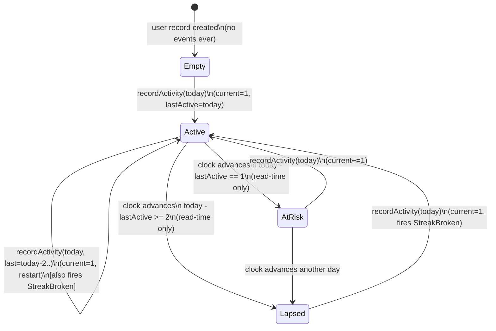
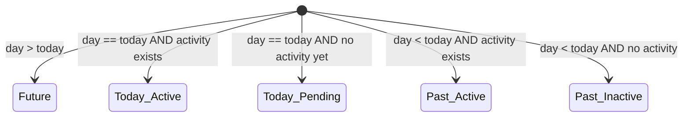

# 09 · Streak System — State Machines

The streak system has fewer entities with state than (say) ride-booking, but the **streak transition** itself is a small, exact state machine that we want explicit. Two state machines matter:

1. **Streak state machine** — the per-user lifecycle.
2. **AdminConfig** — small but worth pinning.

## 1. Streak state machine

The conceptual states of a `StreakState`:



### Important nuances

#### `AtRisk` and `Lapsed` are **virtual**

There are no `AtRisk` / `Lapsed` enum values stored anywhere. They are computed at read time from `today - lastActiveDay`:

```java
public StreakDisplayState displayState(LocalDate today) {
    if (lastActiveDay == null) return EMPTY;
    long gap = ChronoUnit.DAYS.between(lastActiveDay, today);
    if (gap == 0) return ACTIVE_TODAY;
    if (gap == 1) return AT_RISK;        // can still rescue today
    return LAPSED;                        // already broken (will be reset on next event)
}
```

This is the core trick for avoiding the daily cron. The DB only ever sees `Empty` or `Active` rows. The "is the streak still going?" question is computed.

#### `StreakBroken` event semantics

When a user comes back after a 5-day gap, the *next* `recordActivity` does:
1. Compute `gap = today - lastActiveDay` = 5.
2. Domain function returns `Restarted(newState_with_current=1, previousLongest=...)`.
3. Application publishes **two** events in order:
   - `StreakBroken{ previousCurrent: 12, previousLongest: 47 }` (for analytics/notification)
   - `StreakAdvanced{ current: 1 }` (for the new run starting today)

Why two events? Downstream consumers care about *both* facts: the analytics ETL counts churn (broken streaks), the notification service may send "welcome back, let's start fresh!" These are different signals.

#### `Backfilled` vs `Restarted` vs `Advanced`

| Scenario | Event day vs lastActive | Returns |
| --- | --- | --- |
| Same day | `eventDay == lastActiveDay` | `NoOp` |
| Next day | `eventDay == lastActiveDay + 1` | `Advanced` |
| Future skip | `eventDay > lastActiveDay + 1` | `Restarted` (broken + new run) |
| Past day, no row | `eventDay < lastActiveDay` | `Backfilled` (calendar only) |
| Past day, dup | dedup key already set | absorbed at cache layer |

This is why `recordActivity` returns a sealed `StreakUpdate`. Each variant maps to specific persistence + event behaviors.

## 2. AdminConfig state machine

```mermaid
stateDiagram-v2
    [*] --> Default
    Default --> Default : setActiveType(same, version=v)\n(no-op, version stays v)
    Default --> Default : setActiveType(diff, version=v)\n(version=v+1, fires AdminConfigChanged)
```

Trivial as a diagram, but the *invariants* matter:
- Single row (`id = 1` constraint).
- Version monotonically increases.
- `setActiveType` is idempotent (same value with correct version is a no-op).

## 3. Activity classification flow (decision diagram, not strictly a state machine)

```mermaid
flowchart TD
    E[RawAppEvent] --> C{kind?}
    C -->|SESSION_STARTED| A[AppVisitClassifier]
    C -->|EPISODE_PLAYED| L[ListeningClassifier]
    C -->|other| D[Drop]

    A --> A_ok{is real session?\n(not background refresh)}
    A_ok -->|yes| OUT_V[ClassifiedEvent type=APP_VISIT]
    A_ok -->|no| D

    L --> L_ok{played seconds >= 30}
    L_ok -->|yes| OUT_L[ClassifiedEvent type=LISTENING]
    L_ok -->|no| D
```

We always classify **all** events through **all** applicable classifiers — even when admin has chosen `APP_VISIT`. This way switching the active type later doesn't lose history. The cost is a per-(user, day) row in `daily_activity` for each type the user qualified for; trivial.

## 4. Calendar day "color" decision

The calendar UI typically shows three states per day:



Server returns `{ day, active, eventCount }`. Client decides color from `(day vs today)` — keeps server stateless.

## 5. Milestone state per (user, type, days)

```mermaid
stateDiagram-v2
    [*] --> Locked
    Locked --> Awarded : streak.current >= days\n(insert milestone_award; ON CONFLICT NO-OP)
    Awarded --> Awarded : (lifetime; cannot un-award in V1)
```

V2 alternative: per-streak awards (re-award after break). State machine becomes:

```
Locked → Awarded → ResetWaiting (on StreakBroken) → Locked
```

## Common interview pitfalls (call them out)

1. **"Just store is_alive and a daily cron flips it."** Wrong: 30 M users × 38 timezones × races against incoming events = pain. Compute on read.
2. **"Use a sliding 24-hour window."** That's a different feature. Day basis is calendar-aligned; if the spec says day-basis (it does), commit.
3. **"What about clock skew?"** Server clamps `occurredAt` into `[now - 5m, now + 5m]`. Beyond that, treat as malformed.
4. **"Late events grow the current streak."** No. Backfill is calendar-only — otherwise users can ship offline events to cheat.
5. **"Restart vs continue when same calendar day, different TZ."** TZ is captured per-event. Day = day-of-event-in-event's-TZ. Travel doesn't reset.

## Output

```
StreakState:    Empty → Active (with virtual AtRisk/Lapsed at read time)
AdminConfig:    Default with versioned active_type
Classification: deterministic decision tree
Milestone:      Locked → Awarded (idempotent per user×type×days)
```

The whole streak system is essentially **one tiny state machine** (`Empty | Active`) plus the algorithm that transitions it. That simplicity is the win.
