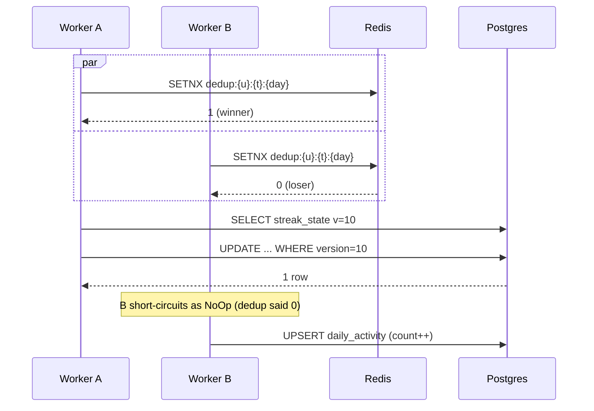

# 11 · Streak System — Concurrency & Scaling

This is the file that earns the role. Every failure mode below is one a real production team has hit.

## Concurrency hotspots — enumerate them

| # | Hotspot | Bad outcome | Fix |
| --- | --- | --- | --- |
| 1 | Same user, two devices, simultaneous activity | Double-increment current streak | Redis SETNX dedup + DB CAS |
| 2 | Kafka redelivery | Duplicate `daily_activity` count | UPSERT on PK + dedup key |
| 3 | Admin switch mid-read | Client sees stale active_type | Cache version bump |
| 4 | Streak state cache stale across admin switch | Stale `current` shown | Same as #3 |
| 5 | Late event grows current streak | Cheating with offline mode | Domain returns `Backfilled`, no streak movement |
| 6 | Milestone double-fire | Spam push | UNIQUE on `(user, type, days)` |
| 7 | TZ change while streak active | Streak appears to skip a day | Use event-time TZ; keep history; never recompute past |
| 8 | Clock skew on client | Future events / past spoofing | Server clamps to ±5 min |
| 9 | Postgres failover during write | Duplicate write on retry | Idempotency layers + CAS |
| 10 | Cache-stampede on cold start | Thundering herd to Postgres | Single-flight per key + jittered TTL |

Each is below in detail.

## #1 Multi-device race (the canonical concurrency case)

**Scenario.** User opens iPhone and iPad at the same instant. Both produce `SESSION_STARTED`. Both events flow through Ingestor → Classifier → StreakService.



The dedup key is the primary defense. CAS is the fallback if dedup is bypassed (e.g., Redis offline).

### Failure case: Redis is down

Hot path: skip Redis, go straight to DB.
- `daily_activity` UPSERT is idempotent (PK).
- `streak_state` CAS protects `current_streak`.
- Without the cache short-circuit, we pay full DB cost — autoscale ingestor + database read replicas absorb it.

We log a `cache_unavailable` metric and alert.

## #2 Kafka redelivery

Default consumer is at-least-once. After processing an event but before committing the offset, the worker can crash → same event arrives again.

Defense:
- The dedup SETNX has TTL ≥ delivery retry window (26 h).
- `daily_activity` upsert is idempotent.
- `streak_state` CAS will fail on retry because version has advanced — we treat that retry as `NoOp`.

Net: **at-least-once + idempotent operations = exactly-once effect.**

## #3 / #4 Admin switch races

The admin changes active type from `APP_VISIT` to `LISTENING` at 14:00:00.

Concurrent reads happening at 13:59:59.500 may have already started serving APP_VISIT data; that's acceptable.

The risk is: a client opens the app at 14:00:01 but their streak read returned cached APP_VISIT. Solution:

```
streak read flow:
  v = redis.get("admin:cache_version") (TTL on local app: 1s)
  return redis.get("streak:v" + v + ":{user}:{type}") OR DB fallback
```

When admin switches:
```
PG: UPDATE admin_config ... CAS on version
Redis: INCR admin:cache_version
Redis: SET admin:active_type
```

Within 1 second, all clients move to the new prefix; old keys are unreachable and expire naturally.

## #5 Late events — anti-cheat

A user goes on a flight, plays an episode offline. Comes back 5 days later. Their phone has 5 days of buffered events.

Naive: each event hits `recordActivity`, each one matches `eventDay == lastActiveDay + 1`, current streak grows by 5. **Cheat.**

Defense in `StreakState.recordActivity`:
```java
if (lastActiveDay != null && eventDay.isBefore(lastActiveDay)) {
    return new Backfilled(this);     // calendar only, no streak math
}
if (lastActiveDay != null && eventDay.equals(lastActiveDay)) {
    return new NoOp(this);
}
```

Plus: the **first** of those backfilled events advances `lastActiveDay`. Then the next one is treated as same-day or backfill. Net effect: even if a user replays 5 offline events all dated yesterday, only one moves the streak forward by 1.

If a user genuinely uses the app offline for 5 days continuously, we don't currently award the streak (V1 limitation). V2 may add a "trust window" that allows backdating up to 24 h.

## #6 Milestone double-fire

The naive "if streak == 7 then award" runs once per qualifying event. With multi-device + replays, the milestone could fire 3 times.

Defense:
```sql
INSERT INTO milestone_award (user_id, streak_type, milestone_days, achieved_at)
VALUES ($1, $2, $3, $4)
ON CONFLICT (user_id, streak_type, milestone_days) DO NOTHING;
```

The `ON CONFLICT` returns a row count of 0 on duplicate. We only publish `StreakMilestoneReached` when row count = 1.

## #7 Timezone changes

User flies from Mumbai (IST, +5:30) to NYC (EST, -5:00). They open the app shortly after landing. Should that count for "today" in IST or EST?

Decision: **the user's TZ at event time is what we honor.** We capture `userTimezone` on each event (snapshot from device or profile). Day-of-event is computed in that TZ.

`streak_state.user_timezone` is also stored — for *display* and for computing `today` on read. We do **not** retroactively recompute history.

Edge case: a user's profile TZ changes from IST to EST. Their last activity was 11:30 PM IST = 12:00 PM EST same day. After the change, "today in EST" might be the same calendar day → streak intact.

This works because we always compute `today` using **user's current TZ**, but compare against `last_active_day` which is a `LocalDate` (no TZ). The math is calendar-arithmetic, independent of clock.

## #8 Clock skew

Client sends `occurred_at` 3 days in the future (broken clock or malicious).

Defense at API and ingestor:
```java
Instant clamped = clamp(event.occurredAt(), clock.now().minus(5, MINUTES), clock.now().plus(5, MINUTES));
if (!clamped.equals(event.occurredAt())) {
    metrics.increment("event.clock_skew");
}
event = event.withOccurredAt(clamped);
```

For events outside ±24h, we drop and log. The user's app should resync NTP.

## #9 Postgres failover

Replica promotion can take 10–30 seconds.
- Ingestor uses retry-with-backoff against the connection pool.
- Kafka offsets are not committed during the outage; events accumulate, then drain on recovery.
- Idempotency layers (Redis SETNX, PG upsert) absorb the replay storm.

The cache layer continues serving reads with stale data (TTL bounded by user-midnight). User sees their own latest streak from the previous read; they may see slightly stale "current" until cache TTL expires after restoration.

## #10 Cache stampede on cold start

Service restarts, cache is empty. 5 K RPS of reads suddenly all miss → 5 K queries to Postgres for the same user records, ×30 M users staggered.

Defense:
- **Single-flight** per key: while one request is fetching, others wait on a future. Implemented via `Caffeine.LoadingCache` or in-memory promise map.
- **Jittered TTL** — TTL = base + random(0..30s) → cache entries don't all expire at once.
- **Warmup** — on deploy, run a one-time scan that pre-loads top-1M most-active users.

## Scaling

### Vertical (V1)

```
Postgres:    1 primary + 2 read replicas; m6i.4xlarge  (handles 50 M users)
Redis:       3-node cluster; cache.r6g.xlarge          (10 GB working set)
Ingestor:    20 pods × 4 vCPU                          (handles 50 K RPS peak)
StreakSvc:   30 pods × 2 vCPU                          (read traffic)
Kafka:       6 brokers × 3 partitions per topic        (240 M msgs/day)
```

### Horizontal (V2 / V3)

When we cross 200 M users:

1. **Shard `daily_activity` by user_id.** Postgres FDW or move to Cassandra. Calendar reads are still per-user; sharding by user is a clean fit.
2. **Shard `streak_state` by user_id.** Same key. Hot path queries one shard.
3. **Multi-region** writes — eventually consistent across regions. Streak reads pin to home region. Admin config is one-write region.

### Partition strategy for `daily_activity`

We already partition by month. At 200 M users, monthly partitions are ~80 GB — still fine. Sub-partitioning by `user_id % 16` would let us parallelize maintenance.

### Backpressure on ingest

Kafka consumer lag is the leading indicator. Auto-scale ingestor when `consumer_lag > 30s`. If Postgres saturates, ingestor pauses (does not commit offsets) — Kafka becomes the buffer.

## Hot keys

A power user (or test account) producing 100 K events/sec? Two protections:
1. Per-user rate limit at API gateway: 60/min on `POST /v1/me/activity`.
2. Per-user dedup key still works — even 100 K events resolve to 1 DB write per day.

Internal Kafka has no rate limit; we trust upstream.

## Backpressure on milestones

If 1 M users hit a 7-day milestone simultaneously (cohort effect from a marketing campaign), the notification provider may rate-limit us.

Mitigation:
- Milestone awards write to DB synchronously (cheap) → user sees badge.
- Push notification is queued in Kafka with a per-second token-bucket limiter on the consumer side.
- Some notifications get delayed by minutes — acceptable.

## Observability checklist

| Metric | Threshold |
| --- | --- |
| `ingest.lag.kafka` | alert if > 30 s |
| `streak.cas.fail.ratio` | alert if > 1 % over 5 min |
| `streak.cache.hit.ratio` | alert if < 95 % over 10 min |
| `streak.api.p99` | alert if > 200 ms |
| `daily_activity.upsert.ms.p99` | alert if > 50 ms |
| `milestone.fired.rate` | dashboard only |
| `admin.config.changes` | dashboard + audit |

## Output

```
Concurrency:   layered idempotency (HTTP key, Redis SETNX, PG UPSERT, version CAS)
Anti-cheat:    Backfilled events don't grow current streak
Admin races:   cache version prefix
Scaling V1:    vertical Postgres + Redis cluster
Scaling V2:    user-id sharding, monthly partitions, Cassandra option
Failure modes: Redis offline (slow path OK), PG failover (Kafka buffer), Cold start (single-flight)
```

The system is small in surface area but full of subtle race conditions. Owning each defense end-to-end is what staff-level interviewers want to hear.
