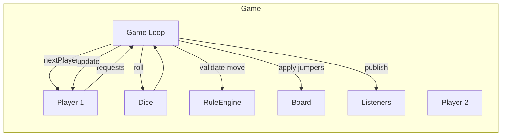

# 03 · Snake and Ladder — High Level Architecture

## Single-game architecture



The **Game** is the orchestrator. Everything else is a passive object it consults.

## Components

| Component | Responsibility |
| --- | --- |
| `Game` | Owns the loop, turn order, win condition. Emits events. |
| `Board` | Holds cells (1..N) and the map of `cell → Jumper`. |
| `Jumper` | Polymorphic — `Snake` and `Ladder` are subtypes. Returns destination cell on land. |
| `Dice` | Strategy — returns an int (or list, for multi-die). |
| `Player` | Token, name, position, history. Mutates only via Game. |
| `RuleEngine` | Pluggable validators (must-start-with-6, exact-finish, win-on-overshoot). |
| `GameEventListener` | Logger, UI, replay recorder, scoreboard. Multiple subscribers. |

## Two-loop view

### Synchronous (V1)

```
while not finished:
   player = nextActivePlayer()
   roll = dice.roll()
   moveOutcome = game.applyMove(player, roll)
   listeners.notify(moveOutcome)
   if moveOutcome.isWin: break
```

The game *drives* the players. The player has no autonomy — they are essentially a record.

### Event-driven (V2)

The same loop becomes an actor that suspends between rolls, awaiting a player's input via WebSocket.

```
on(PlayerRollMessage):
   if player != currentTurn: ignore
   roll = playerSubmittedRoll  // or server-validated dice roll
   apply, broadcast, advance turn
```

Same domain model; different orchestration.

## Why we don't put dice rolling inside Player

Tempting:
```java
class Player { int rollAndMove(Board b) { ... } }
```

This couples Player to Board and to rules. Worse, it makes Player non-deterministic, which destroys testability.

The better split:
- Player is **state** (name, position, history).
- Dice is **a separate thing you can plug**.
- Game is **logic** (loop, validation, apply).

## Why Snake and Ladder are the same class

They are both: "if you land on cell X, go to cell Y." The differences are cosmetic:
- `Snake.head > Snake.tail` (you go down).
- `Ladder.bottom < Ladder.top` (you go up).

Modeling them as one `Jumper` (or two-arg `Cell.jumpTo`) means:
- One method to look up jumpers on landing.
- New entity types (Teleporter, Trapdoor, Moving Platform) drop in without changing Game logic.

The game engine doesn't *care* whether it's a snake or a ladder. The listener does, for UX.

## Output

```
Architecture:    Game (orchestrator) + Board + Dice + Player + RuleEngine + Listeners
Loop model:      V1 synchronous, V2 actor / WebSocket-driven
Core abstraction: Jumper (snake/ladder unified)
Why split this way: testability + OCP + clear ownership
```
