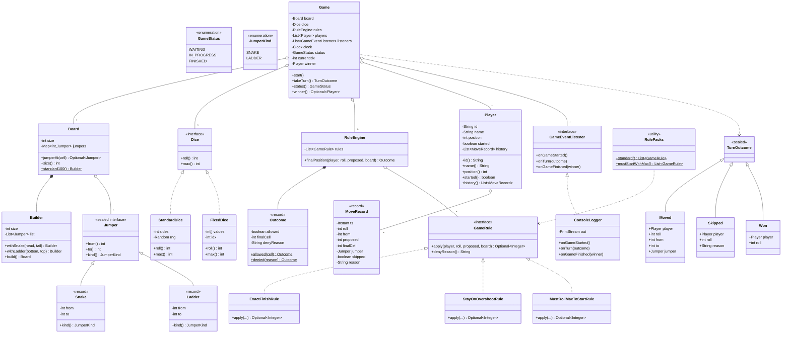
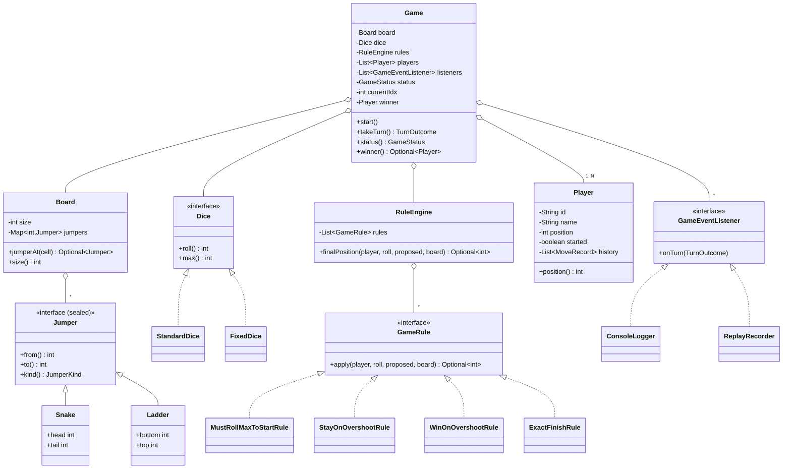

# 07 · Snake and Ladder — Class Diagrams

## Aggregated class diagram

A single view of every class, interface, and enum in the system — fields and methods included. Source of truth: the Java skeleton under `12_machine_coding_skeleton/`.



---

## Class diagram



## Package layout

```
com.snakeladder
├── domain/
│   ├── Board.java
│   ├── Jumper.java          (sealed interface + Snake/Ladder records)
│   ├── Player.java
│   ├── MoveRecord.java
│   ├── TurnOutcome.java
│   ├── GameStatus.java
│   └── JumperKind.java
├── dice/
│   ├── Dice.java
│   ├── StandardDice.java
│   └── FixedDice.java
├── rule/
│   ├── GameRule.java
│   ├── RuleEngine.java
│   ├── MustRollMaxToStartRule.java
│   ├── StayOnOvershootRule.java
│   ├── WinOnOvershootRule.java
│   ├── ExactFinishRule.java
│   └── RulePacks.java       (preset combinations)
├── listener/
│   ├── GameEventListener.java
│   └── ConsoleLogger.java
├── Game.java
└── Main.java
```

## Why the Builder for `Game`?

Constructors with 7+ parameters are unreadable. A builder:

```java
new Game.Builder()
    .withBoard(...)
    .withDice(...)
    .addPlayer("Alice")
    .addPlayer("Bob")
    .build();
```

reads top-down and validates at `build()` time:
- ≥ 2 players
- non-null board, dice, rules
- all-unique player names

## Why `TurnOutcome` is a sealed interface

Three terminal cases:
- `Skipped` — player tried but rule blocked them.
- `Moved` — moved with optional jumper.
- `Won` — moved AND landed on last cell.

Listeners pattern-match for richer logging:

```java
switch (outcome) {
    case Skipped s -> log("skipped: " + s.reason());
    case Moved m   -> log(m.player().name() + " " + m.from() + "→" + m.to());
    case Won w     -> log("WINNER: " + w.player().name());
}
```

## Output

A small graph: `Game` aggregates Board / Dice / RuleEngine / Players / Listeners. Strategies (Dice, GameRule) are interfaces. The whole thing fits on one whiteboard.
