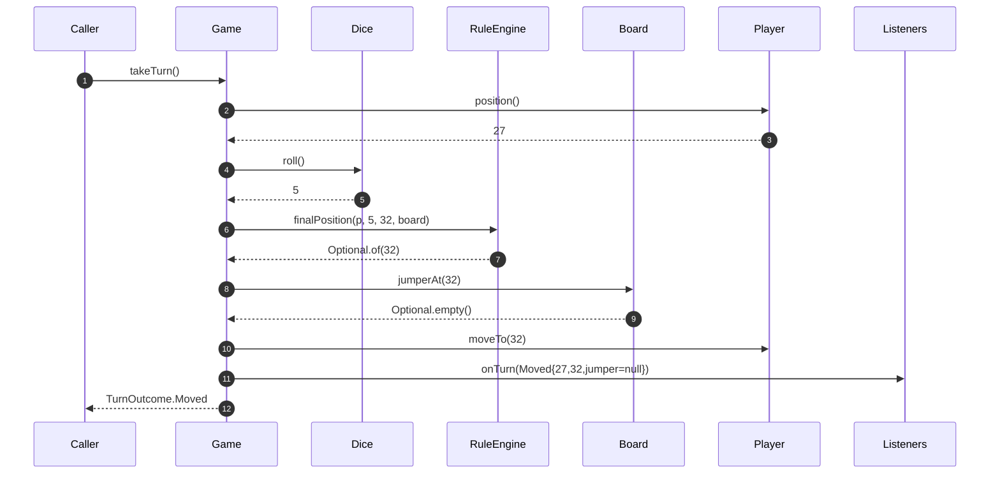
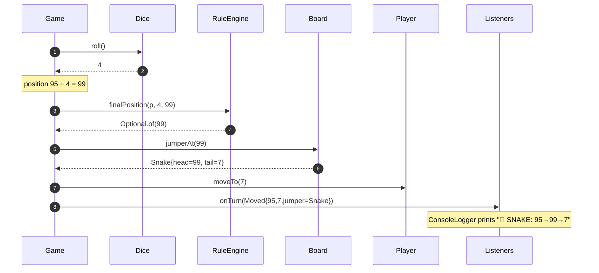
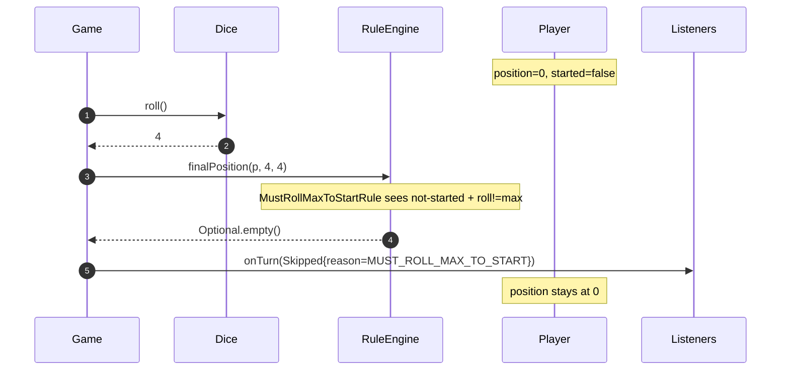
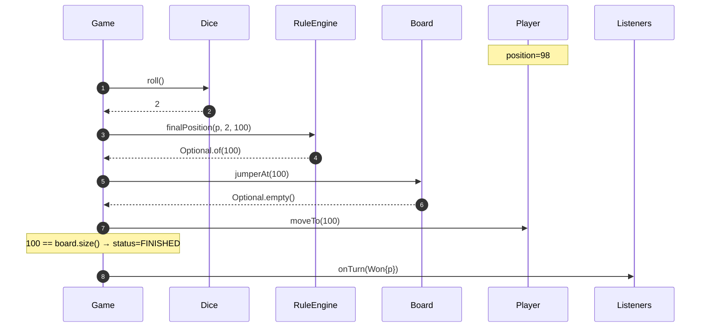
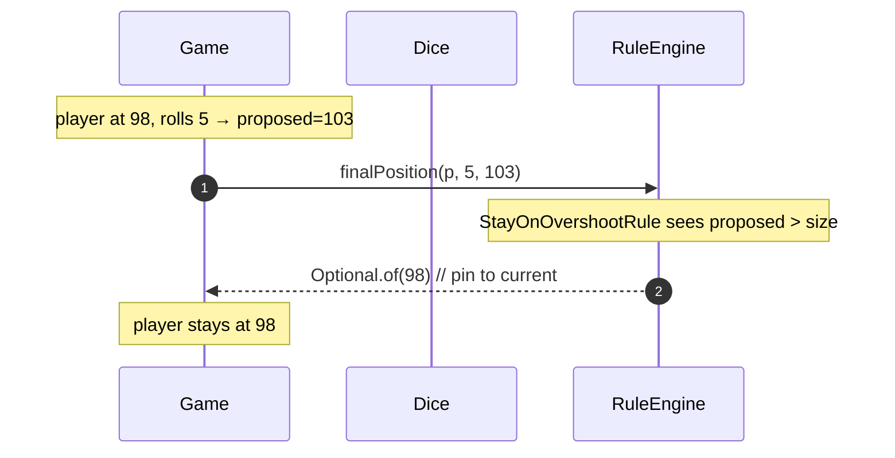
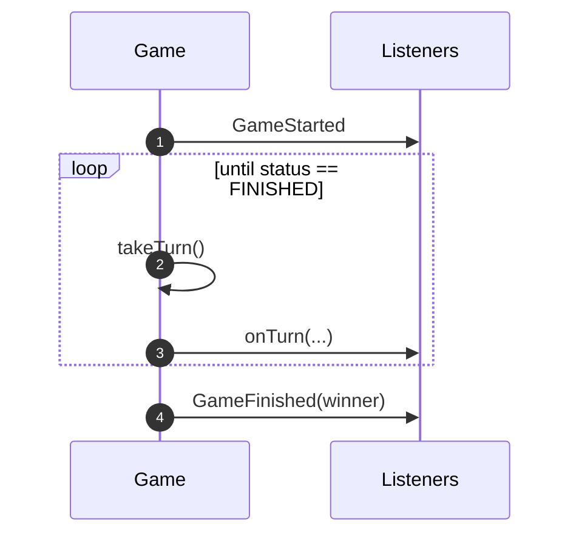

# 08 · Snake and Ladder — Sequence Diagrams

## 1. Take a turn (happy path: regular move)



## 2. Take a turn (lands on a snake)



## 3. Must-roll-6-to-start rule



## 4. Win on landing exactly at last cell



## 5. Overshoot — stay-put rule



The same call returns `Optional.of(103)` if `WinOnOvershootRule` is configured; the game then proceeds, applies any jumper at 100 (last cell), and detects win.

## 6. Full-game outline



## Output

```
Each turn is: roll → ruleEngine → board lookup → mutate player → notify listeners.
At most one of {Moved, Skipped, Won}.
The Game is the only thing that mutates state.
```
