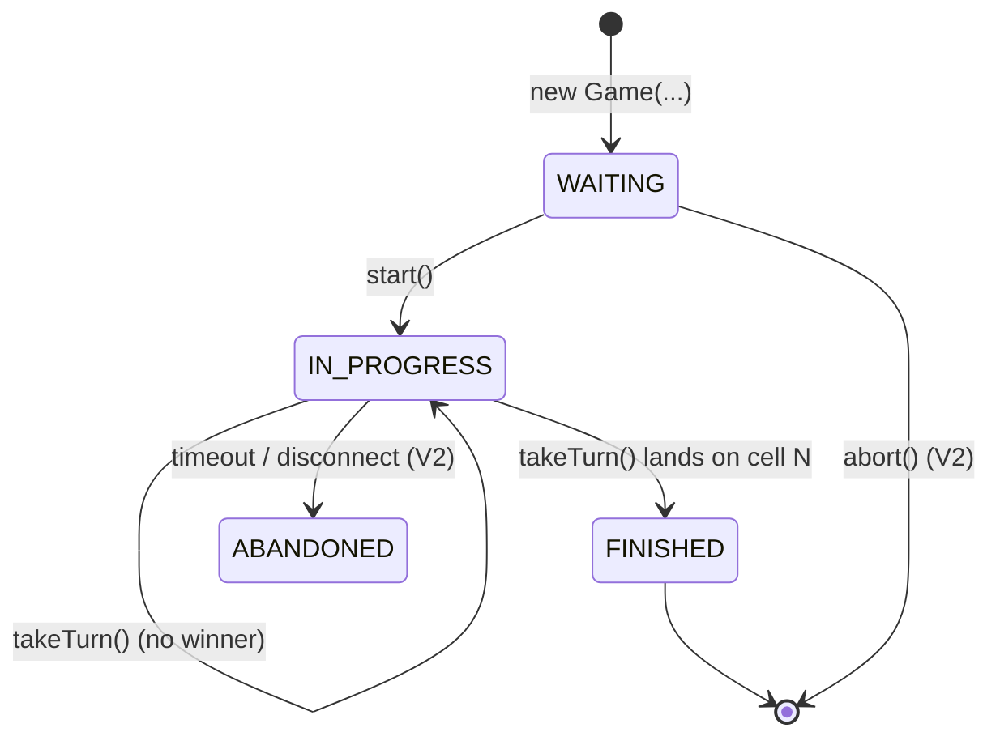
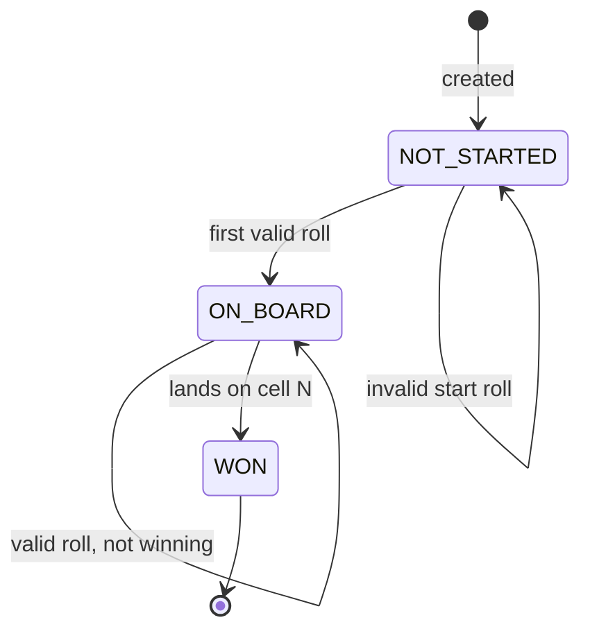
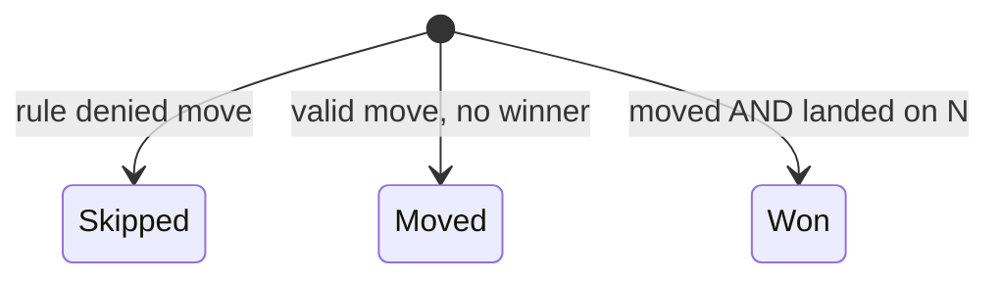

# 09 · Snake and Ladder — State Machines

## Game state machine



V1 has three states: `WAITING`, `IN_PROGRESS`, `FINISHED`.

V2 adds `ABANDONED` for server-hosted games when all players disconnect.

## Player state machine



`NOT_STARTED` matters only when `MustRollMaxToStartRule` is in effect — otherwise players are `ON_BOARD` from move 1.

## TurnOutcome — discriminated union

Not strictly a state machine, but the same idea: every turn produces *exactly one* of:



Listeners pattern-match on the variant. Each variant carries its own data:
- `Skipped(player, roll, reason)`
- `Moved(player, from, to, jumper?)`
- `Won(player)`

## Why no "rolling dice" intermediate state?

In a turn-based game, the dice roll is **synchronous**. There's no observable "rolling" state at the domain level. (For an animated UI, the UI can show a roll animation; that's UI concern, not domain.)

If we ever made dice asynchronous (e.g., third-party fairness oracle), we'd add `WAITING_DICE` → `DICE_RESOLVED` to the turn substate machine — but that's V2.

## Output

```
Game:    WAITING → IN_PROGRESS → FINISHED  (V2: + ABANDONED)
Player:  NOT_STARTED → ON_BOARD → WON
Turn:    one of {Skipped, Moved, Won}
```

The state surface is small and explicit. That's the whole point — for a game this simple, the *clarity* of the model is what's being tested, not its complexity.
