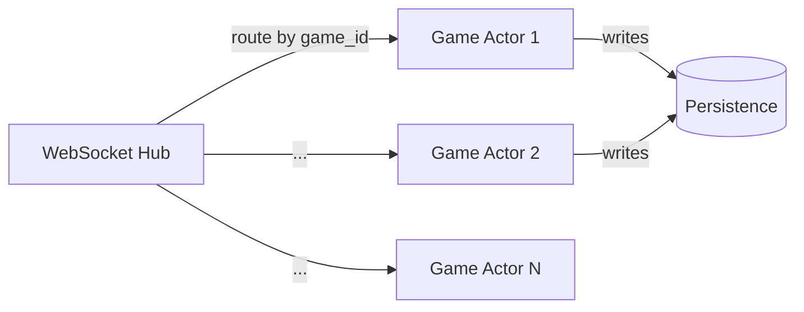

# 11 · Snake and Ladder — Concurrency & Scaling

V1 is single-threaded. The interesting concurrency story is V2 (multi-game server).

## V1 — single-threaded

The Game is a sequential state machine. One thread drives the loop. No locks needed.

The only "race" possible is if a listener mutates Game state while Game iterates — we forbid this by passing `TurnOutcome` (immutable record) to listeners and never giving them a writable handle.

## V2 — multi-tenant server

### Per-game serial; cross-game parallel

Different games are independent → trivially parallelizable.
Within a single game, all moves are serialized — only one player's turn at a time.

The natural concurrency model: **one logical actor (or single-threaded executor) per Game.**



Each actor processes one message at a time. No locks inside the actor — pure single-threaded reasoning.

### Sticky routing

WebSocket hub hashes `game_id` to the same backend pod. All members of one game land on the same actor. If the pod fails, the game is rebalanced to another pod and rehydrated from the persisted snapshot.

### Idempotent client submissions

Client sends `client_seq` (monotonic per player). Actor remembers `last_client_seq` per (game, player). Replay → return the cached `TurnOutcome` instead of double-applying.

```java
if (msg.client_seq <= player.lastClientSeq) {
    return cachedOutcomeFor(msg.client_seq);
}
```

### Persistence after each move

Optimistic version on the game document:
```
UPDATE games SET state=?, version=version+1 WHERE id=? AND version=?
```

Failure → server re-reads, re-applies in-memory state from DB, returns 409 to client.

### Crash recovery

On pod restart:
1. Active games are rehydrated from DB.
2. WebSockets are re-established by clients (with backoff).
3. Any in-flight move that was acked-to-client but not persisted is replayed by the client (idempotent on client_seq).

## Scaling targets (V2)

| Metric | Target | Notes |
| --- | --- | --- |
| Concurrent games | 100 K | sticky routing across ~10 pods |
| Memory per game | ~5 KB live | + ~3 KB if WebSocket state cached |
| Moves / sec | 13 K | one DB write per move |
| WebSocket fanout | 4× per move | broadcast to up to 4 players + spectators |

## Bottleneck: WebSocket fanout

Naive: each move publishes to N subscribers → O(N) per move. Fine at 4 players. At 1000 spectators per game, we'd batch: snapshot every 200 ms instead of per-move.

## Failure modes

| Failure | Mitigation |
| --- | --- |
| Pod crash mid-turn | Game state re-hydrated from DB; client retries with `client_seq` |
| DB transient failure | Retry with exponential backoff; if persistent, return 5xx; client may abandon |
| Slow listener (V1) | Listeners are fast (logging only); else we'd queue events |
| Pathological player rolls every 1ms | Per-player rate limit at WebSocket layer |

## What we explicitly avoid

- **Distributed locks per game.** Sticky routing makes this unnecessary; one writer per game.
- **Optimistic concurrency between players.** There can only ever be one writer at a time (the current player) — guarded by `if (player != currentTurn) reject`.
- **Microservices.** A game doesn't need 6 services. One actor + one DB is the right size.

## Output

```
V1:    single-threaded, no concurrency
V2:    one actor per game, sticky-routed; DB write per move with version CAS;
       WebSocket fanout 4× per move; rehydrate on pod restart
```

The pattern — **sticky-routed, single-threaded actor per aggregate** — is general. It's the same pattern that makes Erlang and Akka scale to 1M+ actors with simple per-actor logic.
