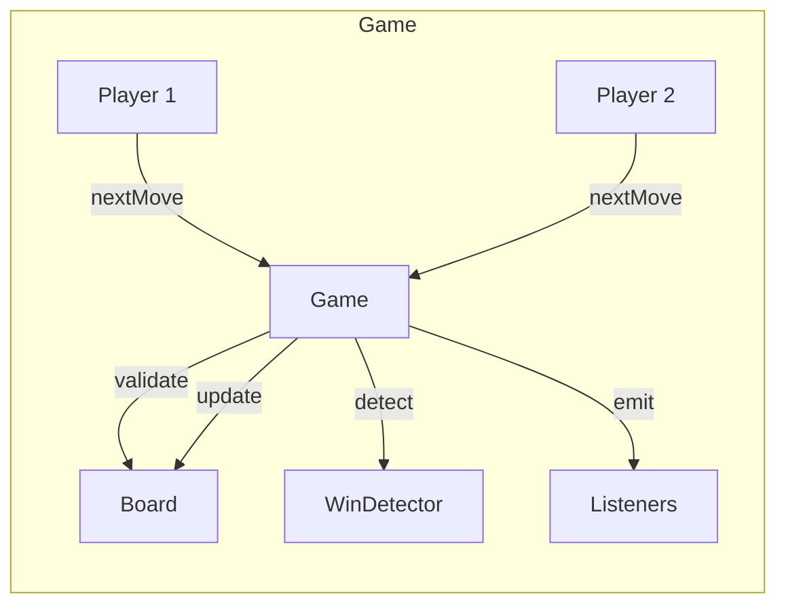

# 03 · Tic Tac Toe — High Level Architecture

## Diagram



## Components

| Component | Responsibility |
| --- | --- |
| `Game` | Orchestrator. Polls current player for a move, validates, applies, detects outcome. |
| `Board` | Cells + per-row/col/diagonal counters used by WinDetector. |
| `WinDetector` | Given the last move, decides win/draw/continue in O(1). |
| `Player` | Has a Symbol + a `PlayerInput` (Human or Bot). |
| `PlayerInput` | Strategy: returns the next `Move` given the current Board snapshot. |
| `GameListener` | Notified of moves and game outcome. |

## The O(1) win-detection trick

A naive implementation re-scans the entire board after every move: O(N²) per move.

A smarter approach maintains **per-line counters**:

```
rowCount[row][symbol]      → count of symbol's marks in that row
colCount[col][symbol]      → ditto for column
diagCount[symbol]          → for the main diagonal (if move is on it)
antiDiagCount[symbol]      → for the anti-diagonal (if move is on it)
```

After a move at `(r, c)` by `s`:
```
rowCount[r][s]++
colCount[c][s]++
if (r == c)            diagCount[s]++
if (r + c == N - 1)    antiDiagCount[s]++

win  = any of the four counters == K
draw = all cells filled and no win
```

O(1) per move regardless of N.

For arbitrary K < N (e.g., K=5 on 19×19 Gomoku), we instead **slide a window of size K** along the four lines through `(r, c)` and check if any window is all-`s`. That's O(K) per move — still constant in N.

## Player input — Strategy

```java
public interface PlayerInput {
    Move nextMove(BoardSnapshot snapshot, Symbol mySymbol);
}

public final class HumanInput  implements PlayerInput { ... }    // reads from console / queue
public final class RandomBot   implements PlayerInput { ... }
public final class MinimaxBot  implements PlayerInput { ... }
public final class HeuristicBot implements PlayerInput { ... }
```

Game asks the current player's input for a move. Same shape regardless of human/bot.

## Why we don't put `nextMove` on Player

`Player` is a *role* (X plays first, O plays second; it has a symbol and a name). The "where do moves come from" is orthogonal: a human keyboard, a bot, a remote websocket, a pre-recorded log for replay.

Splitting them lets us swap any axis (player identity vs input source) independently.

## Event flow

```
Human types "1,2"
  → HumanInput parses Move(1, 2)
  → Game validates against Board
  → Board.apply(move) — updates cell + counters
  → WinDetector inspects last move
  → Game emits TurnOutcome (Moved | Won | Drawn)
```

## Output

```
Components:    Game, Board, WinDetector, Player, PlayerInput, Listener
Win check:     O(1) per move via incremental counters
Player input:  Strategy — Human / RandomBot / MinimaxBot / HeuristicBot
```
