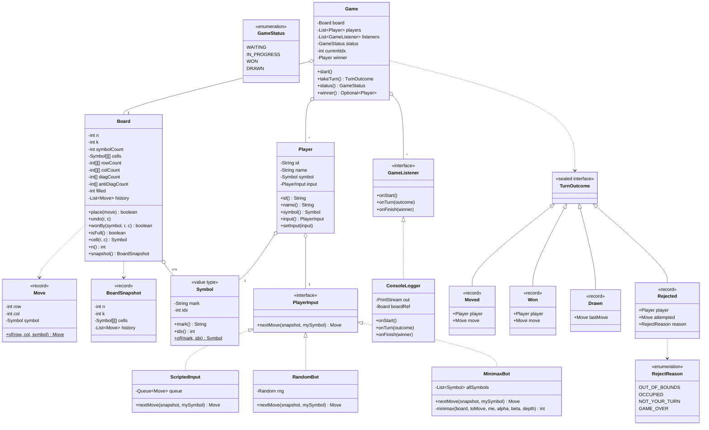
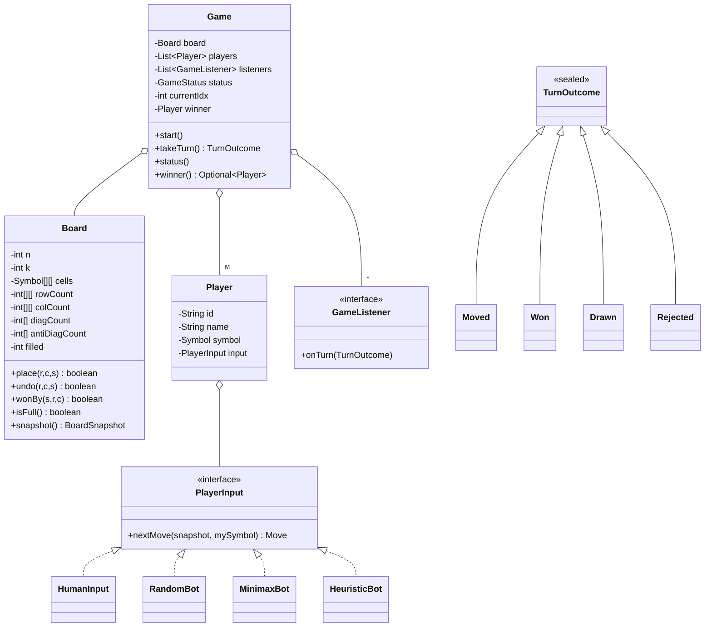

# 07 · Tic Tac Toe — Class Diagrams

## Aggregated class diagram

A single view of every class, interface, and enum in the system — fields and methods included. Source of truth: the Java skeleton under `12_machine_coding_skeleton/`.



---


## Class diagram



## Package layout

```
com.tictactoe
├── domain/
│   ├── Symbol.java
│   ├── Move.java
│   ├── Board.java
│   ├── BoardSnapshot.java
│   ├── Player.java
│   ├── GameStatus.java
│   └── TurnOutcome.java
├── strategy/
│   ├── PlayerInput.java
│   └── HumanInput.java
├── bot/
│   ├── RandomBot.java
│   ├── MinimaxBot.java
│   └── HeuristicBot.java
├── listener/
│   ├── GameListener.java
│   └── ConsoleLogger.java
├── Game.java
└── Main.java
```

## Why `Player.input` and not subclasses

Suppose we modeled `class HumanPlayer extends Player`, `class BotPlayer extends Player`. Now adding "Player with optional time-control" means subclassing each. **Composition over inheritance**: Player has-a PlayerInput.

Switching a player from human to bot mid-game is a setter on `Player.input` — useful for "AFK auto-bot" mode.

## MinimaxBot — quick algorithm note

For 3×3 with K=3, the full game tree has ~26 K positions. Full minimax (no memoization) terminates in milliseconds.

```java
int minimax(Board b, Symbol toMove, Symbol me) {
    if (b.wonBy(me, lastR, lastC))    return +10;
    if (b.wonBy(opp(me), lastR, lastC)) return -10;
    if (b.isFull())                  return 0;
    int best = (toMove == me) ? Integer.MIN_VALUE : Integer.MAX_VALUE;
    for (each empty cell (r, c)) {
        b.place(r, c, toMove);
        int v = minimax(b, opp(toMove), me);
        b.undo(r, c, toMove);
        best = (toMove == me) ? max(best, v) : min(best, v);
    }
    return best;
}
```

Alpha-beta pruning + transposition table makes it fast at N=4. At N=5+ K=4, switch to heuristic / MCTS.

## Output

A graph of 5 main classes. Players are composed of PlayerInput (Strategy). TurnOutcome is sealed for exhaustive listener handling.
