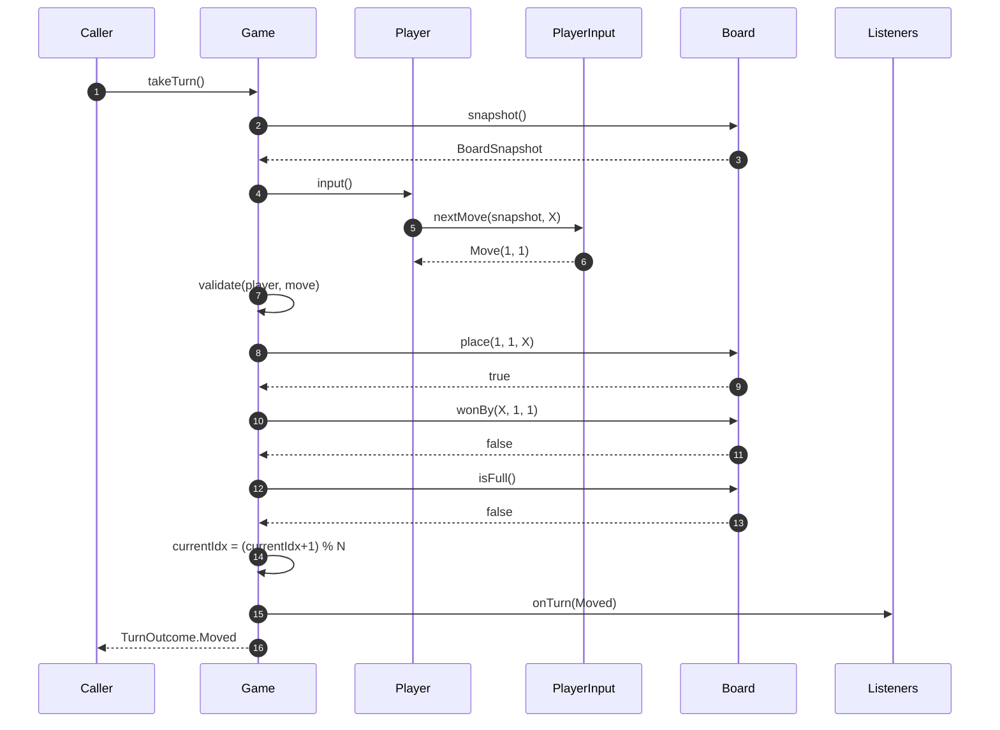
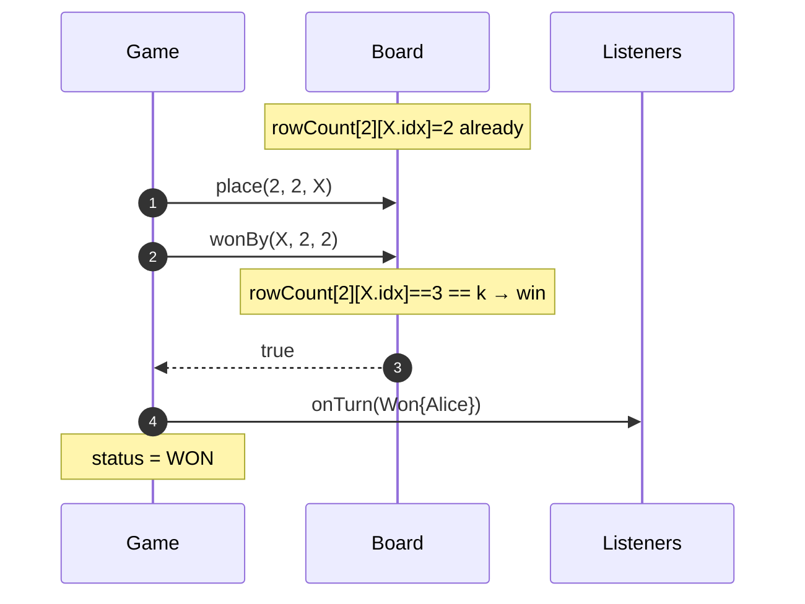
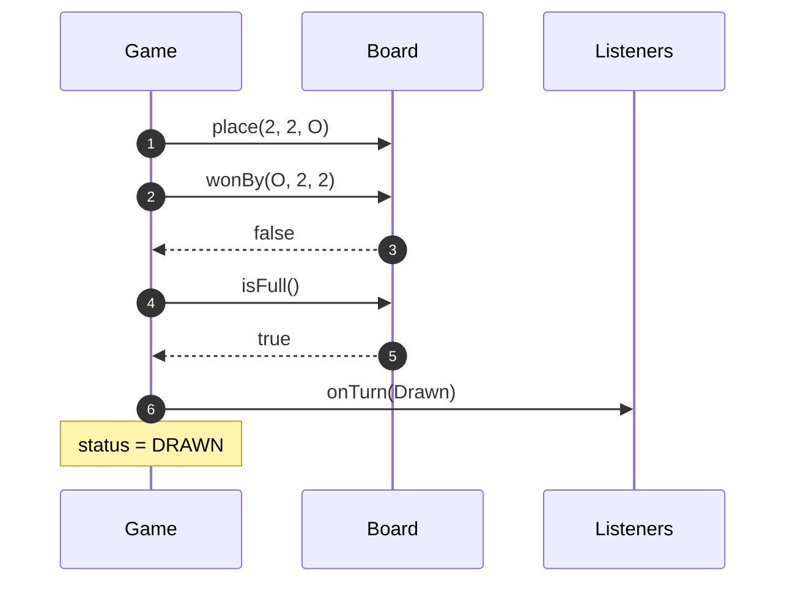
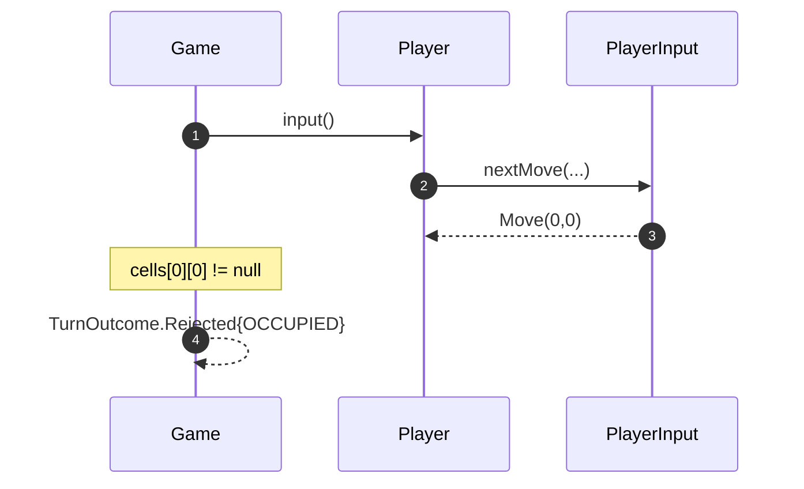
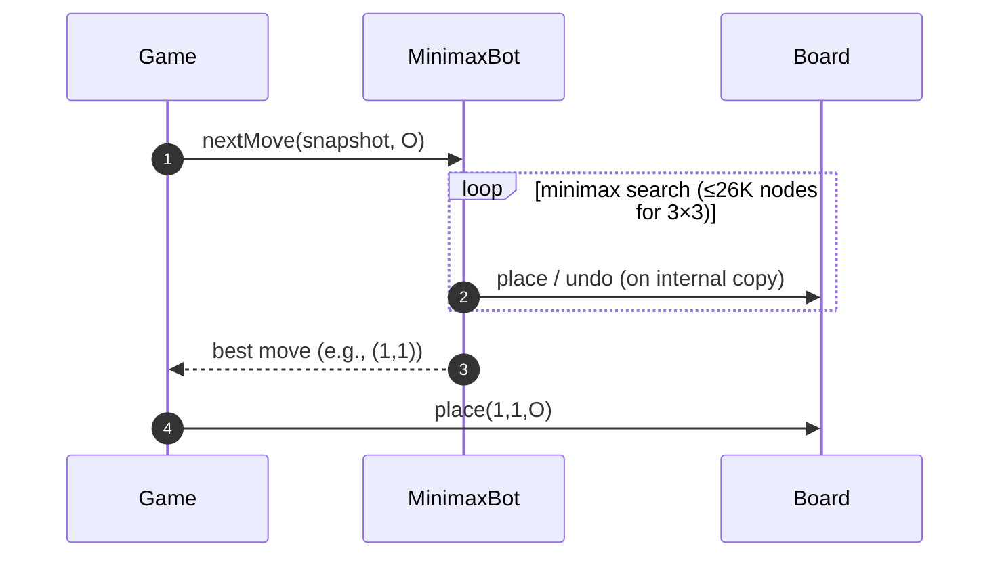

# 08 · Tic Tac Toe — Sequence Diagrams

## 1. Take a turn (valid move, game continues)



## 2. Winning move (3-in-a-row)



## 3. Draw



## 4. Invalid move (cell occupied)



V1: Rejected does not advance currentIdx — same player tries again. (V2 might count it as a forfeit on N retries; product call.)

## 5. Bot turn



The bot operates on **its own Board copy** to avoid mutating the live game. Pass a `Board.copy()` not a snapshot if the bot needs `place/undo`.

## Output

```
takeTurn flow:   snapshot → input → validate → place → wonBy → isFull → emit
Win flow:        wonBy returns true on the move that completes K-in-a-row
Bot flow:        bot operates on its copy; returns final move
```
