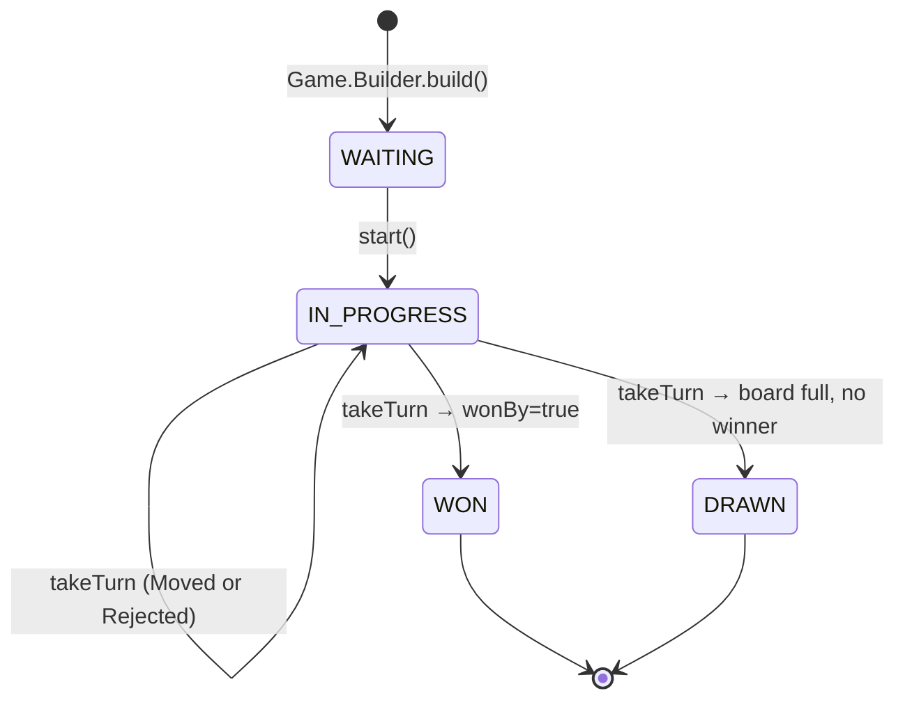
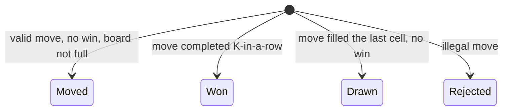
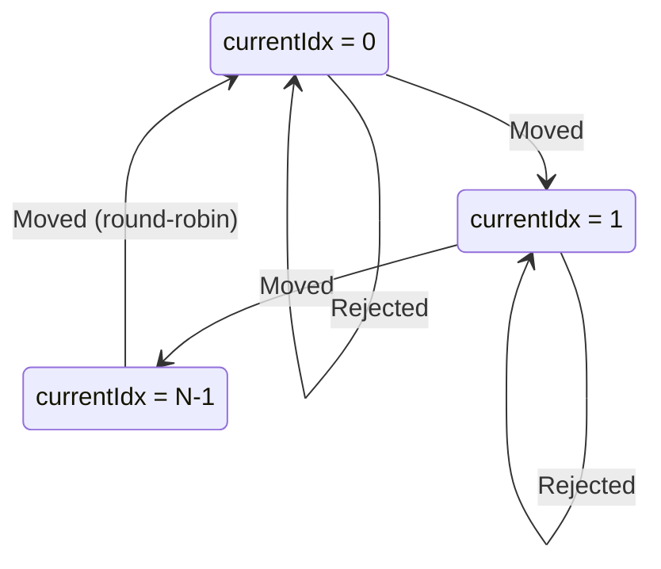

# 09 · Tic Tac Toe — State Machines

## Game



## TurnOutcome (per turn)



`Rejected` does **not** advance `currentIdx`. Same player must retry.

## Player turn ordering



Round-robin advances on `Moved` only; on `Rejected`, the same player goes again.

## Output

```
Game:    WAITING → IN_PROGRESS → (WON | DRAWN)
Turn:    Moved | Won | Drawn | Rejected (sealed)
Order:   round-robin on Moved; stay on Rejected
```
