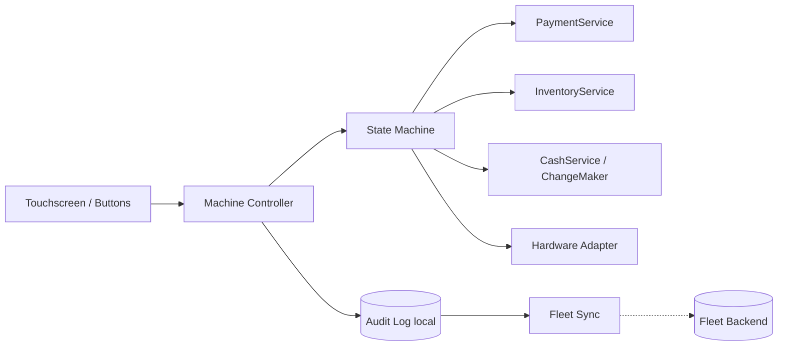

# 03 · Vending Machine — High Level Architecture

## Per-machine architecture



## Components

| Component | Responsibility |
| --- | --- |
| `MachineController` | Receives UI events, delegates to State. Single entry point. |
| `State` (subclass per state) | Decides which operations are valid in this state. |
| `PaymentService` | Tracks inserted-but-not-committed cash. Refunds on cancel. |
| `InventoryService` | Slot map; atomic decrement on dispense. |
| `CashService` / `ChangeMaker` | Tracks cash float; computes change; ensures availability before commit. |
| `HardwareAdapter` | Drives motors, coin acceptor, note acceptor. Abstract interface. |
| `AuditLog` | Append-only local log of every event. Durable. |
| `FleetSync` | Batches audit and pushes to cloud. |

## Two phases per transaction

1. **Pre-commit** (intent): customer selects product, inserts money. State machine accumulates "inserted amount." No inventory change yet.
2. **Commit**: when `inserted >= price` AND `change is available`, atomically:
   - decrement product slot,
   - mark inserted cash as "consumed,"
   - emit `change` from cash float,
   - dispense product,
   - log success.

If any step in **commit** fails (e.g., motor jams), we go to `MaintenanceState` and refund the inserted money (manual operator intervention may be required for the stuck product).

## Why a separate `CashService`

- Inserted-but-not-committed cash lives in an **escrow** bucket.
- Cash float is the **bank** for change.
- On commit: escrow → bank; bank → change to customer.
- On cancel: escrow → customer.

Mixing these is the main bug source. Keep them separate.

## State transitions (sketch — full diagram in `09_state_machines.md`)

```
Idle → ProductSelected → AcceptingPayment → Dispensing → Idle
   ↘     ↘                ↘                    ↓
    \____\________________\___________→  Maintenance / OutOfService
                                         ↓
                                       Refund → Idle
```

## Why state subclasses?

Each state has different valid operations:
- `Idle.selectProduct(slot)` is valid; `Idle.insertMoney()` is not.
- `AcceptingPayment.insertMoney()` is valid; `AcceptingPayment.selectProduct()` is not.

If we use `if (state == ...) {}` everywhere, we must update every method when adding a new state. The State pattern centralizes per-state behavior.

## Failure modes

| Failure | Mitigation |
| --- | --- |
| Coin jam | Hardware adapter detects; transition to `Maintenance`; alert |
| Motor stuck mid-dispense | Detect via sensor; do not refund automatically (product may have partially fallen); operator escalation |
| Power loss | On reboot, replay audit log to recover state; in-progress txn → refund or alert |
| Network down (fleet sync) | Local audit only; sync on next connection |
| Card gateway timeout | Treat as decline; release any escrow |

## Output

```
Components:    Controller, State machine, Payment, Inventory, Cash, Hardware, Audit, FleetSync
Two phases:    pre-commit (escrow) → commit (transactional)
Failure mode:  Maintenance state + audit log replay
```
