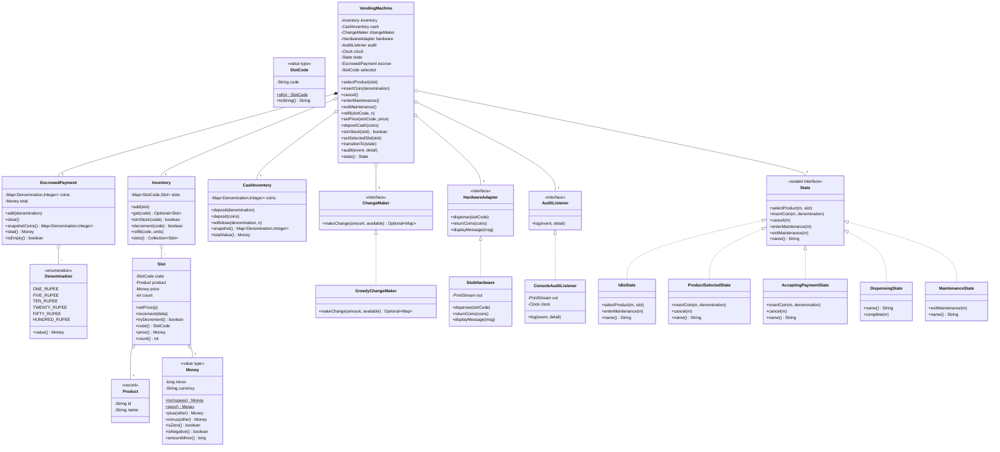
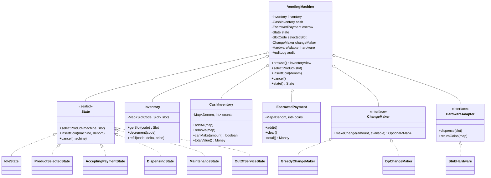

# 07 · Vending Machine — Class Diagrams

## Aggregated class diagram

A single view of every class, interface, and enum in the system — fields and methods included. Source of truth: the Java skeleton under `12_machine_coding_skeleton/`. This is the one LLD system that uses the **GoF State pattern** (each state is its own class implementing `State`); the diagram makes that explicit.



---


## Class diagram



## Package layout

```
com.vending
├── domain/
│   ├── Money.java
│   ├── Currency.java
│   ├── Denomination.java
│   ├── DenominationKind.java
│   ├── SlotCode.java
│   ├── Product.java
│   ├── Slot.java
│   ├── InventoryView.java
│   ├── EscrowedPayment.java
│   └── AuditEvent.java
├── inventory/
│   ├── Inventory.java
│   └── CashInventory.java
├── payment/
│   ├── ChangeMaker.java
│   ├── GreedyChangeMaker.java
│   └── DpChangeMaker.java
├── state/
│   ├── State.java                 # sealed
│   ├── IdleState.java
│   ├── ProductSelectedState.java
│   ├── AcceptingPaymentState.java
│   ├── DispensingState.java
│   ├── MaintenanceState.java
│   └── OutOfServiceState.java
├── listener/
│   ├── AuditListener.java
│   └── ConsoleAuditListener.java
├── hardware/
│   ├── HardwareAdapter.java
│   └── StubHardware.java
├── VendingMachine.java
└── Main.java
```

## Why subclass-per-state instead of `enum State { IDLE, ... }`

- Each state has different valid operations. Enum forces every method to switch on the enum.
- Adding a new state (e.g., `RemoteHoldState`) means subclassing once, not editing 5 methods.
- The behavior **is** the type. That's the whole point of OOP.

The downside is more files. For a small problem (6 states) it's worth it; the clarity pays back at review time.

## Output

A clean separation: `VendingMachine` is a thin façade, `State` subclasses encode operation legality, services (`Inventory`, `CashInventory`, `ChangeMaker`, `HardwareAdapter`) carry the actual work.
