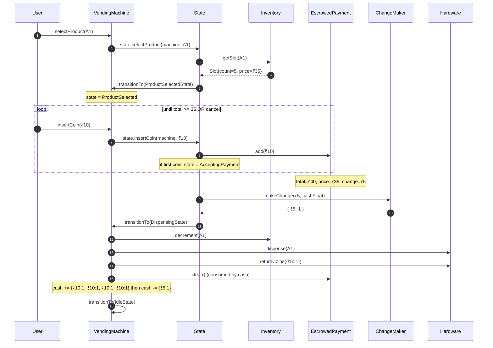
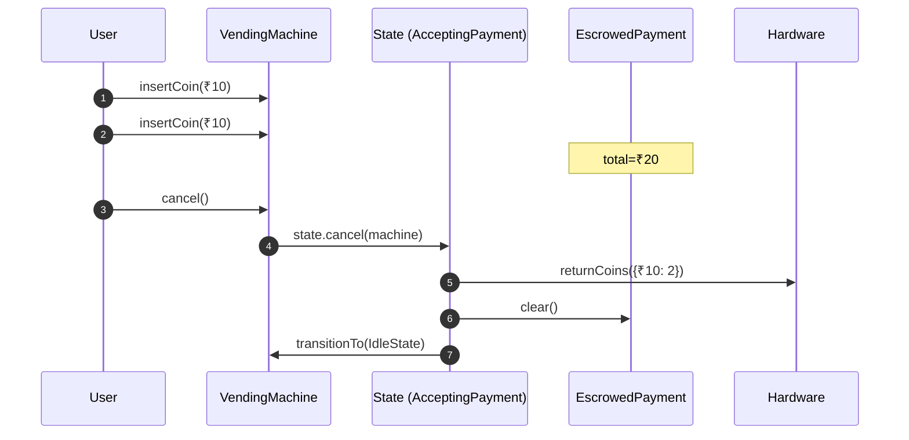
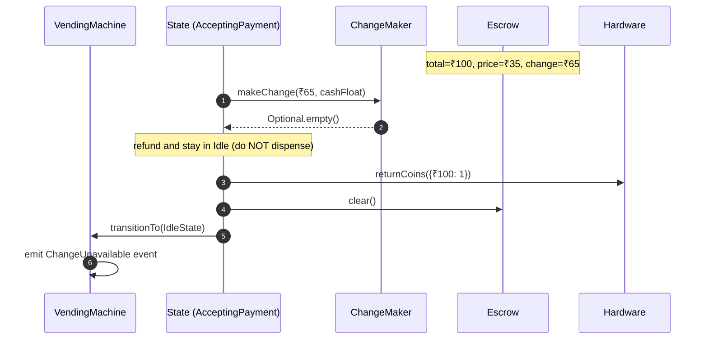
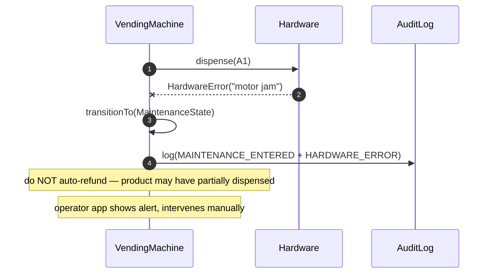
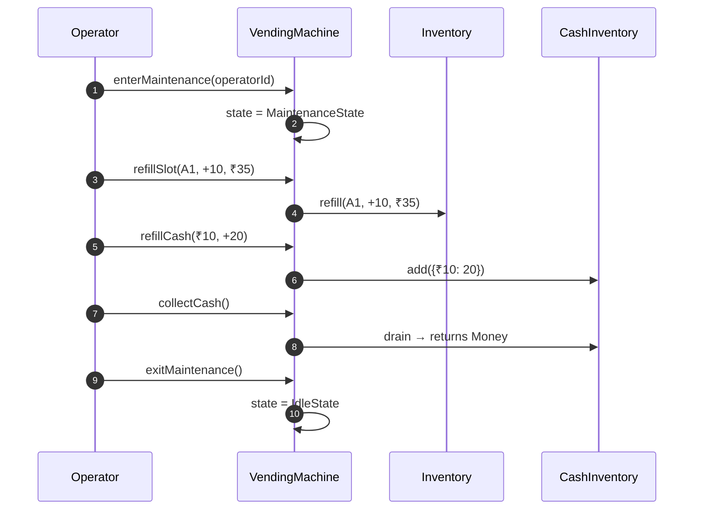
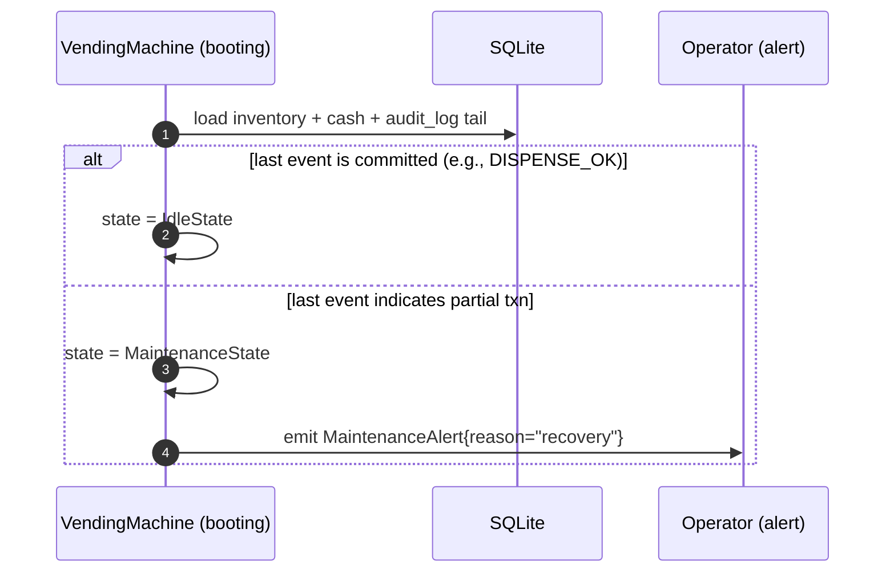

# 08 · Vending Machine — Sequence Diagrams

## 1. Successful purchase



## 2. Cancel mid-payment



## 3. Cannot make change



## 4. Hardware fails mid-dispense



This is intentional. Auto-refunds on hardware errors are how you give people free items.

## 5. Operator refill



## 6. Power-loss recovery on reboot



## Output

```
Happy:        select → insert*N → makeChange → decrement → dispense → returnCoins → Idle
Cancel:       returnCoins(escrow) → Idle
No-change:    refund → Idle (do NOT dispense)
HW error:     Maintenance + alert (no auto-refund)
Operator:     enterMaintenance → refill/collect → exitMaintenance
Recovery:     replay audit_log; alert if partial
```
