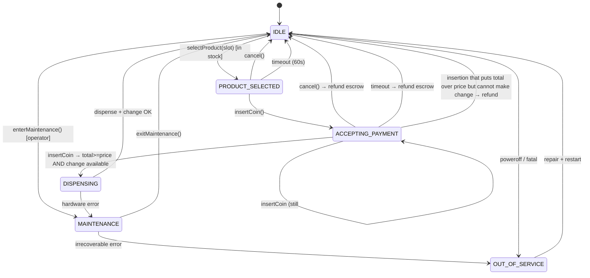

# 09 · Vending Machine — State Machines

## Full state diagram



## Transition table

| From | Event | Guard | To | Side effect |
| --- | --- | --- | --- | --- |
| IDLE | selectProduct(slot) | slot in stock | PRODUCT_SELECTED | record selectedSlot |
| IDLE | selectProduct(slot) | not in stock | IDLE | error event |
| IDLE | enterMaintenance | operator authed | MAINTENANCE | — |
| PRODUCT_SELECTED | insertCoin(d) | — | ACCEPTING_PAYMENT | escrow.add(d) |
| PRODUCT_SELECTED | cancel | — | IDLE | clearSelection |
| PRODUCT_SELECTED | timeout | — | IDLE | clearSelection |
| ACCEPTING_PAYMENT | insertCoin(d) | escrow+d < price | ACCEPTING_PAYMENT | escrow.add(d) |
| ACCEPTING_PAYMENT | insertCoin(d) | escrow+d ≥ price ∧ canMakeChange | DISPENSING | escrow.add(d); commit |
| ACCEPTING_PAYMENT | insertCoin(d) | escrow+d ≥ price ∧ ¬canMakeChange | IDLE | refund + alert |
| ACCEPTING_PAYMENT | cancel | — | IDLE | refund |
| ACCEPTING_PAYMENT | timeout | — | IDLE | refund |
| DISPENSING | dispenseOk | — | IDLE | clearSelection; clearEscrow |
| DISPENSING | hardwareError | — | MAINTENANCE | alert; do NOT refund |
| MAINTENANCE | refill / collect / setPrice | — | MAINTENANCE | mutate |
| MAINTENANCE | exitMaintenance | — | IDLE | — |

## Why is `DISPENSING → MAINTENANCE` not auto-refunded?

The product motor may have partially dispensed. We don't know if the customer got the can or not. Auto-refund + customer-got-product = free product / fraud surface. Operator inspects and decides.

## Customer-side perception of state

| State | Display |
| --- | --- |
| IDLE | "Welcome — Select a product" |
| PRODUCT_SELECTED | "Insert ₹35 — coins or notes" |
| ACCEPTING_PAYMENT | "Inserted ₹20 — Insert ₹15 more" |
| DISPENSING | "Dispensing… please wait" |
| MAINTENANCE | "Out of order — please contact operator" |
| OUT_OF_SERVICE | (dark / blank screen) |

## Edge: timeout

`PRODUCT_SELECTED` and `ACCEPTING_PAYMENT` have soft timeouts (60s, 90s respectively). Timeout returns the user to `IDLE` and refunds any escrow. Avoids machines stuck waiting for a customer who walked away.

## Output

```
States:    IDLE, PRODUCT_SELECTED, ACCEPTING_PAYMENT, DISPENSING, MAINTENANCE, OUT_OF_SERVICE
Trigger:   user actions, hardware events, operator commands, timeouts
Side effects: escrow updates, audit log writes, alerts
```
