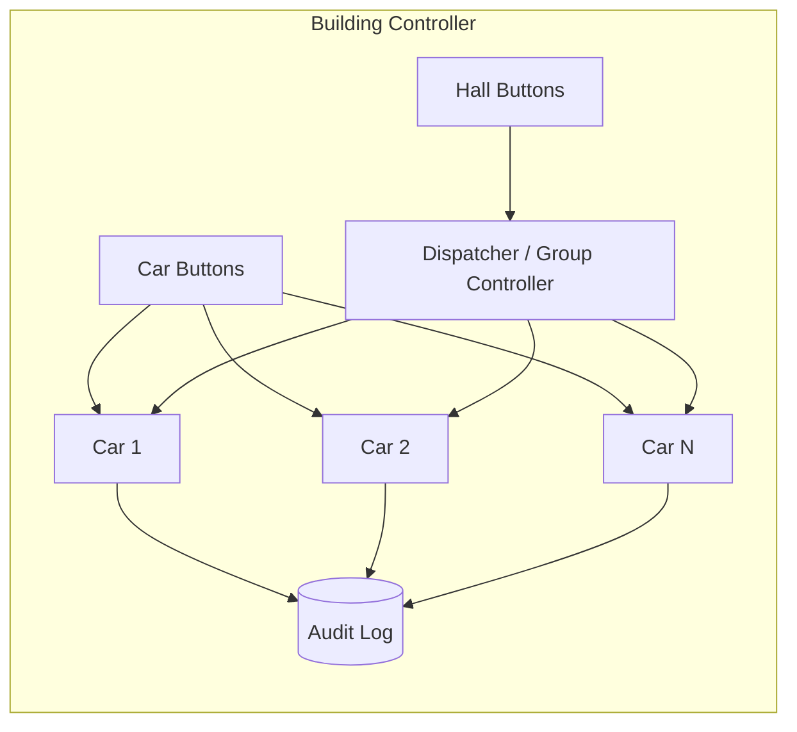

# 03 · Elevator System — High Level Architecture

## Diagram



## Components

| Component | Responsibility |
| --- | --- |
| `Dispatcher` | Receives hall calls, picks best car via cost function. |
| `Car` | Owns per-car state (floor, direction, doors), schedules its own stop list (LOOK). |
| `HallCallQueue` | Pending hall calls not yet assigned (rare; we assign immediately). |
| `MotorAdapter` | Hardware abstraction: move up/down/stop. |
| `DoorAdapter` | Open/close with sensor feedback. |
| `LoadSensor` | Reports current load; triggers overload. |
| `BuildingMode` | NORMAL / FIRE / EVACUATION. Affects dispatch. |
| `AuditLog` | All events. |

## Dispatch algorithm — overview

```
On HallCall(floor, direction):
  bestCar = argmin over cars: cost(car, hallCall)
  bestCar.assign(hallCall)

cost(car, hallCall) =
  ETA(car arrives at hallCall.floor with capacity room) +
  PENALTY(if direction conflicts) +
  PENALTY(if car already has many stops)
```

The cost function is the lever for tuning behavior. We make it a `Strategy`.

## Per-car scheduling — LOOK

A car maintains a sorted set of "stops" (floors it must visit). It moves toward the **furthest stop in the current direction**, picking up calls along the way, then reverses **only at the last stop in the direction** (not the end of the shaft).

```
state: { currentFloor, direction, stops: SortedSet<int> }
on tick:
  if no stops AND no queued calls: state = Idle
  if stops contains currentFloor: stop, openDoor (board / disembark)
  else move one floor in direction
  if no more stops in current direction: reverse
```

This is **O(log N)** per tick (sorted set ops); typically O(1) per "step."

## Hall call → car call interaction

When a passenger boards, they press their destination floor → that's a **car call** local to the car. The car merges the car call into its sorted stop set.

The dispatcher only deals with **hall calls**. Once a hall call has been served, it leaves the system; car calls take over.

## Why dispatcher and car are separate

- Dispatcher solves a **selection problem** (which car?).
- Car solves a **scheduling problem** (in what order do I visit my stops?).
- Different abstractions, different responsibilities.

If the dispatcher and car were one class, "let's add destination-dispatch (DD)" would be a major rewrite. With separation, DD is a richer dispatcher alone.

## Building modes

```
mode = NORMAL  → dispatch normally
mode = FIRE    → all cars: cancel current journey, go to ground, open doors, ignore further calls
mode = EVAC    → like FIRE but for power-loss / earthquake
```

Mode change is a system-level event.

## Failure modes

| Failure | Mitigation |
| --- | --- |
| Motor stuck | Car transitions to OutOfService; dispatcher reassigns its hall calls |
| Door won't close | Try N times; alert; OutOfService if persists |
| Sensor failure | Conservative behavior (assume full load) |
| Network partition with cloud | Local audit only; sync later |
| Dispatcher crashed | Fail-over to standby; in-flight hall calls re-evaluated |

## Output

```
Components:    Dispatcher (cost-fn picks car), Car (LOOK scheduler), MotorAdapter, DoorAdapter, LoadSensor
Two problems:  selection (dispatcher) + scheduling (car)
Modes:         NORMAL / FIRE / EVAC
```
