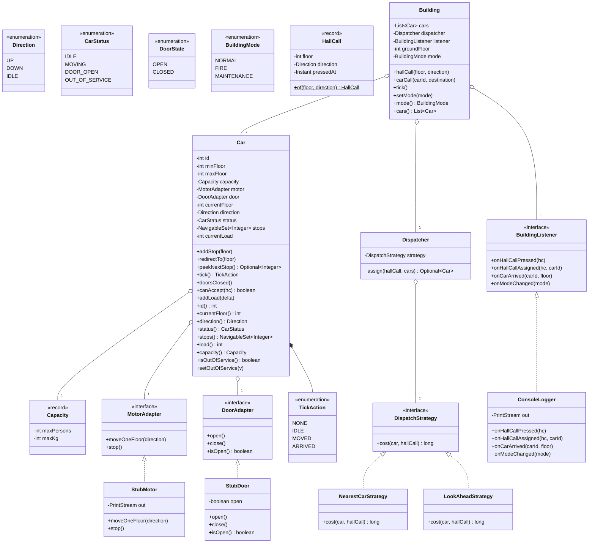
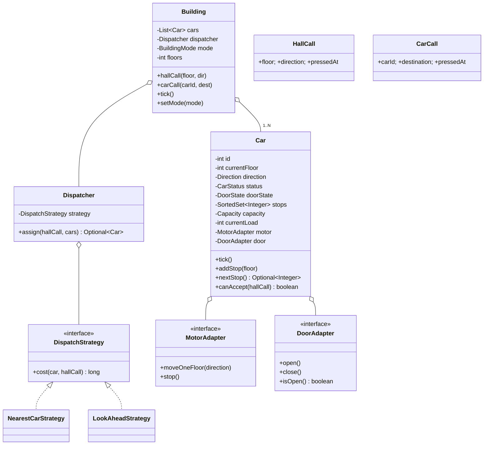

# 07 · Elevator System — Class Diagrams

## Aggregated class diagram

A single view of every class, interface, and enum in the system — fields and methods included. Source of truth: the Java skeleton under `12_machine_coding_skeleton/`.



---

## Class diagram



## Package layout

```
com.elevator
├── domain/
│   ├── Direction.java
│   ├── CarStatus.java
│   ├── DoorState.java
│   ├── Capacity.java
│   ├── HallCall.java
│   ├── CarCall.java
│   ├── BuildingMode.java
│   └── BuildingSnapshot.java
├── scheduler/
│   ├── Car.java                         # the LOOK scheduler
│   ├── MotorAdapter.java
│   ├── DoorAdapter.java
│   └── adapters: StubMotor, StubDoor
├── strategy/
│   ├── DispatchStrategy.java
│   ├── NearestCarStrategy.java
│   └── LookAheadStrategy.java
├── listener/
│   ├── BuildingListener.java
│   └── ConsoleLogger.java
├── Dispatcher.java
├── Building.java
└── Main.java
```

## Why split Dispatcher and Car

Two distinct algorithms:
- Dispatcher = **selection problem** (one of M cars).
- Car = **scheduling problem** (in what order do I visit my stops?).

Same Strategy interface idiom for both. Separation lets you ship destination-dispatch as a richer dispatcher without touching cars.

## Output

A clean separation: `Building` orchestrates, `Dispatcher` selects, `Car` schedules. Strategy interfaces let dispatch and motion behaviors be tuned independently.
